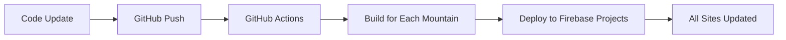

# Mountain Cat Platform Architecture

## Overview
Transform the single-mountain cat tracking application into a multi-tenant platform where different admins can manage cats for their respective mountains while sharing the same codebase and functionality.

## Architecture Decision: Single Repo + Multi-Instance Firebase Deployment

### Core Principles
- **Single codebase** - All functionality maintained in one repository
- **Multi-instance deployment** - Each mountain gets its own Firebase project and website
- **Admin-friendly** - Non-technical users can manage their mountain without touching code
- **Cost-effective** - Each admin pays for their own Firebase usage
- **Centralized updates** - Platform owner controls feature rollouts and updates

## Technical Architecture

### Repository Structure
```
mtcat-platform/
├── src/                          # Application code (shared)
├── config/
│   └── mountains.json           # Mountain configurations
├── scripts/
│   └── deploy-to-firebase.js    # Deployment automation
├── .github/workflows/
│   └── deploy-all.yml          # CI/CD pipeline
└── docs/
    └── admin-onboarding.md     # Admin setup guide
```

### Mountain Configuration
Each mountain is configured via a JSON file:
```json
{
  "geyang": {
    "name": "계양산 냥이들",
    "firebaseProjectId": "geyang-mountain-cats",
    "adminEmail": "geyang-admin@gmail.com",
    "customDomain": "geyang-cats.com",
    "youtubeChannelId": "UC...",
    "theme": {
      "primaryColor": "#green",
      "logoUrl": "/images/geyang-logo.png"
    },
    "features": {
      "videoAlbum": true,
      "advancedFiltering": true,
      "customTheme": false
    }
  }
}
```

### Deployment Strategy

#### Each Mountain Gets:
- **Separate Firebase project** (under admin's own Google account)
- **Firebase Hosting** for the website (e.g., `geyang-cats.web.app`)
- **Firestore database** for cat data
- **Firebase Storage** for images and videos
- **Firebase Auth** for admin authentication
- **Optional custom domain** (e.g., `www.geyang-cats.com`)

#### Automated Deployment:
1. **Code updates** pushed to main branch
2. **GitHub Actions** builds app for each mountain
3. **Environment-specific builds** using `MOUNTAIN_ID` environment variable
4. **Parallel deployment** to all Firebase projects
5. **All mountain sites updated** simultaneously

### Update Process


## Admin Experience

### Onboarding Process
1. **Admin fills registration form** with mountain details
2. **Admin creates Firebase account** (free Google account)
3. **Platform owner sets up** Firebase project structure
4. **Platform owner configures** deployment pipeline
5. **Admin receives** website URL and admin dashboard access

### Admin Responsibilities
- ✅ **Content management** (cat photos, videos, descriptions)
- ✅ **YouTube channel** setup and maintenance
- ✅ **Basic configuration** (mountain name, contact info)
- ❌ **No code changes** required
- ❌ **No technical deployment** needed
- ❌ **No server management** required

### Platform Owner Responsibilities
- ✅ **Codebase maintenance** and feature development
- ✅ **Deployment automation** and infrastructure
- ✅ **Initial Firebase setup** for new mountains
- ✅ **Technical support** for admins
- ✅ **Security updates** and monitoring

## Benefits

### For Mountain Admins
- **Simple onboarding** - No technical expertise required
- **Cost control** - Pay only for their own usage (mostly free tier)
- **Data ownership** - Complete control over their mountain's data
- **Customization** - Mountain-specific themes and features
- **Reliability** - Independent infrastructure per mountain

### For Platform Owner
- **Single codebase** - Easy to maintain and update
- **Scalable architecture** - Add new mountains without complexity
- **Centralized control** - Manage features and updates globally
- **Low operational overhead** - Automated deployment and management
- **Fair cost distribution** - No hosting costs for platform owner

### Technical Benefits
- **Data isolation** - Complete separation between mountains
- **Independent scaling** - Each mountain scales based on usage
- **Fault tolerance** - One mountain's issues don't affect others
- **Simple deployment** - Single repository, multiple targets
- **No vendor lock-in** - Firebase provides flexibility and migration options

## Implementation Phases

### Phase 1: Core Refactoring
- [ ] Extract mountain-specific configurations
- [ ] Implement environment-based configuration loading
- [ ] Create deployment automation scripts
- [ ] Set up CI/CD pipeline for multi-instance deployment

### Phase 2: Admin Dashboard
- [ ] Build admin configuration interface
- [ ] Implement theme customization tools
- [ ] Create feature toggle system
- [ ] Add admin onboarding workflow

### Phase 3: Platform Launch
- [ ] Create admin registration system
- [ ] Develop onboarding documentation
- [ ] Set up monitoring and analytics
- [ ] Launch with pilot mountains

### Phase 4: Scale and Optimize
- [ ] Add advanced customization options
- [ ] Implement usage analytics and reporting
- [ ] Create community features
- [ ] Optimize costs and performance

## Technology Stack

### Frontend
- **Next.js** - React framework with SSR/SSG
- **TypeScript** - Type safety and better development experience
- **Tailwind CSS** - Utility-first styling framework

### Backend & Infrastructure
- **Firebase Hosting** - Static site hosting with CDN
- **Firestore** - NoSQL database for cat data
- **Firebase Storage** - File storage for images and videos
- **Firebase Auth** - User authentication
- **YouTube API** - Video content integration

### DevOps
- **GitHub Actions** - CI/CD pipeline
- **Firebase CLI** - Deployment automation
- **Environment Variables** - Configuration management

## Conclusion

This architecture provides the best balance of simplicity, scalability, and cost-effectiveness for transforming the mountain cat platform into a multi-tenant solution. By leveraging Firebase's infrastructure and maintaining a single codebase, we can serve multiple mountain communities while keeping technical complexity manageable for both admins and the platform owner.
