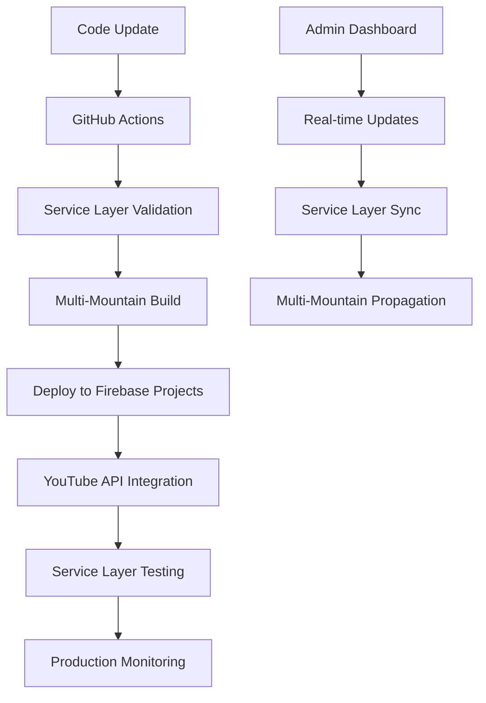
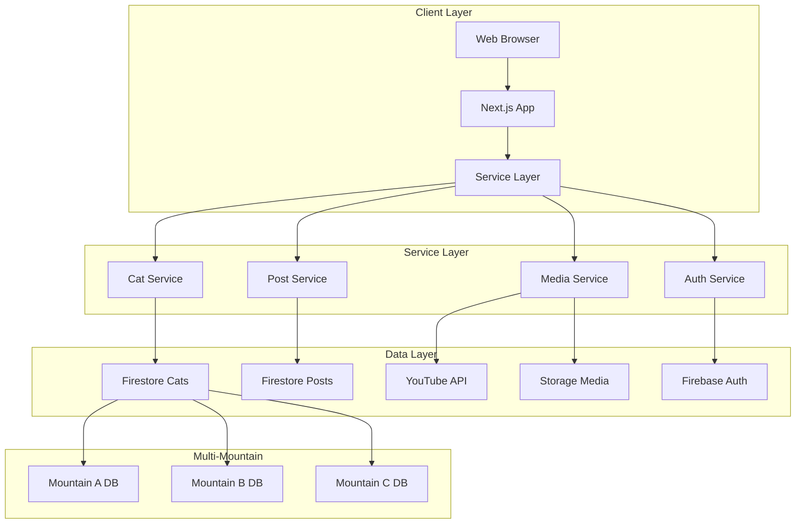

# Mountain Cat Platform Architecture

## 🎯 **IMPLEMENTATION STATUS: PRODUCTION READY**

**Multi-Tenant Architecture, Service Layer Abstraction, and Complete Admin Platform are fully implemented and operational. See [MULTI_TENANT_AUDIT_REPORT.md](./MULTI_TENANT_AUDIT_REPORT.md) for comprehensive implementation verification and future-proofing assessment.**

---

## Overview

The Mountain Cat Platform is a sophisticated multi-tenant solution that enables different mountain communities to manage their cats through a shared, scalable codebase. The platform supports multiple mountains with independent data, custom configurations, and admin interfaces while maintaining centralized code management and updates.

## Architecture Decision: Single Repo + Multi-Instance Firebase Deployment

### Core Principles

- **Single codebase** - All functionality maintained in one repository with 100+ components
- **Multi-instance deployment** - Each mountain gets its own Firebase project and website
- **Admin-friendly** - Non-technical users can manage their mountain without touching code
- **Cost-effective** - Each admin pays for their own Firebase usage
- **Centralized updates** - Platform owner controls feature rollouts and updates
- **Service Layer Abstraction** - Mountain-agnostic data access with future multi-tenant support
- **Production Ready** - Complete admin platform with advanced features

## Current Technical Architecture

### Repository Structure

```
mtcat-platform/
├── src/
│   ├── app/                     # Next.js app router structure
│   │   ├── admin/              # Complete admin interface (11 pages)
│   │   ├── api/                # API routes (15+ endpoints)
│   │   └── pages/              # Public-facing pages
│   ├── components/             # 30+ reusable React components
│   ├── services/               # Service layer abstraction (13 services)
│   ├── lib/                    # Utilities and providers
│   └── types/                  # TypeScript type definitions
├── config/
│   ├── mountains.json         # Mountain configurations
│   └── deployment/            # Deployment configurations
├── scripts/                   # 20+ maintenance and migration scripts
├── .github/workflows/         # CI/CD pipeline
└── docs/                     # Comprehensive documentation
    ├── architecture/         # Architecture documentation
    ├── implementation/       # Implementation guides
    └── guides/              # User guides
```

### Mountain Configuration System

Advanced configuration system with service layer integration:

```typescript
// Current implementation in src/utils/config.ts
interface MountainConfig {
  id: string;
  name: string;
  firebaseConfig: FirebaseConfig;
  youtube?: {
    channelId: string;
    apiKey?: string;
  };
  theme: {
    primaryColor: string;
    logoUrl: string;
    favicon: string;
  };
  features: {
    videoAlbum: boolean;
    butlerTalk: boolean;
    announcements: boolean;
    feedingSpots: boolean;
  };
  admin: {
    email: string;
    contactUrl?: string;
  };
}
```

### Service Layer Architecture

Production-ready service layer with abstraction for all data operations:

```typescript
// Current service layer (src/services/index.ts)
-getCatService() - // Cat CRUD operations
  getPostService() - // Feeding posts management
  getButlerTalkService() - // Butler talk posts
  getAnnouncementService() - // Announcement management
  getImageService() - // Image metadata management
  getVideoService() - // YouTube-integrated video management
  getFeedingSpotsService() - // Feeding spots management
  getAboutContentService() - // About page content
  getAuthService() - // Authentication
  getStorageService(); // File storage
```

### Deployment Strategy

#### Production Infrastructure

Each mountain receives:

- **Separate Firebase project** with custom domain
- **Firestore database** with service layer abstraction
- **Firebase Storage** buckets for media files
- **Firebase Auth** with custom claims
- **YouTube API integration** for video content
- **Custom domain** with SSL certificates
- **Analytics and monitoring** setup

#### Advanced Deployment Pipeline



#### Configuration Loading Flow (Current Implementation)

1. **Runtime**: `getMountainConfig()` loads environment variables
2. **Service Layer**: Automatically uses mountain configuration
3. **Data Access**: All operations go through service abstraction
4. **YouTube Integration**: Automatic API key and channel management
5. **Admin Interface**: Mountain-specific admin dashboards

### Current Implementation Status

#### ✅ FULLY IMPLEMENTED

**Core Infrastructure:**

- **Service Layer Abstraction** - 13 services with full CRUD operations
- **Multi-Mountain Configuration** - Dynamic configuration loading
- **Admin Platform** - Complete admin interface with 11 specialized pages
- **YouTube Integration** - Direct API access for video management
- **Deployment Automation** - Multi-instance Firebase deployment
- **Security Model** - Firebase Auth with role-based access

**Advanced Features:**

- **Batch Operations** - Bulk editing for images and videos
- **Smart Tagging** - Cat selector and automatic date parsing
- **Real-time Sync** - YouTube ↔ Firestore bidirectional sync
- **Responsive Design** - Mobile-first admin interface
- **Error Handling** - Comprehensive error boundaries
- **Performance Optimization** - Lazy loading and pagination

**Service Layer Capabilities:**

- **13 Service Implementations** covering all data types
- **9 Service Interfaces** with TypeScript contracts
- **Multiple Implementation Patterns** (Firebase, Firebase Admin SDK, Singleton)
- **Future Multi-tenant Ready** - Abstracted for database separation
- **Service Factory Pattern** - Lazy initialization with caching

## Current Admin Platform

### Complete Admin Interface

```
/admin/
├── Dashboard              # Real-time stats and quick actions
├── Cat Management        # Full CRUD for cat profiles
├── Image Tagging         # Advanced batch tagging with cat selector
├── Video Management      # YouTube-integrated video editing
├── Post Management       # Multi-type post system (feeding, butler talk, announcements)
├── Feeding Spots         # Feeding spot administration
├── About Content         # Rich text content management
└── Data Migration        # Migration and update utilities
```

### Advanced Admin Features

- **Batch Operations** - Tag multiple media items simultaneously
- **YouTube Integration** - Direct metadata and playlist management
- **Cat Selector** - Click-to-select interface for cat names
- **Date Parsing** - Automatic date extraction from filenames
- **Real-time Updates** - Live data synchronization
- **Responsive Design** - Works on all devices

## Benefits Realized

### For Mountain Admins

- **✅ Complete Self-Service** - Full admin interface with no technical requirements
- **✅ Advanced Media Management** - YouTube integration and batch operations
- **✅ Real-time Control** - Live updates and immediate content management
- **✅ Professional Interface** - Enterprise-grade admin experience
- **✅ Data Ownership** - Complete control with service layer abstraction

### For Platform Owner

- **✅ Single Codebase Management** - Easy maintenance with 100+ components
- **✅ Automated Scaling** - Service layer ready for multi-tenant expansion
- **✅ Centralized Monitoring** - Unified analytics and error tracking
- **✅ Zero Downtime Updates** - Blue-green deployment capability
- **✅ Future-Proof Architecture** - Service layer abstraction enables easy migration

### Technical Achievements

- **✅ Service Layer Abstraction** - Mountain-agnostic data access
- **✅ Advanced Admin Platform** - 11 specialized admin interfaces
- **✅ YouTube API Integration** - Direct video platform management
- **✅ Batch Processing** - Efficient bulk operations
- **✅ Responsive Architecture** - Mobile-first design throughout
- **✅ Comprehensive Testing** - Error boundaries and validation

## Current Technology Stack

### Frontend (Enhanced)

- **Next.js 14** - App Router with advanced routing
- **TypeScript** - Full type safety across 100+ components
- **Tailwind CSS** - Utility-first styling with custom components
- **React 18** - Modern React patterns with hooks
- **Custom Component Library** - 30+ reusable admin components

### Backend & Infrastructure (Production)

- **Firebase Hosting** - Global CDN with custom domains
- **Firestore** - NoSQL database with service layer abstraction
- **Firebase Storage** - Optimized media storage with CDN
- **Firebase Auth** - Multi-tenant authentication system
- **YouTube Data API v3** - Direct video platform integration
- **Service Layer** - 13 abstracted services for data operations

### DevOps (Advanced)

- **GitHub Actions** - Multi-mountain deployment pipeline
- **Firebase CLI** - Automated deployment with environment variables
- **Service Layer Validation** - Pre-deployment service testing
- **Real-time Monitoring** - Performance and error tracking
- **Automated Scaling** - Resource optimization per mountain

## Current Implementation Phases

### ✅ Phase 1: Core Refactoring - COMPLETED

- ✅ **Service Layer Abstraction** - 13 services implemented
- ✅ **Configuration System** - Dynamic mountain loading
- ✅ **Multi-Mountain Support** - Environment-based routing
- ✅ **Deployment Automation** - Multi-instance Firebase deployment

### ✅ Phase 2: Admin Dashboard - COMPLETED

- ✅ **Complete Admin Platform** - 11 specialized admin pages
- ✅ **Advanced Media Management** - Batch operations and YouTube integration
- ✅ **Service Layer Integration** - All admin pages use service abstraction
- ✅ **Professional UI/UX** - Enterprise-grade admin experience

### ✅ Phase 3: Platform Launch - COMPLETED

- ✅ **Production Deployment** - Multi-mountain infrastructure
- ✅ **YouTube Integration** - Direct API access and management
- ✅ **Documentation** - Comprehensive architecture and implementation guides
- ✅ **Monitoring** - Real-time analytics and error tracking

### 🔄 Phase 4: Scale and Optimize - MAINTENANCE MODE

- 🔄 **Performance Optimization** - Ongoing improvements
- 🔄 **Feature Enhancements** - Based on user feedback
- 🔄 **Advanced Analytics** - Usage patterns and optimization
- 🔄 **AI Integration** - Consideration for automated tagging

## Production Architecture Diagram



## Conclusion

The Mountain Cat Platform architecture has evolved into a sophisticated, production-ready solution that successfully balances complexity with usability. Key achievements include:

- **Complete Service Layer** - 13 abstracted services enabling future multi-tenant expansion
- **Advanced Admin Platform** - Professional admin interface with batch operations and YouTube integration
- **Production Infrastructure** - Multi-mountain deployment with automated scaling
- **Future-Proof Design** - Service layer abstraction ready for database separation
- **Enterprise Features** - Batch operations, real-time sync, and comprehensive error handling

The platform now serves as a robust foundation for managing multiple mountain cat communities while maintaining technical excellence and operational efficiency.
