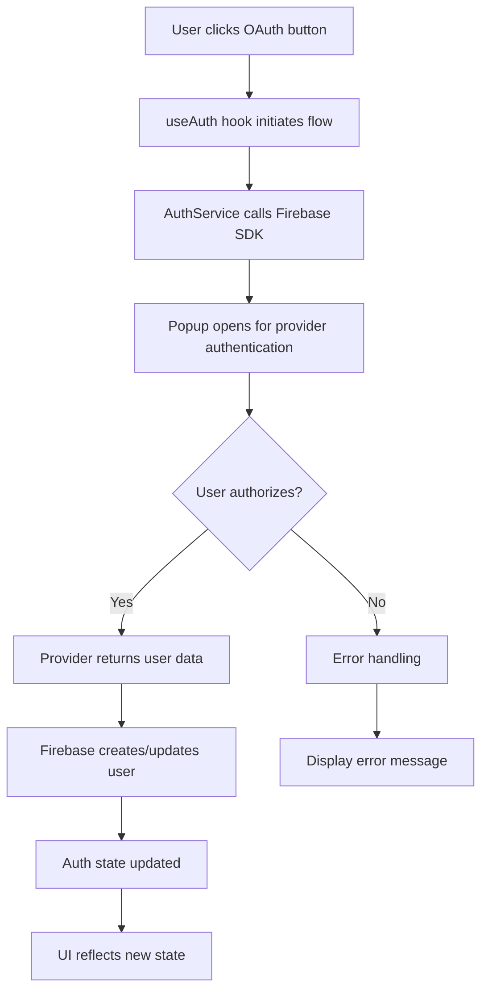

# Firebase Social Authentication Implementation

This document provides comprehensive guidance for implementing and using social login functionality with Firebase Authentication in the Mountain Cats application.

## Table of Contents

1. [Overview](#overview)
2. [Architecture](#architecture)
3. [Firebase Configuration](#firebase-configuration)
4. [Environment Setup](#environment-setup)
5. [Component Usage](#component-usage)
6. [Service Layer API](#service-layer-api)
7. [Integration Guide](#integration-guide)
8. [Troubleshooting](#troubleshooting)
9. [Security Considerations](#security-considerations)
10. [Testing](#testing)

## Overview

The social login implementation provides users with multiple authentication options:

- **Google OAuth**: Sign in with Google accounts
- **Kakaotalk OAuth**: Sign in with Kakaotalk accounts (popular in Korea)
- **Email/Password**: Traditional email and password authentication
- **Provider Linking**: Link multiple social accounts to a single user

This implementation is fully integrated with the existing admin system and maintains backward compatibility with the current authentication flow.

### Key Features

- **Multiple OAuth Providers**: Support for Google and Kakaotalk authentication
- **Provider Management**: Users can link/unlink social accounts
- **Error Handling**: Comprehensive error handling for all OAuth scenarios
- **Admin Integration**: Seamless integration with existing admin authentication
- **Mobile Responsive**: Works across all device sizes
- **Security**: Follows Firebase security best practices

## Architecture

### Component Structure

```
src/
├── components/
│   ├── SocialLoginButton.tsx      # Reusable OAuth buttons
│   ├── LoginForm.tsx              # Main login form with social options
│   ├── ProviderManagement.tsx     # Account linking/unlinking UI
│   └── admin/
│       └── AdminAuth.tsx          # Admin authentication wrapper
├── hooks/
│   └── useAuth.ts                 # Authentication state management
├── services/
│   ├── auth-service.ts            # Firebase authentication service
│   └── interfaces.ts              # TypeScript interfaces
└── utils/
    └── config.ts                  # OAuth configuration management
```

### Data Flow

1. **User Interaction**: User clicks social login button
2. **Hook Processing**: `useAuth` hook handles the OAuth flow
3. **Service Layer**: `FirebaseAuthService` executes Firebase operations
4. **State Management**: Authentication state is updated globally
5. **UI Updates**: Components react to state changes

### OAuth Flow



## Firebase Configuration

### Prerequisites

1. **Firebase Project**: Ensure you have a Firebase project set up
2. **Firebase SDK**: The application uses Firebase v9 modular SDK
3. **Authentication Enabled**: Enable Authentication in Firebase Console

### Enabling OAuth Providers

#### Google OAuth Setup

1. **Create Google OAuth Credentials**:
   - Go to [Google Cloud Console](https://console.cloud.google.com/)
   - Select your project or create a new one
   - Navigate to **APIs & Services > Credentials**
   - Click **Create Credentials > OAuth 2.0 Client ID**
   - Select **Web application** as the application type
   - Set **Authorized redirect URIs**: `http://localhost:3000/__/auth/handler`
   - Copy the **Client ID** and **Client Secret**

2. **Enable Google OAuth in Firebase**:
   - Go to [Firebase Console](https://console.firebase.google.com/)
   - Select your project
   - Navigate to **Authentication > Sign-in method**
   - Find **Google** and click **Enable**
   - Enter the **Client ID** and **Client Secret** from Google Cloud
   - Set **Project support email** and **OAuth consent screen**
   - Save configuration

#### Kakaotalk OAuth Setup (Updated - Follow This Guide)

**IMPORTANT**: This implementation uses Firebase OpenID Connect with provider ID `oidc.kakao`. Follow these exact steps:

1. **Create Kakaotalk OAuth Credentials**:
   - Go to [Kakao Developers](https://developers.kakao.com/)
   - Create a new application or select existing
   - Navigate to **Product Settings > Kakao Login**
   - Set **Authorized redirect URI**: `http://localhost:3000/__/auth/handler`
   - Copy the **REST API Key** as your client ID
   - **Enable Client Secret**: Go to **Product Settings > Kakao Login > Security** and activate Client Secret
   - Copy the **Client Secret** for Firebase configuration

2. **Enable Kakaotalk OAuth in Firebase (Critical Step)**:
   - Go to [Firebase Console](https://console.firebase.google.com/)
   - Select your project
   - Navigate to **Authentication > Sign-in method**
   - Click **Add new provider > OpenID Connect**
   - **Provider ID**: `oidc.kakao` (This must be exactly this value!)
   - **Display name**: `Kakaotalk`
   - **Client ID**: Your Kakaotalk REST API Key
   - **Client secret**: Your Kakaotalk Client Secret
   - **Issuer**: `https://kauth.kakao.com`
   - **Authorization endpoint**: `https://kauth.kakao.com/oauth/authorize`
   - **Token endpoint**: `https://kauth.kakao.com/oauth/token`
   - **Additional scopes**: `profile_account`
   - Click **Save**

3. **Environment Variables**:
   Ensure these are set in your `.env.local`:
   ```bash
   NEXT_PUBLIC_KAKAO_CLIENT_ID=your-rest-api-key
   NEXT_PUBLIC_KAKAO_CLIENT_SECRET=your-client-secret
   NEXT_PUBLIC_KAKAO_OAUTH_ENABLED=true
   ```

**Common Setup Issues**:

- ❌ Using `kakao.com` instead of `oidc.kakao` as provider ID
- ❌ Not enabling Client Secret in Kakao Developers
- ❌ Missing or incorrect redirect URI
- ❌ Provider not enabled in Firebase Authentication settings

### Firebase Security Rules

Ensure your Firebase security rules are properly configured:

```javascript
// firestore.rules
service cloud.firestore {
  match /databases/{database}/documents {
    // Admin users have full access
    match /{document=**} {
      allow read, write: if request.auth != null &&
                          isAdmin(request.auth.uid);
    }
  }
}

// Helper function to check admin status
function isAdmin(uid) {
  // Implement your admin checking logic here
  return exists(/databases/$(database)/documents/admins/$(uid));
}
```

## Environment Setup

### Required Environment Variables

Add these variables to your `.env.local` file:

```bash
# Firebase Configuration (Required)
NEXT_PUBLIC_FIREBASE_API_KEY=your-firebase-api-key
NEXT_PUBLIC_FIREBASE_AUTH_DOMAIN=your-project.firebaseapp.com
NEXT_PUBLIC_FIREBASE_PROJECT_ID=your-project
NEXT_PUBLIC_FIREBASE_STORAGE_BUCKET=your-project.appspot.com
NEXT_PUBLIC_FIREBASE_MESSAGING_SENDER_ID=123456789
NEXT_PUBLIC_FIREBASE_APP_ID=1:123456789:web:abcdef123456

# Google OAuth (Optional)
GOOGLE_CLIENT_ID=your-google-oauth-client-id
GOOGLE_CLIENT_SECRET=your-google-oauth-client-secret
GOOGLE_OAUTH_ENABLED=true

# Kakaotalk OAuth (Optional)
KAKAO_CLIENT_ID=your-kakao-oauth-client-id
KAKAO_CLIENT_SECRET=your-kakao-oauth-client-secret
KAKAO_OAUTH_ENABLED=true

# Application Configuration
NEXT_PUBLIC_BASE_URL=http://localhost:3000
```

### Configuration Options

| Variable               | Required | Default | Description                    |
| ---------------------- | -------- | ------- | ------------------------------ |
| `GOOGLE_CLIENT_ID`     | No       | -       | Google OAuth Client ID         |
| `GOOGLE_CLIENT_SECRET` | No       | -       | Google OAuth Client Secret     |
| `GOOGLE_OAUTH_ENABLED` | No       | `true`  | Enable/disable Google OAuth    |
| `KAKAO_CLIENT_ID`      | No       | -       | Kakaotalk OAuth Client ID      |
| `KAKAO_CLIENT_SECRET`  | No       | -       | Kakaotalk OAuth Client Secret  |
| `KAKAO_OAUTH_ENABLED`  | No       | `true`  | Enable/disable Kakaotalk OAuth |

### Development vs Production

For production deployment:

1. **Update Redirect URIs**: Change from `localhost:3000` to your production domain
2. **Configure Authorized Domains**: Add your domain in Firebase Authentication settings
3. **Environment Variables**: Set production values in your deployment environment
4. **SSL Requirements**: Ensure your production site uses HTTPS

## Component Usage

### SocialLoginButton

Reusable component for OAuth login buttons.

```tsx
import SocialLoginButton from '@/components/SocialLoginButton';

function MyComponent() {
  const handleGoogleLogin = () => {
    // Handle Google OAuth flow
  };

  const handleKakaoLogin = () => {
    // Handle Kakaotalk OAuth flow
  };

  return (
    <div>
      <SocialLoginButton
        provider="google"
        onClick={handleGoogleLogin}
        loading={isLoading}
        size="md"
        className="w-full"
      />

      <SocialLoginButton
        provider="kakao"
        onClick={handleKakaoLogin}
        loading={isLoading}
        size="md"
        className="w-full"
      />
    </div>
  );
}
```

**Props:**

- `provider`: `'google' | 'kakao'` - OAuth provider type
- `onClick`: `() => void` - Click handler for OAuth flow
- `loading`: `boolean` - Show loading state
- `disabled`: `boolean` - Disable button
- `size`: `'sm' | 'md' | 'lg'` - Button size
- `className`: `string` - Additional CSS classes

### LoginForm

Complete login form with social and email/password options.

```tsx
import LoginForm from '@/components/LoginForm';

function LoginPage() {
  const handleLoginSuccess = () => {
    // Redirect to dashboard or next page
    router.push('/admin');
  };

  const handleLoginError = (error: string) => {
    // Show error message to user
    console.error('Login failed:', error);
  };

  return (
    <div className="login-container">
      <LoginForm onLoginSuccess={handleLoginSuccess} onLoginError={handleLoginError} />
    </div>
  );
}
```

**Props:**

- `onLoginSuccess`: `() => void` - Called on successful login
- `onLoginError`: `(error: string) => void` - Called on login error

### ProviderManagement

Component for managing linked OAuth providers.

```tsx
import ProviderManagement from '@/components/ProviderManagement';

function AccountSettings() {
  const handleSuccess = (message: string) => {
    // Show success notification
    toast.success(message);
  };

  const handleError = (error: string) => {
    // Show error notification
    toast.error(error);
  };

  return (
    <div className="settings-container">
      <ProviderManagement
        className="space-y-6"
        showSuccessMessages={true}
        onSuccess={handleSuccess}
        onError={handleError}
      />
    </div>
  );
}
```

**Props:**

- `className`: `string` - Additional CSS classes
- `showSuccessMessages`: `boolean` - Show success notifications
- `onSuccess`: `(message: string) => void` - Success callback
- `onError`: `(error: string) => void` - Error callback

### AdminAuth

Admin authentication wrapper with social login support.

```tsx
import AdminAuth from '@/components/admin/AdminAuth';

// Wrap your admin pages/components
export default function AdminPage() {
  return (
    <AdminAuth>
      {/* Protected admin content */}
      <div>
        <h1>Admin Dashboard</h1>
        <p>This content is only visible to authenticated admins.</p>
      </div>
    </AdminAuth>
  );
}
```

**Props:**

- `children`: `React.ReactNode` - Protected content

### useAuth Hook

React hook for authentication state management.

```tsx
import { useAuth } from '@/hooks/useAuth';

function UserProfile() {
  const {
    user,
    isAuthenticated,
    providerData,
    linkedProviders,
    signInWithGoogle,
    signInWithKakao,
    linkGoogleProvider,
    linkKakaoProvider,
    unlinkProvider,
    isSigningInWithGoogle,
    isSigningInWithKakao,
  } = useAuth();

  const handleLinkGoogle = async () => {
    try {
      await linkGoogleProvider();
      // Success handled by hook
    } catch (error) {
      // Error handled by hook
    }
  };

  return (
    <div>
      {isAuthenticated ? (
        <div>
          <h3>Welcome, {user?.displayName}</h3>
          <p>Email: {user?.email}</p>
          <div>
            <h4>Linked Providers:</h4>
            {providerData.map((provider) => (
              <div key={provider.providerId}>
                {provider.providerId}: {provider.email}
              </div>
            ))}
          </div>

          {!linkedProviders.includes('google.com') && (
            <button onClick={handleLinkGoogle} disabled={isSigningInWithGoogle}>
              Link Google Account
            </button>
          )}
        </div>
      ) : (
        <div>
          <p>Please log in to view your profile.</p>
          <button onClick={signInWithGoogle} disabled={isSigningInWithGoogle}>
            Sign in with Google
          </button>
        </div>
      )}
    </div>
  );
}
```

## Service Layer API

### FirebaseAuthService

Main service class implementing the `IAuthService` interface.

#### Methods

**Authentication Methods:**

- `getCurrentUser(): User | null` - Get current authenticated user
- `signIn(email: string, password: string): Promise<User>` - Email/password sign in
- `signOut(): Promise<void>` - Sign out current user
- `createUser(email: string, password: string): Promise<User>` - Create new user
- `onAuthStateChanged(callback: (user: User | null) => void): () => void` - Listen for auth changes

**OAuth Methods:**

- `signInWithGoogle(): Promise<UserCredential>` - Sign in with Google
- `signInWithKakao(): Promise<UserCredential>` - Sign in with Kakaotalk
- `linkProvider(providerId: string): Promise<UserCredential>` - Link OAuth provider
- `unlinkProvider(providerId: string): Promise<void>` - Unlink OAuth provider
- `getProviderData(): Promise<ProviderData[]>` - Get user's linked providers

#### Error Handling

The service provides comprehensive error handling for OAuth operations:

```typescript
try {
  const result = await authService.signInWithGoogle();
  console.log('Google sign-in successful:', result.user);
} catch (error) {
  if (error.code === 'auth/popup-closed-by-user') {
    console.log('User closed the popup');
  } else if (error.code === 'auth/popup-blocked') {
    console.log('Popup was blocked by browser');
  } else {
    console.error('Sign-in failed:', error.message);
  }
}
```

### Common OAuth Errors

**Google OAuth Errors:**

- `auth/popup-closed-by-user`: User closed the popup
- `auth/cancelled-popup-request`: Popup request was cancelled
- `auth/popup-blocked`: Popup blocked by browser
- `auth/account-exists-with-different-credential`: Account exists with different provider

**Kakaotalk OAuth Errors:**

- Same error codes as Google with appropriate Korean provider messages

## Integration Guide

### Adding to Existing Pages

#### 1. Login Page Integration

```tsx
// src/app/login/page.tsx
import LoginForm from '@/components/LoginForm';
import { useAuth } from '@/hooks/useAuth';

export default function LoginPage() {
  const { loading } = useAuth();

  if (loading) {
    return <div>Loading...</div>;
  }

  return (
    <div className="login-page">
      <div className="container">
        <h1>Sign In</h1>
        <LoginForm
          onLoginSuccess={() => router.push('/admin')}
          onLoginError={(error) => console.error('Login error:', error)}
        />
      </div>
    </div>
  );
}
```

#### 2. Admin Page Integration

```tsx
// src/app/admin/page.tsx
import AdminAuth from '@/components/admin/AdminAuth';

export default function AdminPage() {
  return (
    <AdminAuth>
      <div className="admin-content">
        <h1>Admin Dashboard</h1>
        {/* Your admin content here */}
      </div>
    </AdminAuth>
  );
}
```

#### 3. User Profile Integration

```tsx
// src/components/UserProfile.tsx
import { useAuth } from '@/hooks/useAuth';
import ProviderManagement from '@/components/ProviderManagement';

export default function UserProfile() {
  const { user, isAuthenticated } = useAuth();

  if (!isAuthenticated || !user) {
    return <div>Please log in to view your profile.</div>;
  }

  return (
    <div className="profile-container">
      <div className="user-info">
        <h2>User Profile</h2>
        <p>Name: {user.displayName}</p>
        <p>Email: {user.email}</p>
      </div>

      <div className="provider-management">
        <ProviderManagement />
      </div>
    </div>
  );
}
```

### Custom Authentication Flow

For custom authentication flows, you can use the service directly:

```tsx
import { getAuthService } from '@/services';

function CustomAuthComponent() {
  const authService = getAuthService();
  const [loading, setLoading] = useState(false);
  const [error, setError] = useState<string | null>(null);

  const handleCustomGoogleLogin = async () => {
    setLoading(true);
    setError(null);

    try {
      const result = await authService.signInWithGoogle();
      console.log('Custom Google login successful:', result.user);

      // Redirect or update UI as needed
    } catch (err: any) {
      setError(err.message);
    } finally {
      setLoading(false);
    }
  };

  return (
    <div>
      <button onClick={handleCustomGoogleLogin} disabled={loading}>
        {loading ? 'Signing in...' : 'Custom Google Login'}
      </button>

      {error && <div className="error">{error}</div>}
    </div>
  );
}
```

## Troubleshooting

### Common Issues

#### 1. OAuth Popup Blocked

**Problem**: Popup is blocked by browser
**Solution**:

- Ensure popup blocker is disabled
- Trigger OAuth from user interaction (click event)
- Add fallback for popup blocked error

```tsx
try {
  await authService.signInWithGoogle();
} catch (error: any) {
  if (error.code === 'auth/popup-blocked') {
    alert('Please disable popup blocker and try again');
  }
}
```

#### 2. User Cancellation

**Problem**: User closes popup without signing in
**Solution**: Handle the cancellation gracefully

```tsx
try {
  await authService.signInWithGoogle();
} catch (error: any) {
  if (error.code === 'auth/popup-closed-by-user') {
    console.log('User cancelled the sign-in process');
  }
}
```

#### 3. Account Already Exists

**Problem**: User tries to sign in with provider that's already linked to different account
**Solution**: Guide user to sign in with original method

```tsx
try {
  await authService.signInWithGoogle();
} catch (error: any) {
  if (error.code === 'auth/account-exists-with-different-credential') {
    alert('An account already exists with this email. Please sign in using the original method.');
  }
}
```

#### 4. Configuration Issues

**Problem**: OAuth providers not working
**Checklist**:

- [ ] Environment variables are set correctly
- [ ] Firebase Authentication providers are enabled
- [ ] OAuth redirect URIs are configured
- [ ] Authorized domains are set in Firebase Console
- [ ] Client IDs and secrets are correct

#### 5. Development vs Production

**Problem**: OAuth works in development but not production
**Solution**:

- Update redirect URIs for production domain
- Ensure production environment variables are set
- Verify authorized domains in Firebase Console
- Check SSL certificate for HTTPS

### Debug Mode

Enable debug logging by adding this to your configuration:

```typescript
// In development, add debug logging
if (process.env.NODE_ENV === 'development') {
  console.log('Auth state changed:', user);
  console.log('Provider data:', providerData);
}
```

### Error Monitoring

Implement error monitoring for OAuth operations:

```typescript
// Add error tracking
const trackAuthError = (error: any, provider: string) => {
  console.error(`Auth error (${provider}):`, error);

  // Send to your error tracking service
  // errorTrackingService.captureException(error, { tags: { provider } });
};

// Usage in OAuth methods
try {
  await authService.signInWithGoogle();
} catch (error) {
  trackAuthError(error, 'google');
  // Handle error...
}
```

## Security Considerations

### OAuth Security Best Practices

1. **Secure Redirect URIs**: Only use HTTPS in production
2. **State Parameter**: Firebase handles this automatically
3. **Scope Minimization**: Only request necessary user data
4. **Credential Storage**: Never store OAuth tokens client-side
5. **CORS Configuration**: Properly configure CORS for your domain

### Firebase Security Rules

Ensure proper security rules for authenticated users:

```javascript
// firestore.rules
service cloud.firestore {
  match /databases/{database}/documents {
    // Only authenticated users can read
    match /{document=**} {
      allow read: if request.auth != null;
      allow write: if request.auth != null &&
                          isAdmin(request.auth.uid);
    }
  }
}
```

### Admin Privileges

The admin system uses Firebase Custom Claims for role management:

```typescript
// Check admin status
function isAdmin(user: User): boolean {
  // Implementation checks custom claims
  return user.customClaims?.admin === true;
}
```

### Session Management

- Firebase handles session persistence automatically
- Sessions are stored securely using Firebase's mechanisms
- Users can be signed out programmatically or through Firebase Console

## Testing

### Test Page

A comprehensive test page is available at `/auth-test` that provides:

- **Real-time authentication status display**
- **Interactive OAuth flow testing**
- **Provider linking/unlinking testing**
- **Error scenario simulation**
- **Component integration verification**

Access the test page by navigating to `http://localhost:3000/auth-test` in your development environment.

### Manual Testing Checklist

#### OAuth Flow Testing

- [ ] Google OAuth login works
- [ ] Kakaotalk OAuth login works
- [ ] OAuth login creates new user account
- [ ] OAuth login signs in existing user
- [ ] User cancellation is handled gracefully
- [ ] Popup blocked errors are handled

#### Provider Management Testing

- [ ] Users can link additional providers
- [ ] Users can unlink providers
- [ ] Provider linking shows appropriate UI states
- [ ] Error messages display correctly
- [ ] Success messages clear automatically

#### Admin Integration Testing

- [ ] AdminAuth component works with social login
- [ ] Admin privileges are maintained across OAuth flows
- [ ] Non-admin users are properly blocked
- [ ] Admin interface shows correct user information

#### Error Handling Testing

- [ ] Network errors are handled gracefully
- [ ] Invalid credentials show appropriate messages
- [ ] OAuth errors display user-friendly messages
- [ ] Loading states work correctly
- [ ] Disabled states prevent multiple submissions

### Automated Testing

For unit and integration tests, consider testing:

```typescript
// Example test structure
describe('Authentication Service', () => {
  test('should sign in with Google', async () => {
    // Mock Firebase Auth
    // Test Google OAuth flow
  });

  test('should handle OAuth errors', async () => {
    // Test error scenarios
  });

  test('should link providers correctly', async () => {
    // Test provider linking
  });
});
```

### Performance Testing

- **OAuth Popup Performance**: Ensure popups open quickly
- **State Updates**: Verify smooth UI transitions
- **Mobile Responsiveness**: Test on various screen sizes
- **Network Resilience**: Test with slow network conditions

---

## Conclusion

This Firebase Social Authentication implementation provides a robust, secure, and user-friendly authentication system with support for multiple OAuth providers. The modular architecture allows for easy integration into existing and new components while maintaining backward compatibility.

For additional support or questions, refer to:

- [Firebase Authentication Documentation](https://firebase.google.com/docs/auth)
- [Google OAuth 2.0 Documentation](https://developers.google.com/identity/protocols/oauth2)
- [Kakaotalk OAuth Documentation](https://developers.kakao.com/docs/latest/kakaologin/rest-api)
