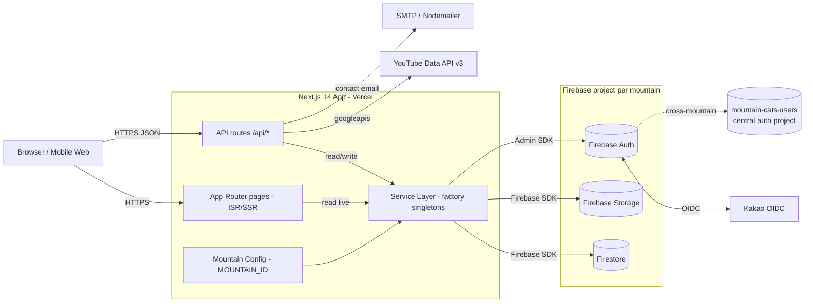

# Codebase Overview

> Generated by the `explore-codebase` skill. Last updated: 2026-07-11

<!-- audience: Architect / tech lead -->

## Purpose

MOHOCAT (산냥이집냥이 — "MOuntain cat and HOuse CAT") is a Korean-language Next.js 14
platform that raises awareness of cats living on Korean mountains. The public experience
centers on an interactive **Leaflet** map of a single mountain (currently 계양산 / Geyang)
where each point reveals the cats that live — or used to live — there. The codebase is
intentionally **multi-tenant ready**: a `MOUNTAIN_ID` env var drives configuration, theming,
and feature flags so a second mountain can be onboarded without code changes. Firestore,
Firebase Auth, and Firebase Storage provide the backend; an admin platform under `/admin`
offers CMS-style management of cats, media, posts, announcements, adoption, members, roles,
and the about page.

The app reads Firestore **live through the service layer** — there is no static-data export
and no Cloud Storage data path. The home page is an ISR Server Component
(`revalidate = 3600s`) that bakes points + cat avatars into the render, so the client map
issues zero Firestore queries for avatars; admin cat edits also fire on-demand
`revalidatePath('/')`. The **only deploy target is Vercel** (Production = `main`, Preview =
`dev`, via Git integration). Cloud Run, the home-server Docker path, and Firebase Hosting were
removed; Terraform is parked under `_infra/_terraform/` as a future blueprint.

## Tech Stack

| Layer             | Technology                                                                            |
| ----------------- | ------------------------------------------------------------------------------------- |
| Framework         | Next.js 14 (App Router, ISR/SSR), TypeScript (strict)                                 |
| UI                | React 18, Tailwind CSS, Heroicons, react-icons                                        |
| Map               | Leaflet + react-leaflet; react-zoom-pan-pinch (legacy image-map interactions)         |
| Forms / grids     | react-hook-form; react-datasheet-grid + @dnd-kit (admin cat grid)                     |
| Data fetching     | Live Firestore via service layer; SWR + axios on some client views                    |
| Auth (client)     | Firebase Auth (`firebase` SDK) — email/password, phone (SMS), Kakao OIDC              |
| Auth (server)     | Firebase Admin SDK (`firebase-admin`)                                                 |
| Database          | Firestore (read live through the service layer)                                       |
| File storage      | Firebase Storage (images/video thumbnails, signed URLs); CORS configured              |
| Email             | Nodemailer (contact/동참 notifications via an API route)                              |
| Uploads           | busboy (multipart parsing in upload routes)                                           |
| Video integration | YouTube Data API v3 (`googleapis`)                                                    |
| Build             | `fetch-static-assets.js` (pull thumbnails/about-photos into `public/`) → `next build` |
| Testing           | Vitest (`tests/smoke/` structural smoke suite)                                        |
| Tooling           | ESLint, Prettier, Husky + lint-staged, dotenv                                         |
| Deploy target     | **Vercel only** (Git integration: Production = `main`, Preview = `dev`)               |
| IaC               | Terraform — **parked** under `_infra/_terraform/` (not the live path)                 |

## Top-Level Structure

```
mohocat/
├── src/                          # All application code
│   ├── app/                      # Next.js App Router
│   │   ├── page.tsx              # Home (async Server Component; ISR map)
│   │   ├── layout.tsx            # Root layout (providers, Navigation, Footer)
│   │   ├── admin/                # Admin CMS pages (gated by AdminAuth)
│   │   ├── api/                  # HTTP API routes (admin, auth, youtube, points, contact, …)
│   │   ├── pages/                # Public content pages (about, cats, adoption, posts, …)
│   │   ├── login/ , mypage/      # Auth entry + member self-service
│   ├── components/               # React components by domain (auth/, admin/, album/, ui/, …)
│   ├── services/                 # Firebase service layer (factory + interfaces, lazy singletons)
│   ├── lib/                      # Cross-cutting libs (firebase init, auth/admin, server cat-reads, cache-config, revalidate)
│   ├── hooks/                    # Custom hooks (useAuth, usePermissions, useIsMobile, useIdleTimeout, useMediaFilter, …)
│   ├── contexts/                 # React contexts (AnnouncementModalContext)
│   ├── config/                   # In-source config helpers (permission-config.ts)
│   ├── constants/                # UI string tables (strings.ts, adminStrings.ts) — Korean-first
│   ├── types/                    # Shared TypeScript types
│   └── utils/                    # Utilities (config loader, cat-filters, map clustering/labels, parse-date, cn, …)
├── config/
│   ├── firebase/                 # firestore.rules, CORS (firebase.json trimmed to firestore block)
│   ├── mountains/mountains.json  # Multi-tenant per-mountain config (public) + _meta central user service
│   └── permissions.json          # Role/permission seed data
├── scripts/
│   ├── migration/                # One-shot Firestore field migrations
│   ├── maintenance/              # fetch-static-assets.js (build-time asset pull)
│   ├── auth/ , dev/              # OAuth/Kakao + local dev helpers
├── tests/smoke/                  # Vitest structural smoke suite
├── public/                       # Static assets (build-fetched thumbnails/about-photos, icons)
├── docs/                         # codebase/, handoff/, planning/, design/, manuals/, compliance/, archive/
├── log/                          # DEBUG_LOG.md, FEATURE_MOD_LOG.md, doc_updates.log
├── _infra/_terraform/            # Parked Terraform blueprint (underscore = stale)
├── next.config.js                # Image optimization, remote patterns, package import opts
└── package.json                  # Scripts: dev, build (fetch-assets → next build), vercel-build, test:smoke
```

## Entry Points

- `src/app/layout.tsx` — Root layout. Wraps the tree in `AnnouncementModalProvider` and
  `AuthProvider`, mounts `Navigation`, `Footer`, `MountainSelector`, and `AnalyticsTracker`.
- `src/app/page.tsx` — Home page. `async` Server Component that `await`s points **and** cats
  together (`getPointService().getAllPoints()` + `getAllCatsServer()`), groups cats by point,
  and passes both as props to `MountainViewer`. Sets `revalidate = REVALIDATE_SECONDS` (ISR).
- `src/app/api/**/route.ts` — All HTTP API routes (admin, auth, YouTube, points, contact,
  account deletion, signed URLs, revalidate).
- `package.json` `build` / `vercel-build` — both run
  `node scripts/maintenance/fetch-static-assets.js && next build`. The pre-build step pulls
  cat thumbnails / about-photos from Firebase Storage into `public/`.
- **Deploy = `git push`** — Vercel Git integration builds and hosts. There is no deploy
  command, Dockerfile, or CI deploy workflow.

## Functional Areas

All ten areas have a Layer 2 deep-dive document in this folder:

- **[mountain-map-and-cats](mountain-map-and-cats.md)** — Leaflet map (`MountainViewer` +
  `LeafletMountainMap`), clickable points, marker clustering, cat galleries, the `/cats`
  browser, and server-side (Admin SDK) cat reads baked into the ISR landing.
- **[authentication](authentication.md)** — Firebase Auth + Kakao OIDC + phone/email login;
  `AuthProvider` context; account linking/unlinking; reauth, email change, idle-timeout, and
  account-deletion flows.
- **[permissions-and-roles](permissions-and-roles.md)** — RBAC (`admin`, `butler-ground`,
  `butler-internet`, `viewer`); `PermissionService`, `RoleAssignmentService`,
  `permission-config`, `usePermissions`/`useResourceAccess`; `requireApiPermission` guard;
  admin role/permission UI.
- **[services-layer](services-layer.md)** — Factory-pattern service abstraction over
  Firebase. Interface-typed lazy singletons in `src/services/index.ts` (cat, point, image,
  video, post, butler-talk, announcement, adoption, contact, storage, auth, feeding-spots,
  about-content, permission).
- **[api-routes](api-routes.md)** — Next.js API routes: admin (cats, posts-collections,
  role/resource permissions, YouTube auth), auth (Kakao), points, contact (email),
  account/delete, generate-signed-url, revalidate, and the YouTube upload/metadata family.
- **[admin-platform](admin-platform.md)** — Admin pages/components: dashboard, cats CMS
  (datasheet grid), points editor with map picker, posts, announcements, adoption, members,
  app-management, migration, tag-images, tag-videos, contact management, about editor.
- **[community-pages](community-pages.md)** — User-facing pages outside the map: cats,
  adoption, butler_talk, butler_stream, photo/video album, posts, announcements, about,
  contact, faq, privacy, terms, mypage; replies; Footer & NavDropdown chrome.
- **[media-and-youtube](media-and-youtube.md)** — Photo & video albums (shared album
  primitives: `MediaTile`, `AlbumFilterBar`, `Lightbox`, `VideoPlayer`), YouTube playlist
  management, video upload, metadata sync, Firebase Storage signed URLs, image optimization.
- **[multi-tenant-config](multi-tenant-config.md)** — Mountain config system:
  `config/mountains/mountains.json` (+ `_meta` central user service), `src/utils/config.ts`,
  `MountainSelector`, `MOUNTAIN_ID`-driven switching, per-mountain theme/features/map/secrets.
- **[deployment-and-build](deployment-and-build.md)** — Vercel-only deployment (Git push),
  the `fetch-static-assets` build step, Firestore-rules CLI deploy, env-var management, and
  the parked Terraform blueprint.

<!-- ============================================================
     DIAGRAM STEP — Architecture Diagram
     Current tool: Mermaid
     To switch tools: replace the Mermaid block below with the
     output of the new tool. See "Diagram guidance" section.
     ============================================================ -->

## Architecture Diagram



## Cross-Cutting Concerns

- **Multi-tenant configuration (baked)**: Services and pages read mountain context from
  `getMountainConfig()` (driven by `MOUNTAIN_ID`). Theme, features, map settings, OAuth
  enablement, and social links live in `mountains.json`, a **static import** — so config
  changes take effect only on redeploy, unlike Firestore data which is ISR-fresh.
- **Service-layer abstraction**: Components never touch Firebase directly — they call
  `getXxxService()` factory functions returning interface-typed singletons. This is the seam
  for future multi-tenant DB separation and testing.
- **Live reads + ISR freshness**: There is no static-data export. The landing is an ISR
  Server Component (`revalidate = 3600s`) that bakes points + cat avatars server-side; admin
  cat edits additionally trigger on-demand `revalidatePath('/')` (`src/lib/revalidate-client.ts`
  → `/api/revalidate`) for an immediate refresh. Point edits rely on the ≤1h backstop.
- **Authentication & permissions**: `AuthProvider` exposes the Firebase user + linked OIDC
  providers to the tree; `PermissionService`/`RoleAssignmentService` resolve Firestore-stored
  roles into effective permissions; `usePermissions`/`useResourceAccess` gate UI and
  `requireApiPermission` gates API routes.
- **Error handling**: Per the repo owner's convention, new `try/catch` should **log and
  re-raise** (no silent swallow / fallback unless asked); never log secrets or PII. Some
  legacy read paths still return empty/null on error — hardening is open work.
- **Image optimization**: Next.js `<Image>` with WebP/AVIF, Firebase Storage allowed via
  `remotePatterns`, 1-year cache TTL. Enabled (works on Vercel).
- **Korean-first UI**: User-facing copy is Korean (해요체 for friendly tone). String tables
  live in `src/constants/strings.ts` and `adminStrings.ts`. No i18n framework.
- **Shared UI primitives**: `src/components/ui/` holds the shared design system (Modal,
  Button, Card, Input, Field, Alert, Lightbox, VideoPlayer). User-facing modals must use the
  shared `ui/Modal` system rather than hand-rolled shells.

## External Dependencies

- **Firebase** (per mountain) — Firestore (database), Authentication, Storage. Configured via
  `NEXT_PUBLIC_FIREBASE_*` and `SERVICE_ACCOUNT_KEY` (Admin SDK) env vars.
- **`mountain-cats-users` Firebase project** — Centralized authentication / user-management
  project shared across mountains, declared in `mountains.json` `_meta.centralUserService`.
- **Kakao OIDC** — Korean social login. Configured via `NEXT_PUBLIC_KAKAO_*` env vars.
- **YouTube Data API v3** — Playlist management, video upload, metadata sync. Refresh-token
  OAuth flow (`YOUTUBE_*`, `NEXT_PUBLIC_YOUTUBE_API_KEY`).
- **SMTP (Nodemailer)** — Outbound email for the contact / 동참 form (Admin-SDK-backed API
  route, not a Cloud Function).
- **Vercel** — The sole hosting target. Env vars managed by hand in the Vercel dashboard
  (Production + Preview), not by IaC.
  </content>
  </invoke>
