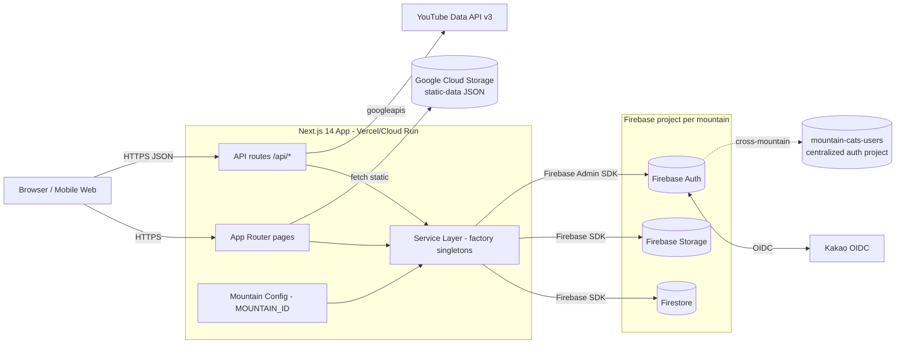

# Codebase Overview

> Generated by the `explore-codebase` skill. Last updated: 2026-05-10

<!-- audience: Architect / tech lead -->

## Purpose

MOHOCAT (산냥이집냥이 — "MOuntain cat and HOuse CAT") is a Korean-language Next.js 14
platform that raises awareness of cats living on Korean mountains. The user-facing experience
is centered on an interactive map of a single mountain (currently 계양산 / Geyang) where each
point reveals the cats that live or used to live there. The codebase is intentionally
multi-tenant ready — a mountain ID drives configuration, theming, and feature flags so a second
mountain can be onboarded without code changes. Backend storage, authentication, and image
hosting all run on Firebase. An admin platform under `/admin` provides CMS-style management of
cats, media, posts, announcements, members, and roles.

The project was first deployed to Firebase Hosting (static export), then to Google Cloud Run
(containerized SSR) once server-side compute became necessary. It is currently being migrated
to Vercel for Next.js-optimized infrastructure with lower latency. See `docs/` for in-depth
deployment, architecture, authentication, and CI/CD documentation.

## Tech Stack

| Layer             | Technology                                                                                  |
| ----------------- | ------------------------------------------------------------------------------------------- |
| Framework         | Next.js 14 (App Router)                                                                     |
| Language          | TypeScript (strict)                                                                         |
| UI                | React 18, Tailwind CSS, Material-UI v7, Heroicons, react-icons                              |
| Forms             | react-hook-form                                                                             |
| Drag-and-drop     | @dnd-kit                                                                                    |
| Data fetching     | SWR, axios                                                                                  |
| Auth (client)     | Firebase Auth (`firebase` SDK)                                                              |
| Auth (server)     | Firebase Admin SDK (`firebase-admin`)                                                       |
| Database          | Firestore                                                                                   |
| File storage      | Firebase Storage + Google Cloud Storage (static-data CDN)                                   |
| Video integration | YouTube Data API v3 (`googleapis`)                                                          |
| Build             | npm scripts orchestrating static-data export → asset fetch → next build                     |
| Container         | `node:18-alpine` multi-stage Dockerfile (standalone output)                                 |
| Tooling           | ESLint, Prettier, Husky, lint-staged, fnm/.nvmrc                                            |
| Deploy targets    | Vercel (current), Cloud Run (legacy), Firebase Hosting (deprecated)                         |
| IaC               | Terraform under `infra/terraform/`                                                          |
| CI/CD             | GitHub Actions (`deploy-cloud-run.yml`, `deploy-home-server.yml`, `firebase-hosting-*.yml`) |

## Top-Level Structure

```
mohocat/
├── src/                          # All application code
│   ├── app/                      # Next.js App Router (pages + API routes)
│   ├── components/               # React components (organized by domain)
│   ├── services/                 # Firebase service layer (factory pattern, 13+ services)
│   ├── lib/                      # Cross-cutting libs (firebase init, auth/admin helpers)
│   ├── hooks/                    # Custom hooks (useAuth, usePermissions, useResourceAccess, useAboutPhoto)
│   ├── contexts/                 # React contexts (AnnouncementModalContext)
│   ├── config/                   # In-source config helpers (permission-config.ts)
│   ├── types/                    # Shared TypeScript types
│   └── utils/                    # Utilities (config loader, oauth, date parser, cn, etc.)
├── config/                       # Non-code configuration files
│   ├── firebase/                 # firebase.json, firestore.rules, CORS, service account (gitignored)
│   ├── mountains/                # mountains.json — multi-tenant per-mountain configuration
│   ├── deployment/               # cloud-run-service.yaml
│   └── permissions.json          # Role/permission seed data
├── scripts/                      # Operational scripts
│   ├── migration/                # Firestore → Cloud Storage static-data exporters
│   ├── maintenance/              # Asset fetchers, housekeeping
│   ├── deployment/               # Cloud Run deploy helpers
│   ├── auth/                     # OAuth/Kakao test helpers
│   └── dev/                      # Local dev scripts
├── infra/terraform/              # Terraform IaC
├── public/                       # Static assets (images, robots.txt, SVG icons)
├── docs/                         # Architecture, CI/CD, deployment, monitoring docs
├── .github/workflows/            # CI/CD pipelines
├── Dockerfile                    # Multi-stage container build
├── docker-compose.yml            # Local container run
├── next.config.js                # Image optimization, remote patterns, package import opts
├── tsconfig.json, tailwind.config.js, postcss.config.js, eslint.config.mjs
└── package.json                  # Scripts: dev, build (export → fetch → next build), vercel-build, docker:*, cloud-run:deploy-backup
```

## Entry Points

- `src/app/layout.tsx` — Root layout. Wraps the app in `AnnouncementModalProvider` and
  `AuthProvider`, mounts `Navigation`, `MountainSelector`, and `AnalyticsTracker`.
- `src/app/page.tsx` — Home page. Server-renders the mountain map, fetching points via
  `getPointService().getAllPoints()`.
- `src/app/api/**/route.ts` — All HTTP API routes (admin, auth, YouTube, points, signed URLs,
  health).
- `package.json` `build` script — `node scripts/migration/export_all_to_cloud_storage.js &&
node scripts/maintenance/fetch-static-assets.js && next build`. The pre-build steps
  materialize static-data JSON to Cloud Storage and pull required assets into `public/`.
- `package.json` `vercel-build` — `next build` only (skips the static-data export step;
  Vercel deployments rely on static data already being in Cloud Storage).
- `Dockerfile` — Production container. Builds via `npm run build`, runs Next standalone
  output (`node server.js`) on port 8080.
- `.github/workflows/deploy-cloud-run.yml` — Manual dispatch GitHub Action that deploys
  the container to Cloud Run (legacy path).

## Functional Areas

All ten areas have a Layer 2 deep-dive document in this folder:

- **[mountain-map-and-cats](mountain-map-and-cats.md)** — Interactive map (`MountainViewer`),
  clickable points, cat galleries, thumbnail preloading. The public landing experience.
- **[authentication](authentication.md)** — Firebase Auth + Kakao OIDC + phone/email login;
  `AuthProvider` context; account linking and provider unlinking; reauth & email change flows.
- **[permissions-and-roles](permissions-and-roles.md)** — Role-based access control
  (`admin`, `butler-ground`, `butler-internet`, `viewer`); `PermissionService`,
  `permission-config`, `usePermissions`, `useResourceAccess`; admin role management UI.
- **[services-layer](services-layer.md)** — Factory-pattern service abstraction over
  Firebase. 13+ services with interfaces in `src/services/interfaces.ts` and lazy singletons
  in `src/services/index.ts`. Foundation for future multi-tenant database separation.
- **[api-routes](api-routes.md)** — Next.js API routes: admin (cats, users, permissions,
  static-data refresh, YouTube auth), auth (Kakao callback, status), points,
  feeding-spots-basic, YouTube (playlists, upload, metadata), signed URLs, health.
- **[admin-platform](admin-platform.md)** — Admin pages and components: dashboard, cats
  CMS, posts, announcements, members, app-management, migration, tag-images, tag-videos.
- **[community-pages](community-pages.md)** — User-facing pages outside the map: butler_talk,
  butler_stream, photo-album, video-album, posts, announcements, about, contact, faq, mypage.
- **[media-and-youtube](media-and-youtube.md)** — Photo & video albums, YouTube playlist
  management, video upload, metadata sync, Firebase Storage signed URLs, image optimization.
- **[multi-tenant-config](multi-tenant-config.md)** — Mountain configuration system:
  `config/mountains/mountains.json`, `src/utils/config.ts`, `MountainSelector`,
  `MOUNTAIN_ID` env-driven switching, per-mountain theme/features/secrets.
- **[deployment-and-build](deployment-and-build.md)** — Dockerfile, GitHub Actions
  (Cloud Run, Firebase Hosting, home server), Vercel transition, build-time static-data
  export pipeline, `infra/terraform/`.

<!-- ============================================================
     DIAGRAM STEP — Architecture Diagram
     Current tool: Mermaid
     ============================================================ -->

## Architecture Diagram



## Cross-Cutting Concerns

- **Multi-tenant configuration**: All services read mountain context from
  `getMountainConfig()` (driven by `MOUNTAIN_ID` env). Theme, features, OAuth provider
  enablement, YouTube channel ID, and Firebase project credentials are all keyed off this.
- **Service layer abstraction**: Components never touch Firebase directly. They call
  `getXxxService()` factory functions which return interface-typed singletons. This is the
  seam for future multi-tenant database separation and mock-based testing.
- **Hybrid static / dynamic data loading**: Slow-changing entities (cats, points, feeding
  spots) are exported to Cloud Storage as JSON during build (`scripts/migration/export_all_to_cloud_storage.js`)
  and served via CDN. Real-time data (posts, replies, admin operations) goes through
  Firestore directly.
- **Authentication & permissions**: A central `AuthProvider` context exposes Firebase user +
  linked OIDC providers to the tree; `PermissionService` resolves Firestore-stored roles into
  the effective permission list; `useResourceAccess` and `usePermissions` gate UI.
- **Logging**: Currently `console.error` / `console.warn` (no structured logger). The user's
  CLAUDE.md directs new code to use `logging.getLogger`-style per-module loggers and
  `logger.exception`-style traceback preservation.
- **Error handling**: Services tend to swallow errors and return empty arrays / null on
  read paths (e.g., `getPoints()`, `getCatsByPointId()`). Mutations propagate exceptions.
  Hardening this is open work.
- **Image optimization**: Next.js Image with WebP/AVIF, Firebase Storage allowed via
  `remotePatterns`, 1-year cache TTL. Disabled for Firebase Hosting static export (legacy);
  enabled for Cloud Run / Vercel.
- **Internationalization**: Korean is hard-coded in UI strings. No i18n framework yet. Date
  parsing helpers in `src/utils/dateParser.ts`.

## External Dependencies

- **Firebase** (per mountain) — Firestore (database), Authentication, Storage. Secrets via
  `NEXT_PUBLIC_FIREBASE_*` and `SERVICE_ACCOUNT_KEY` env vars.
- **`mountain-cats-users` Firebase project** — Centralized authentication and user-management
  project shared across mountains, declared in `config/mountains/mountains.json` `_meta`.
- **Google Cloud Storage** — Static-data JSON (`/static-data/cats-static-data.json`,
  `points-static-data.json`, `feeding-spots-static-data.json`) served via CDN.
- **Kakao OIDC** — Korean social login. Configured via `NEXT_PUBLIC_KAKAO_CLIENT_ID`,
  `NEXT_PUBLIC_KAKAO_CLIENT_SECRET`, `NEXT_PUBLIC_KAKAO_OAUTH_ENABLED`.
- **YouTube Data API v3** — Playlist management, video upload, metadata sync. Service
  account + refresh-token OAuth flow. Env: `YOUTUBE_CLIENT_ID`, `YOUTUBE_CLIENT_SECRET`,
  `YOUTUBE_REFRESH_TOKEN`, `YOUTUBE_REDIRECT_URI`, `NEXT_PUBLIC_YOUTUBE_API_KEY`.
- **Vercel** — Current hosting target (Next.js-optimized).
- **Google Cloud Run** — Legacy hosting target. Region `asia-northeast3`. Triggered manually
  via `deploy-cloud-run.yml`.
- **Firebase Hosting** — Deprecated static-export target. Workflows still present
  (`firebase-hosting-merge.yml`, `firebase-hosting-pull-request.yml`) but should not be the
  source of truth.
