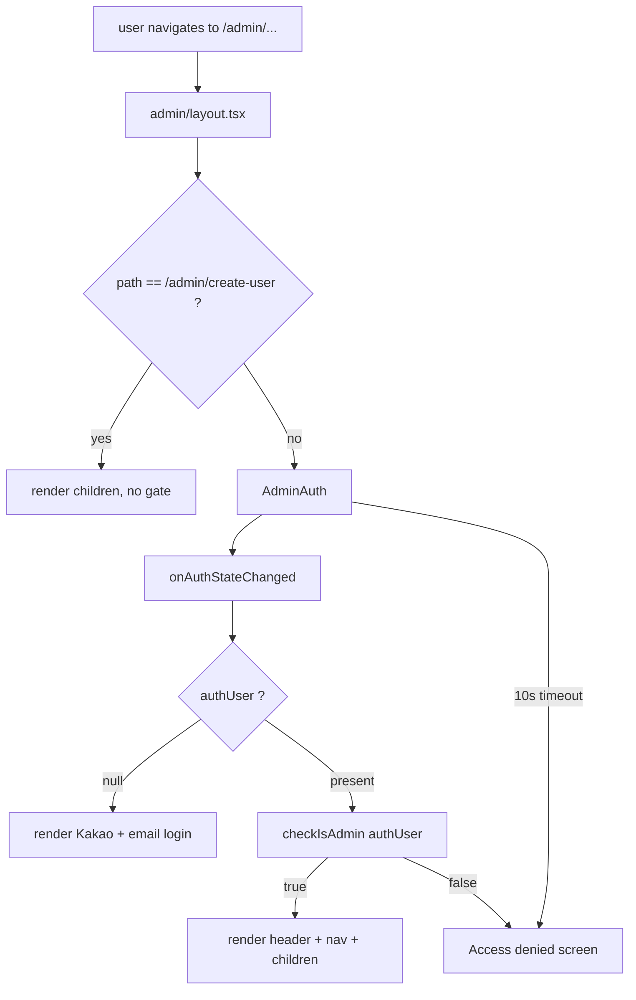
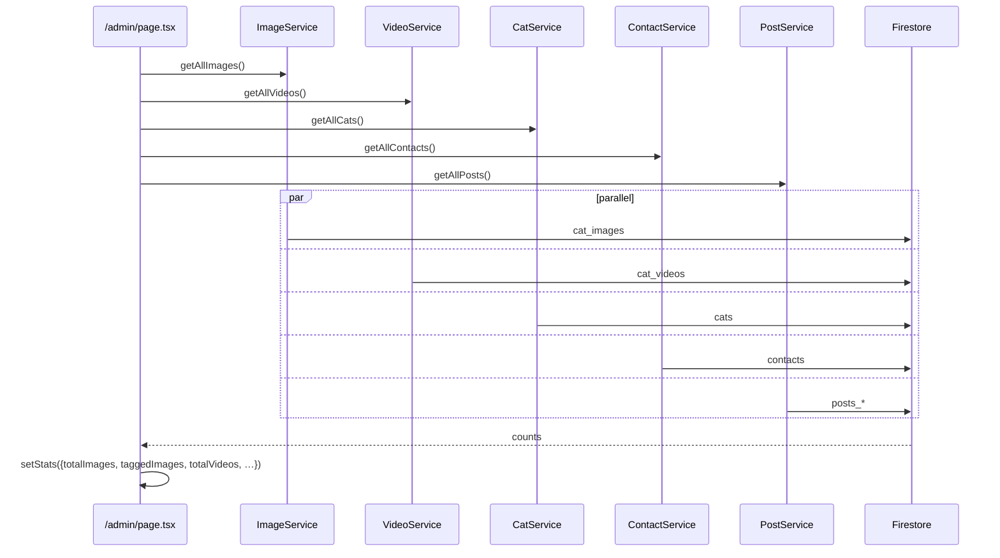
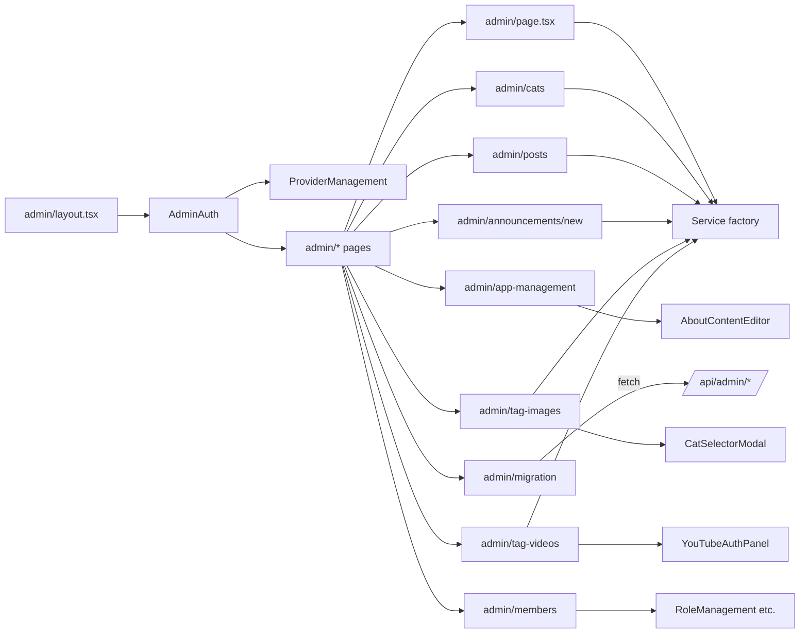

# admin-platform

> Part of: [Codebase Overview](CODEBASE_OVERVIEW.md)

## Purpose

The `/admin` section of the app: a CMS-style platform for the people running the mountain.
Pages exist for cats, posts, announcements, photo tagging, video tagging, app management,
member/role management, and one-shot data migrations. Every admin route is wrapped in an
`AdminAuth` component that enforces a Firebase login plus an admin check before rendering
the content.

## Key Components

| Component                | File(s)                                                                                                                                                                                 | Responsibility                                                                                                                                                                                                                                                                                                                                    |
| ------------------------ | --------------------------------------------------------------------------------------------------------------------------------------------------------------------------------------- | ------------------------------------------------------------------------------------------------------------------------------------------------------------------------------------------------------------------------------------------------------------------------------------------------------------------------------------------------- |
| Admin layout             | `src/app/admin/layout.tsx`                                                                                                                                                              | Top navigation (대쉬보드, 앱관리, 고양이 관리, 사진 관리, 동영상 관리, 게시물 관리, 사용자 관리). Some links are hard-coded as disabled (`/admin/points`, `/admin/winter-houses`) with an alert handler.                                                                                                                                          |
| `AdminAuth` gate         | `src/components/admin/AdminAuth.tsx`                                                                                                                                                    | Subscribes to `onAuthStateChanged`, calls `checkIsAdmin(authUser)` (`src/lib/auth/admin.ts`), renders an inline login (Kakao + email/password), shows error state with reload + emergency-bypass buttons, and on success renders the children + a sidebar `ProviderManagement`. Has 10s loading timeout and a dev-only "Emergency Bypass" button. |
| Dashboard                | `src/app/admin/page.tsx`                                                                                                                                                                | Real-time stats fetched via the service layer: `imageService`, `videoService`, `catService`, `contactService`, `postService`. Mounts `YouTubeAuthPanel`.                                                                                                                                                                                          |
| Cat CMS                  | `src/app/admin/cats/page.tsx`                                                                                                                                                           | Cat add/edit/delete/search interface backed by `getCatService()`.                                                                                                                                                                                                                                                                                 |
| Posts                    | `src/app/admin/posts/page.tsx`, `src/components/AdminPostList.tsx`, `AdminReplyList.tsx`, `AdminReplyItem.tsx`                                                                          | Multi-collection post management.                                                                                                                                                                                                                                                                                                                 |
| Announcements            | `src/app/admin/announcements/new/page.tsx`, `NewAnnouncementForm.tsx`                                                                                                                   | Create modal-popup announcements. Uses `announcement-service`.                                                                                                                                                                                                                                                                                    |
| Tag-images               | `src/app/admin/tag-images/page.tsx`, `src/components/admin/{ImageList, ImageEdit}.tsx`                                                                                                  | Batch tagging of photos with `CatSelectorModal`. Backed by `image-service`.                                                                                                                                                                                                                                                                       |
| Tag-videos               | `src/app/admin/tag-videos/page.tsx`, `src/components/admin/{VideoList, VideoEdit, YouTubeAuthPanelNew}.tsx`                                                                             | Batch metadata edit, YouTube playlist association, recording-date inference via `dateParser`.                                                                                                                                                                                                                                                     |
| Members / roles          | `src/app/admin/members/page.tsx`, `src/components/admin/{RoleManagement, RoleManagementDirect, RolePermissionConfig, ResourcePermissionConfig, PermissionManager, PermissionDebug}.tsx` | RBAC UI surface — see `permissions-and-roles.md`.                                                                                                                                                                                                                                                                                                 |
| App management           | `src/app/admin/app-management/page.tsx`, `src/components/admin/AboutContentEditor.tsx`                                                                                                  | Editing the about-page content document; refreshing static data.                                                                                                                                                                                                                                                                                  |
| Migration                | `src/app/admin/migration/page.tsx`                                                                                                                                                      | Dev utilities to invoke the `scripts/migration/*` jobs against current data.                                                                                                                                                                                                                                                                      |
| react-admin dataProvider | `src/lib/admin/dataProvider.ts`, `src/lib/admin/sampleData.ts`                                                                                                                          | A custom Firestore `dataProvider` for the `react-admin` library. Used in some admin surfaces (verify which).                                                                                                                                                                                                                                      |
| Admin check              | `src/lib/auth/admin.ts` `isAdmin(user)`                                                                                                                                                 | The authoritative admin gate consumed by `AdminAuth`.                                                                                                                                                                                                                                                                                             |

## Data Flow

<!-- ============================================================
     DIAGRAM STEP — Admin auth gate
     ============================================================ -->

<!-- END DIAGRAM STEP -->

<!-- ============================================================
     DIAGRAM STEP — Dashboard load
     ============================================================ -->

<!-- END DIAGRAM STEP -->

## Component Relationships

<!-- ============================================================
     DIAGRAM STEP — Admin component tree
     ============================================================ -->

<!-- END DIAGRAM STEP -->

## Key Patterns & Conventions

- **Single gate, multiple sub-pages.** All admin routes share the layout's `AdminAuth`
  wrapper; sub-pages don't re-check auth. The exception is `/admin/create-user` which is
  explicitly bypassed in the layout.
- **Inline-style + Tailwind mix.** The admin layout uses inline styles; many admin
  components use Tailwind. Don't over-refactor — maintain the local convention of each file.
- **Korean UI strings.** Nav labels and alerts are Korean (`사용자 관리`, `급식소 관리`,
  `기능은 아직 구현되지 않았습니다.`). Don't switch to English without coordination.
- **Disabled-link pattern.** Hard-coded `` with an alert handler is used to flag
  upcoming features (`급식소 관리`, `겨울집 관리`). When implementing one, replace the span
  with an `<a>` and remove the alert.
- **`AdminAuth` directly imports `auth`** from `services/firebase` rather than going through
  `useAuth()`. This is a pre-AuthProvider artifact; consolidating on `useAuth()` would
  remove the duplicate `onAuthStateChanged` subscription.
- **Stats fetched per-component, not centrally.** Each admin page calls service-layer
  factories itself. Add new admin pages by following the same pattern; don't introduce a
  shared `useAdminStats()` unless the duplication grows.
- **react-admin overlap.** `src/lib/admin/dataProvider.ts` exists for a `react-admin` shell;
  most admin pages bypass it and call services directly. Treat react-admin as legacy /
  partial — don't extend it without confirming usage.

## External Integrations

- **Firebase Auth + Admin SDK** — Login + admin gate; `get-all-users` API enumerates users
  via Admin SDK.
- **Firestore** — All CRUD goes through service-layer factories and lands in collection-
  specific docs (`cats`, `cat_images`, `cat_videos`, `posts_*`, `users`, `role_permissions`).
- **YouTube Data API v3** — Used by tag-videos and the dashboard's `YouTubeAuthPanel` for
  metadata refresh and playlist management.
- **Cloud Storage** — `app-management` and the migration page can trigger
  `/api/admin/update-static-data` which exports Firestore data to GCS.

## Watch-outs

- **Emergency-bypass UI is shipped.** The "🚨 Emergency Bypass (Dev Mode)" buttons in
  `AdminAuth` set local flags and warn `console.warn` but continue rendering. They were
  intended for dev only — gate behind `NODE_ENV !== 'production'` before relying on prod
  hardening.
- **Two auth listeners.** `AdminAuth` subscribes to `onAuthStateChanged` directly while the
  rest of the app reads via `AuthProvider`. Two listeners are harmless but the bypass paths
  in `AdminAuth` don't propagate state to `AuthProvider`.
- **`/admin/create-user` is unauthenticated.** The layout deliberately skips `AdminAuth` for
  this path. There is no source file at `src/app/admin/create-user/`; it's referenced from
  the gate but the actual page may be missing or moved. Verify before relying on it.
- **`AdminAuth` does not respect `isLoading`/`isAdmin` ordering perfectly.** The loading
  state has a hard 10s timeout; in slow environments this can flap to `Authentication
timeout` even on a valid login.
- **No admin-route gating on the API side.** `AdminAuth` only protects the UI. Anyone
  hitting `/api/admin/*` directly without a valid Firebase token can succeed if Firestore
  rules allow it. See `api-routes.md` watch-outs.
- **The disabled feature list is duplicated** in `layout.tsx`. Adding `급식소 관리` requires
  changing the layout, not just adding a route.
