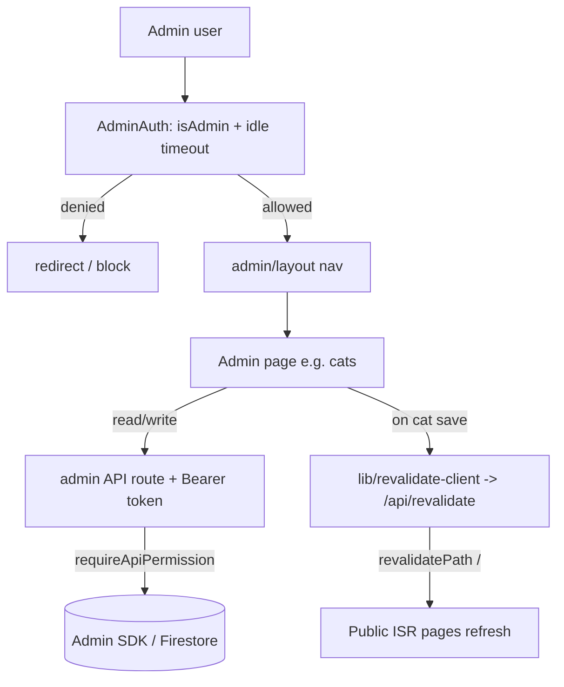
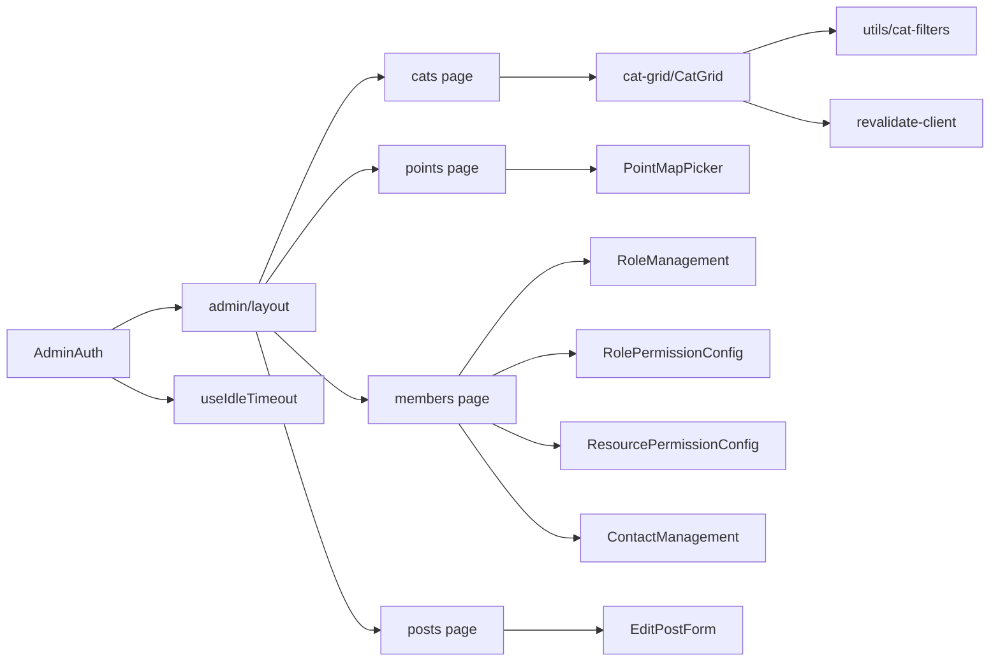

# Admin Platform

> Part of: [Codebase Overview](CODEBASE_OVERVIEW.md)

## Purpose

The `/admin` CMS: a permission-gated set of pages and components for directly managing
Firestore-backed content — cats, feeding-point locations, media (photos/videos), posts,
announcements, adoption promotions, members/roles, contact submissions, and the about page.
Everything edits Firestore live; no Google Sheets dependency.

## Key Components

| Component          | File(s)                                                                                                                                                                         | Responsibility                                                                                                                                                    |
| ------------------ | ------------------------------------------------------------------------------------------------------------------------------------------------------------------------------- | ----------------------------------------------------------------------------------------------------------------------------------------------------------------- |
| Admin gate         | `src/components/admin/AdminAuth.tsx`                                                                                                                                            | Wraps `/admin`; checks `isAdmin` and applies `useIdleTimeout` (auto sign-out)                                                                                     |
| Admin layout / nav | `src/app/admin/layout.tsx`                                                                                                                                                      | Top nav (대시보드, 앱관리, 고양이 관리, 급식소 관리, 겨울집 관리, 사진 관리, 동영상 관리, 게시물 관리, 사용자 관리, 소개)                                         |
| Dashboard          | `src/app/admin/page.tsx`                                                                                                                                                        | 산냥이집냥이 관리자 landing                                                                                                                                       |
| Cats CMS           | `src/app/admin/cats/page.tsx`, `src/components/admin/cat-grid/CatGrid.tsx`, `selectColumn.tsx`                                                                                  | Spreadsheet-style cat editing (`react-datasheet-grid`) with shared `cat-filters` search/filter; on save triggers ISR revalidation                                 |
| Points editor      | `src/app/admin/points/page.tsx`, `src/components/admin/PointMapPicker.tsx`                                                                                                      | Edit feeding-point coordinates via a map picker                                                                                                                   |
| App management     | `src/app/admin/app-management/page.tsx`                                                                                                                                         | App-level config / ops                                                                                                                                            |
| Posts              | `src/app/admin/posts/page.tsx`, `posts/edit/[postType]/[postId]/page.tsx`                                                                                                       | Manage/edit posts, announcements, adoption; dynamic edit route by post type                                                                                       |
| Announcements      | `src/app/admin/announcements/new/page.tsx`                                                                                                                                      | Create 공지사항                                                                                                                                                   |
| Adoption           | `src/app/admin/adoption/new/page.tsx`                                                                                                                                           | Create 입양홍보 posts                                                                                                                                             |
| Members / roles    | `src/app/admin/members/page.tsx`, `RoleManagement.tsx`, `RolePermissionConfig.tsx`, `ResourcePermissionConfig.tsx`, `ContactManagement.tsx`                                     | Tabs: 사용자 / 역할 / 권한 / 문의. See [permissions-and-roles](permissions-and-roles.md)                                                                          |
| Media tagging      | `src/app/admin/tag-images/page.tsx`, `tag-videos/page.tsx` (+ colocated `useYouTubeVideoMutations.ts`), shared toolkit `src/components/admin/media/`, `YouTubeAuthPanelNew.tsx` | Tag images/videos; YouTube auth panel. Both pages compose the shared media toolkit (2026-07 complexity retirement). See [media-and-youtube](media-and-youtube.md) |
| Migration          | `src/app/admin/migration/page.tsx`                                                                                                                                              | Placeholder — data migration now lives in the cats page                                                                                                           |
| About editor       | `src/components/admin/AboutContentEditor.tsx`                                                                                                                                   | Edit about-page content                                                                                                                                           |

## Data Flow

## Component Relationships

## Key Patterns & Conventions

- **Gated at the boundary**: `AdminAuth` is the single gate; pages assume an authenticated admin
  and additionally rely on `requireApiPermission` server-side for each mutation.
- **Korean-first strings centralized**: all admin copy lives in `src/constants/adminStrings.ts`,
  organized one area per admin surface (`nav`, `members`, `cats`, …). Add UI text there, not
  inline.
- **Spreadsheet editing**: the cats CMS uses `react-datasheet-grid`; filtering/sorting reuse the
  shared `cat-filters.ts` predicate so admin and the public `/cats` browser agree.
- **Edits refresh the public map immediately**: cat saves POST `/api/revalidate` (via
  `revalidate-client.ts`) so ISR doesn't wait out the 1h backstop.
- **Idle sign-out**: admin sessions log out after inactivity (`useIdleTimeout`).

## External Integrations

- **Firestore / Firebase Auth / Storage** via admin API routes (Admin SDK).
- **YouTube Data API v3** via the media/tagging surfaces.
- **Next.js ISR** via `/api/revalidate`.

## Watch-outs

- **Legacy admin components were removed**: `ImageEdit`, `ImageList`, `VideoEdit`, `VideoList`,
  `PermissionDebug`, `PermissionManager`, `RoleManagementDirect`. Don't reintroduce them — image
  tagging is `tag-images`, video tagging is `tag-videos`, and permission debugging UI was
  deleted intentionally.
- **The 겨울집 관리 (winter houses) nav item may be a stub/disabled** depending on feature flags —
  check `adminStrings.nav` and the page before assuming it's wired.
- The `migration` page is a **placeholder**; data migration actions now live on the cats page.
- Admin manual (operator "what do I click") lives in `docs/manuals/admin-manual/` — keep it in
  mind when field semantics change.
  </content>
