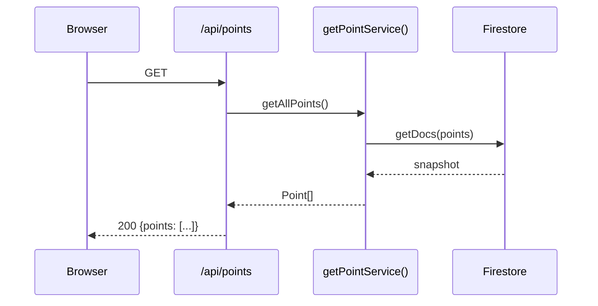
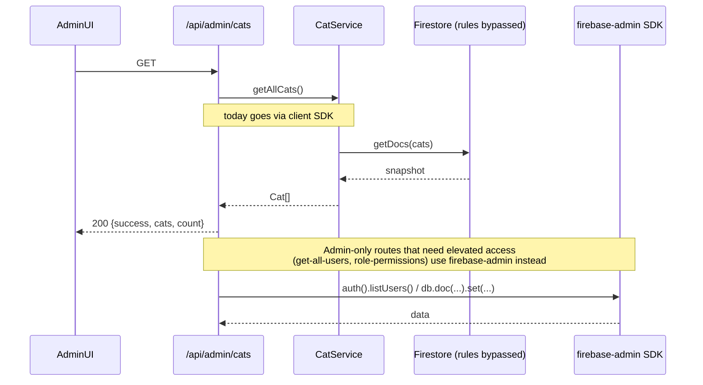
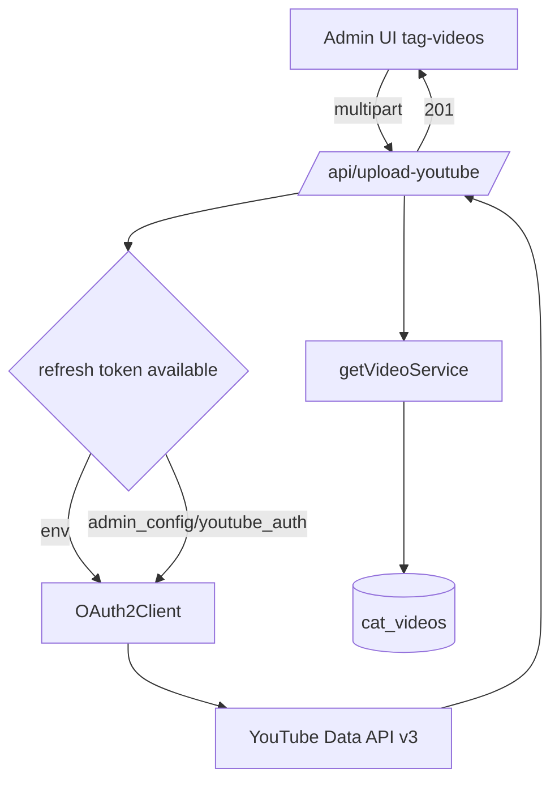
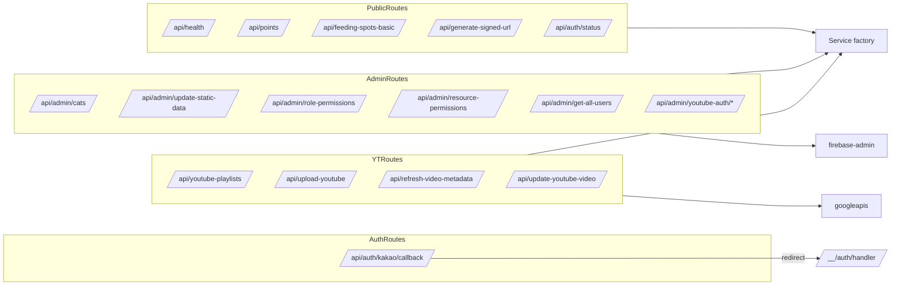

# api-routes

> Part of: [Codebase Overview](CODEBASE_OVERVIEW.md)

## Purpose

Server-side HTTP endpoints exposed via Next.js App Router under `src/app/api/**/route.ts`.
Three groups: **public read endpoints** (health, points, feeding spots, signed URLs),
**OAuth callbacks** (Kakao, YouTube), and **admin endpoints** that elevate via the Firebase
Admin SDK to do work that's not allowed by Firestore rules (user listing, role assignment,
static-data refresh, YouTube uploads). Routes generally delegate to the service layer; the
admin/Admin-SDK paths bypass it and use `firebase-admin` directly.

## Key Components

| Route                                    | File                                   | Method(s) | Responsibility                                                                                                                                                                |
| ---------------------------------------- | -------------------------------------- | --------- | ----------------------------------------------------------------------------------------------------------------------------------------------------------------------------- |
| `/api/health`                            | `health/route.ts`                      | GET, HEAD | Liveness probe used by Cloud Run / Vercel. Returns `status`, `uptime`, `environment`, `version`. The Cloud Run deploy workflow curls this after deploy.                       |
| `/api/auth/status`                       | `auth/status/route.ts`                 | GET       | Auth-service health check. Returns `{status, message}`.                                                                                                                       |
| `/api/auth/kakao/callback`               | `auth/kakao/callback/route.ts`         | GET       | Receives Kakao OIDC `code` + `state`, redirects to Firebase's `<authDomain>/__/auth/handler` to complete sign-in.                                                             |
| `/api/points`                            | `points/route.ts`                      | GET       | Returns all points via `getPointService().getAllPoints()`. Wraps in `{points}`.                                                                                               |
| `/api/feeding-spots-basic`               | `feeding-spots-basic/route.ts`         | GET       | Basic feeding-spots data using the Admin SDK service.                                                                                                                         |
| `/api/generate-signed-url`               | `generate-signed-url/route.ts`         | POST      | Creates a 15-minute Firebase Storage write-signed URL plus a public read URL. Initializes Firebase Admin via `applicationDefault()`. Uploads land under `uploads/<fileName>`. |
| `/api/generate-youtube-signed-url`       | `generate-youtube-signed-url/route.ts` | POST      | Same shape, but bound to YouTube-related upload paths.                                                                                                                        |
| `/api/youtube-playlists`                 | `youtube-playlists/route.ts`           | GET       | Lists the YouTube channel's playlists via `googleapis` + refresh-token OAuth. Returns `{playlists: []}` (200) on auth failure rather than 4xx.                                |
| `/api/manage-playlists`                  | `manage-playlists/route.ts`            | POST      | Add/remove videos from a playlist.                                                                                                                                            |
| `/api/manage-playlist-membership`        | `manage-playlist-membership/route.ts`  | POST      | Wraps add/remove with idempotency checks.                                                                                                                                     |
| `/api/fetch-playlists`                   | `fetch-playlists/route.ts`             | GET       | Sync playlist data into Firestore.                                                                                                                                            |
| `/api/upload-youtube`                    | `upload-youtube/route.ts`              | POST      | Stream a video upload to YouTube. Reads refresh token from env first, falls back to `admin_config/youtube_auth` Firestore doc.                                                |
| `/api/refresh-video-metadata`            | `refresh-video-metadata/route.ts`      | POST      | Sync YouTube video metadata back into Firestore.                                                                                                                              |
| `/api/update-youtube-video`              | `update-youtube-video/route.ts`        | POST      | Direct metadata update (title/description/tags).                                                                                                                              |
| `/api/test-youtube-auth`                 | `test-youtube-auth/route.ts`           | GET       | OAuth health check.                                                                                                                                                           |
| `/api/admin/cats`                        | `admin/cats/route.ts`                  | GET, POST | List all cats; POST has a placeholder Google-Sheets import (not implemented).                                                                                                 |
| `/api/admin/posts-collections`           | `admin/posts-collections/route.ts`     | GET       | List all `posts_*` collections + their counts.                                                                                                                                |
| `/api/admin/update-static-data`          | `admin/update-static-data/route.ts`    | POST      | Re-export Firestore → Cloud Storage static-data JSON (cats, points, feeding spots). One-click admin button.                                                                   |
| `/api/admin/role-permissions`            | `admin/role-permissions/route.ts`      | GET, POST | Read/update the role→permission matrix in Firestore.                                                                                                                          |
| `/api/admin/resource-permissions`        | `admin/resource-permissions/route.ts`  | GET, POST | Read/update resource (admin-page) → required-permission map; consumed by `useResourceAccess`.                                                                                 |
| `/api/admin/get-all-users`               | `admin/get-all-users/route.ts`         | GET       | Lists all Firebase Auth users via Admin SDK.                                                                                                                                  |
| `/api/admin/get-all-user-permissions[*]` | 8 variants                             | GET       | Joined view of users + their assigned roles/permissions. **Multiple debugging variants exist** (see Watch-outs).                                                              |
| `/api/admin/youtube-auth/auth-url`       | `admin/youtube-auth/auth-url/route.ts` | GET       | Generate the OAuth consent URL.                                                                                                                                               |
| `/api/admin/youtube-auth/callback`       | `admin/youtube-auth/callback/route.ts` | GET       | Exchange code for refresh token; persist to `admin_config/youtube_auth`.                                                                                                      |
| `/api/admin/youtube-auth/status`         | `admin/youtube-auth/status/route.ts`   | GET       | Whether YouTube OAuth is currently working.                                                                                                                                   |

## Data Flow

<!-- ============================================================
     DIAGRAM STEP — Public read example (points)
     ============================================================ -->

<!-- END DIAGRAM STEP -->

<!-- ============================================================
     DIAGRAM STEP — Admin elevated path
     ============================================================ -->

<!-- END DIAGRAM STEP -->

<!-- ============================================================
     DIAGRAM STEP — YouTube upload
     ============================================================ -->

<!-- END DIAGRAM STEP -->

## Component Relationships

<!-- ============================================================
     DIAGRAM STEP — Route → service map
     ============================================================ -->

<!-- END DIAGRAM STEP -->

## Key Patterns & Conventions

- **Service layer first.** Most routes call `getXxxService()` and return its result. Only
  routes that need admin privileges (`get-all-users`, `update-static-data`, signed URLs)
  reach for `firebase-admin` directly.
- **Errors logged + 500 with `{error}`.** Routes use try/catch, `console.error`, and
  `NextResponse.json({error}, {status: 500})`. YouTube routes notably return 200 with empty
  arrays on auth failure to keep the admin UI graceful.
- **Body shape**: typically `{success: boolean, ...payload, error?}`. There is no central
  zod/io-ts validator; bodies are read with `await request.json()` and used directly.
- **OAuth refresh-token loading.** YouTube routes use a two-step pattern: env first
  (`YOUTUBE_REFRESH_TOKEN`), then `admin_config/youtube_auth` Firestore doc. This lets an
  admin re-auth without redeploying.
- **Signed-URL routes use `applicationDefault()`** for `firebase-admin`. Locally that means
  `GOOGLE_APPLICATION_CREDENTIALS` must be set; on Cloud Run / Vercel it picks up the
  runtime service account.
- **No middleware-level auth gate.** Admin routes do not consistently verify a Firebase ID
  token. Some routes assume the caller has already gone through the admin UI; this is
  enforced by Firestore rules but not by route-level guards. New admin routes should
  explicitly verify `request.headers.authorization` against `firebase-admin/auth`.

## External Integrations

- **Firebase Admin SDK** (`firebase-admin`) — `getStorage().bucket(...)` for signed URLs;
  `auth().listUsers()` for user enumeration; `getFirestore()` for Firestore writes that
  bypass client rules.
- **YouTube Data API v3** (`googleapis`) — Playlists, video metadata, video upload.
- **Cloud Storage** — Static-data refresh writes JSON into the project's GCS bucket.
- **Firebase Storage** — Signed write URLs for image and video uploads.

## Watch-outs

- **8 `get-all-user-permissions*` variants exist.** `simple`, `working`, `live`, `real`,
  `fixed`, `final`, `client`, plus the unsuffixed one. Stale debugging artifacts. The admin
  UI consumes one specific path — verify with grep before deleting.
- **No request validation library.** Routes parse `await request.json()` and pass fields
  through. A future mistake (missing field, wrong type) is silently propagated. Consider
  adding zod schemas at the boundary.
- **Admin routes lack consistent auth.** Some routes assume the caller is admin without
  verifying. For multi-tenant production, every admin route should verify the bearer's
  `email` / `currentRole.role` via Admin SDK before mutating.
- **`/api/health` returns 200 even if Firebase is unreachable** — the placeholder service
  checks are commented out. Don't rely on it as a true readiness probe; consider wiring
  in a Firestore ping for Cloud Run.
- **Signed-URL bucket fallback.** `generate-signed-url/route.ts` has a hard-coded
  fallback bucket (`mountaincats-61543.firebasestorage.app`). Multi-tenant deployment
  requires removing the fallback.
- **YouTube upload streams via `Readable`.** Large files held in memory; for big uploads,
  prefer YouTube's resumable upload protocol directly rather than buffering.
