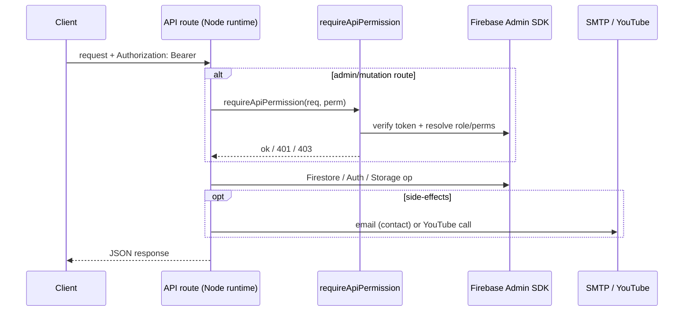
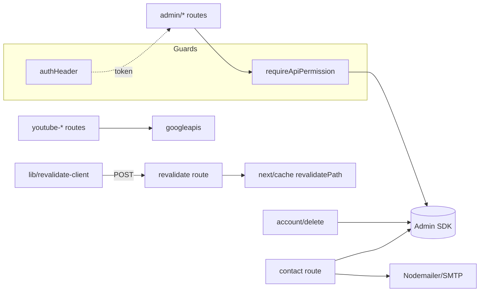

# API Routes

> Part of: [Codebase Overview](CODEBASE_OVERVIEW.md)

## Purpose

The Next.js App Router API surface under `src/app/api/**/route.ts`. These handlers run
server-side (Node runtime) and mostly use the Firebase **Admin SDK**, which bypasses Firestore
security rules — so admin/mutation routes enforce auth + permission themselves via
`requireApiPermission`. Routes cover admin CMS operations, auth callbacks, contact email,
account deletion, points, media/YouTube, signed URLs, and ISR revalidation.

## Key Components

| Group                | Route(s)                                                                                                                                                                          | Responsibility                                                                                  |
| -------------------- | --------------------------------------------------------------------------------------------------------------------------------------------------------------------------------- | ----------------------------------------------------------------------------------------------- |
| Account              | `account/delete`                                                                                                                                                                  | Member self-service hard-delete (Bearer token → uid). See [authentication](authentication.md)   |
| Admin — cats         | `admin/cats`                                                                                                                                                                      | Admin cat reads/writes (Admin SDK)                                                              |
| Admin — posts        | `admin/posts-collections`                                                                                                                                                         | Post/collection management for the CMS                                                          |
| Admin — permissions  | `admin/role-permissions`, `admin/resource-permissions`, `admin/get-all-user-permissions-client`                                                                                   | Read/write the live role & resource permission matrices                                         |
| Admin — YouTube auth | `admin/youtube-auth/{auth-url,callback,status}`                                                                                                                                   | YouTube OAuth handshake + status for the admin panel                                            |
| Auth                 | `auth/kakao/callback`, `auth/status`                                                                                                                                              | Kakao OIDC callback + auth status                                                               |
| Contact              | `contact`                                                                                                                                                                         | 동참/문의 submission: verify token → Admin-SDK write → SMTP email to `adminEmail`               |
| Points               | `points`                                                                                                                                                                          | Feeding-point data endpoint                                                                     |
| Feeding spots        | `feeding-spots-basic`                                                                                                                                                             | Basic feeding-station data                                                                      |
| Media — signed URLs  | `generate-signed-url`, `generate-youtube-signed-url`                                                                                                                              | Firebase Storage / YouTube upload signed URLs                                                   |
| Media — YouTube      | `fetch-playlists`, `manage-playlists`, `manage-playlist-membership`, `youtube-playlists`, `upload-youtube`, `update-youtube-video`, `refresh-video-metadata`, `test-youtube-auth` | YouTube playlist/video management. See [media-and-youtube](media-and-youtube.md)                |
| Revalidation         | `revalidate`                                                                                                                                                                      | On-demand ISR: admin cat mutation → `revalidatePath` for `BAKED_PATHS` (`/`, `/pages/adoption`) |

## Data Flow

## Component Relationships

## Key Patterns & Conventions

- **Node runtime for Admin SDK**: routes that verify ID tokens set `export const runtime =
'nodejs'` (Admin SDK can't run on edge).
- **Self-enforced auth**: because the Admin SDK bypasses Firestore rules, admin routes call
  `requireApiPermission(req, '<permission>')` and map its result to 401/403; the client attaches
  the token via `authHeader.ts`.
- **Token → identity, never the body**: routes derive the caller's uid from the verified Bearer
  token (e.g. `account/delete`, `contact`), never from request parameters.
- **No secret/PII logging**: contact/account routes explicitly avoid logging tokens or
  submitter PII.
- **Revalidation list stays in sync**: `revalidate`'s `BAKED_PATHS` must track the routes that
  read cats server-side (`cat-reads.ts` consumers).

## External Integrations

- **Firebase Admin SDK** (`src/lib/firebase-admin`) — Firestore, Auth, Storage from the server.
- **SMTP via Nodemailer** — outbound contact-form email (provider-agnostic; Gmail today).
- **YouTube Data API v3** (`googleapis`) — playlist and video management.
- **Next.js cache** (`next/cache` `revalidatePath`) — on-demand ISR.

## Watch-outs

- **A pile of duplicate routes was deleted.** The `get-all-user-permissions-{final,fixed,live,
real,simple,working}` family, `get-all-users`, `update-static-data`, and `health` are gone —
  only `admin/get-all-user-permissions-client` survives. Don't recreate throwaway variants;
  extend the surviving route or the service layer.
- `update-static-data` was removed with the static-data pipeline — there is no build-time data
  export anymore.
- Adding a new admin mutation route? It has **no protection** until you add
  `requireApiPermission` — the Admin SDK ignores Firestore rules.
  </content>
