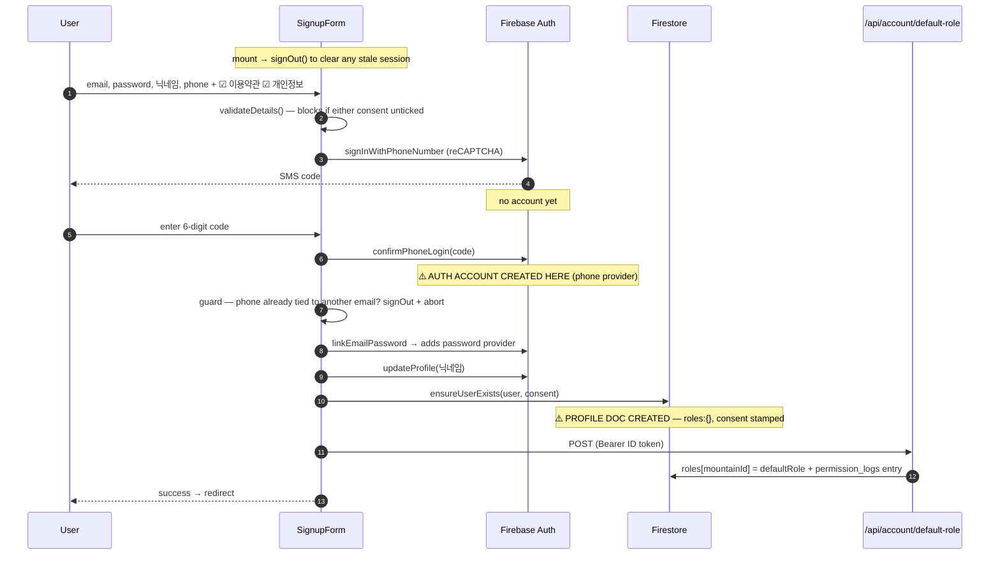
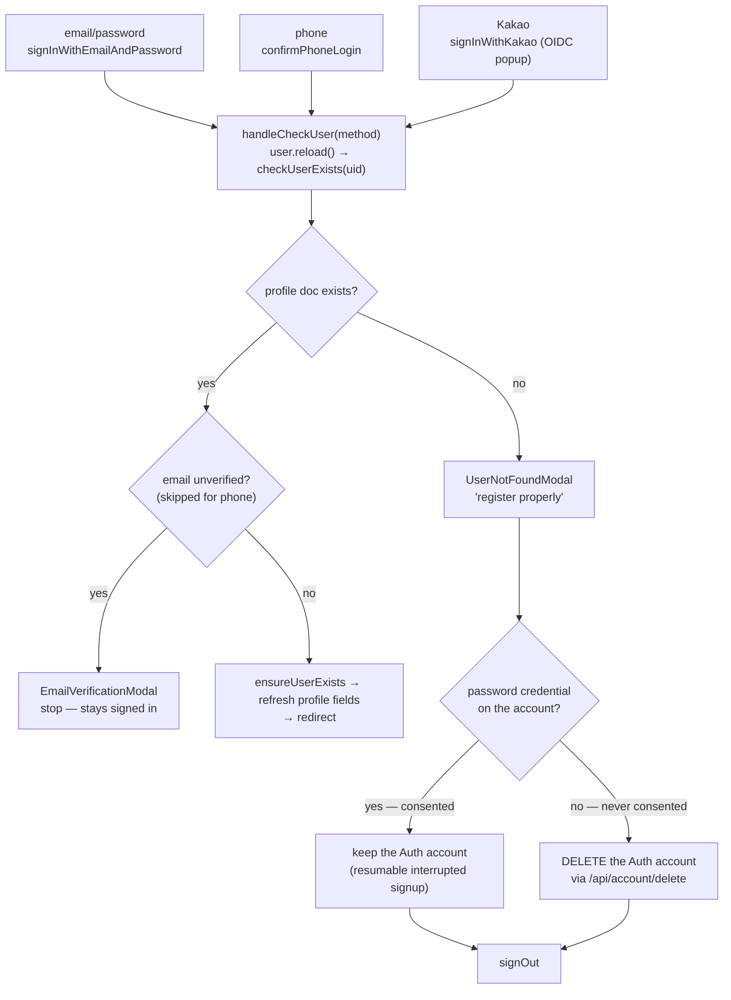
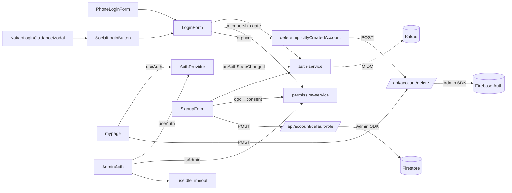

# Authentication

> Part of: [Codebase Overview](CODEBASE_OVERVIEW.md) · Sibling:
> [Permissions & Roles](permissions-and-roles.md)
>
> _Snapshot doc — verify against code before trusting specifics._
> **Last verified against the code: 2026-08-02.**

## Purpose

Identity across three Firebase Auth methods — **phone (SMS)**, **email/password**, and
**Kakao OIDC** — plus account linking, reauthentication, profile changes, and member
self-service withdrawal. A single `AuthProvider` exposes the current user and linked
providers to the whole tree.

---

## 0. The one idea to hold onto: an Auth account is not a membership

There are **two separate records**, created at different moments by different code, and most
of the subtlety in this area comes from the gap between them.

| Record                        | Store         | Holds                                                         | Created by                                        |
| ----------------------------- | ------------- | ------------------------------------------------------------- | ------------------------------------------------- |
| **Firebase Auth account**     | Firebase Auth | Credentials + identity (phone, email, password, linked Kakao) | Firebase, as a **side effect of authenticating**  |
| **`users/{uid}` profile doc** | Firestore     | Membership: 닉네임, roles, consent, profile mirror            | `PermissionService.ensureUserExists` (client SDK) |
| `permission_logs/{auto}`      | Firestore     | Audit entry per role change                                   | The two role-assignment API routes (Admin SDK)    |

**Being signed in does not make someone a member.** Phone and Kakao sign-in mint an Auth
account the instant authentication succeeds — there is no "authenticate but don't create"
mode — so the app can end up holding an Auth account for someone it has decided **not** to
admit. `LoginForm.handleCheckUser` is the gate that resolves this, and §3 covers what it does
with the leftover.

**The profile doc is the membership record.** Every gate that matters (admin access,
permissions, the members roster) reads `users/{uid}`, never the Auth account alone.

---

## 1. Key components

| Component           | File(s)                                                                                                 | Responsibility                                                                                 |
| ------------------- | ------------------------------------------------------------------------------------------------------- | ---------------------------------------------------------------------------------------------- |
| Auth context        | `src/components/auth/AuthProvider.tsx`                                                                  | `onAuthStateChanged` subscription; exposes `AuthState` + actions via `useAuth`                 |
| Auth service        | `src/services/auth-service.ts`                                                                          | Firebase Auth wrapper: sign in/out, phone flow, Kakao, link/unlink, reauth, email/phone update |
| Profile sync        | `src/services/permission-service.ts` → `ensureUserExists`                                               | Creates/refreshes `users/{uid}`; stamps consent **on create only**                             |
| Login host          | `src/components/LoginForm.tsx`                                                                          | Hosts **all three** login methods and owns the post-sign-in membership gate                    |
| Signup              | `src/components/SignupForm.tsx`                                                                         | 집사등록 — the **only** path that creates a membership                                         |
| Phone form          | `src/components/auth/PhoneLoginForm.tsx`                                                                | SMS request + confirm (login only; signup has its own phone step)                              |
| Social              | `src/components/SocialLoginButton.tsx`, `auth/KakaoLoginGuidanceModal.tsx`                              | Kakao entry + in-app-browser guidance                                                          |
| Auth modals         | `auth/EmailVerificationModal.tsx`, `PasswordResetModal.tsx`, `UserNotFoundModal.tsx`, `LogoutModal.tsx` | Shared `ui/Modal` flows                                                                        |
| Member self-service | `src/app/[mountain]/mypage/page.tsx`                                                                    | Profile edits, Kakao link/unlink, 회원탈퇴                                                     |
| Admin gate          | `src/components/admin/AdminAuth.tsx`                                                                    | Wraps `/admin`; layers an admin check + idle timeout on the shared auth state                  |
| Orphan cleanup      | `src/lib/auth/deleteImplicitlyCreatedAccount.ts`                                                        | Deletes an Auth account minted for someone refused membership                                  |
| Deletion API        | `src/app/api/account/delete/route.ts`                                                                   | Admin-SDK hard-delete of the caller's own doc + Auth account                                   |
| Default role API    | `src/app/api/account/default-role/route.ts`                                                             | Admin-SDK grant of the mountain's `defaultRole` at signup                                      |
| Policy version      | `src/constants/policy.ts`                                                                               | `POLICY_VERSION` stamped onto consent records; also renders 시행일 on both policy pages        |

---

## 2. 집사등록 (signup) — the only path that creates a membership

⚠️ **Signup is phone-first, not email-first.** This surprises nearly everyone reading the
code for the first time, and several downstream behaviours depend on it.
`validateDetails` requires a phone number, and the email-only
`authService.createUser` is exposed on the context but **called by no component** — so there
is no email-only registration.



**Where consent sits, and why the ordering matters.** Both checkboxes are required by
`validateDetails`, which runs in `handleSendCode` — _before_ the SMS is sent, and therefore
before the Auth account exists at the `confirmPhoneLogin` step. **Consent always precedes
account creation.** It is _recorded_ later, when the profile doc is created.

That ordering is load-bearing: it is what lets §3 conclude that anyone holding a password
credential consented, even when their profile doc is missing.

**Consent record shape** (`users/{uid}.consent`):

```jsonc
{
  "terms":   { "agreedAt": <timestamp>, "version": "2026-07-10" },
  "privacy": { "agreedAt": <timestamp>, "version": "2026-07-10" }
}
```

- Written **on doc creation only** — never on update. Overwriting the timestamp would
  falsify when consent was given. A re-consent flow for a policy revision **does not exist**
  and would be its own piece of work.
- `version` comes from `POLICY_VERSION`, which also renders 시행일 on both policy pages, so
  the displayed date and the stamped version cannot drift. **Bump it whenever either
  policy's substance changes.**
- 📌 Members created before **2026-08-01** have **no** consent record. Absent ≠ refused — it
  means "predates the feature."

**Default role.** The client cannot seed it: `firestore.rules` permits a self-create only
with an **empty** `roles` map, and that restriction is exactly what makes self-escalation
impossible. So the doc is created with `roles: {}` and `POST /api/account/default-role` then
stamps the mountain's configured `defaultRole` (`viewer`) via the Admin SDK. The route takes
the uid from the verified token, reads the role from config rather than the request, and
refuses if a role already exists. Failure is **non-fatal** — the account is complete either
way and an admin can assign a role.

---

## 3. Login — three methods, one gate

All three converge on `LoginForm.handleCheckUser(method)`. **This is the single most
important function in the auth area**: it decides whether an authenticated person is a
member.



**Implicit signup is refused by design.** A person with no profile doc is shown
`UserNotFoundModal` and signed out — the code comment is explicit: _"Requirement: Do not
allow account creation via Google/Kakao implicitly."_ They are sent to 집사등록, which
captures consent. **This is why the login surfaces have no consent checkboxes and need
none.**

**The orphan, and why the test is the credential.** Phone and Kakao sign-in already created
an Auth account by this point. Signing out would strand it holding PII (phone number, or the
Kakao email/닉네임) with no consent, no profile doc, and nothing to ever remove it — retention
with no PIPA basis. So it is deleted, reusing `POST /api/account/delete`.

⚠️ **The decision hinges on `providerData` containing `'password'`, not on which button they
pressed.** Because signup is phone-first (§2), someone whose signup was interrupted after the
email-link step holds a password and **did** consent; their profile doc simply never got
written, and that state is resumable — re-running 집사등록 with the same email+phone completes
idempotently. Gating on the login _method_ would have deleted exactly those people whenever
they happened to sign in by phone.

**Error handling here is deliberately asymmetric.** The `catch` around `handleCheckUser`
must **not** sign anyone out: a failed Firestore read is "couldn't verify", not "no such
member", and logging someone out on a transient read failure was a real past bug. For the
same reason `deleteImplicitlyCreatedAccount` logs without re-raising — propagating would
strand a live session for someone just refused membership. Both departures are commented at
their sites.

**Kakao specifics.** Sign-in is an OIDC popup with **no explicit scopes** — all three
`addScope` calls are commented out, so the app receives whatever the Kakao Developers console
has configured as consent items. A failure that looks like a user-creation error triggers a
fallback: create an anonymous user, then `linkWithPopup` the Kakao credential onto it.
In-app browsers (KakaoTalk's own webview) get `KakaoLoginGuidanceModal` steering the user to
an external browser first.

---

## 4. What gets written, on which event

| Event                               | Firebase Auth                      | `users/{uid}`                                       | `permission_logs`          |
| ----------------------------------- | ---------------------------------- | --------------------------------------------------- | -------------------------- |
| 집사등록 — SMS code sent            | —                                  | —                                                   | —                          |
| 집사등록 — code confirmed           | **account created** (phone)        | —                                                   | —                          |
| 집사등록 — email linked             | password provider added            | —                                                   | —                          |
| 집사등록 — profile sync             | displayName set                    | **doc created**: profile, `roles: {}`, **consent**  | —                          |
| 집사등록 — default role             | —                                  | `roles[mountainId] = viewer`                        | `role-assigned` (`system`) |
| Login, member                       | —                                  | profile fields refreshed (**never** consent)        | —                          |
| Login, no profile doc, no password  | **account deleted**                | —                                                   | —                          |
| Login, no profile doc, has password | kept                               | —                                                   | —                          |
| mypage — 닉네임 change              | displayName set                    | profile fields refreshed                            | —                          |
| mypage — email change               | reauth → `verifyBeforeUpdateEmail` | on next login sync                                  | —                          |
| mypage — phone change               | reauth → `updatePhoneNumber`       | refreshed via `ensureUserExists`                    | —                          |
| mypage — Kakao link / unlink        | provider added / removed           | —                                                   | —                          |
| mypage — **회원탈퇴**               | **account deleted**                | **doc deleted**                                     | —                          |
| Admin assigns a role                | —                                  | `roles[mountainId]` set, prior role → `roleHistory` | `role-assigned`            |

📌 **`ensureUserExists` refreshes only profile mirror fields on update** (email, displayName,
photoURL, phoneNumber, emailVerified). It never touches `roles` — the self-write rule forbids
changing them — and never touches `consent`.

---

## 5. Roles and the admin gate

Roles are a **map keyed by `mountainId`** (`roles: Record<mountainId, UserRole>`), so one
account can hold roles on several mountains and the active tenant picks which applies. Full
treatment in [`permissions-and-roles.md`](permissions-and-roles.md); what matters here:

- **`AdminAuth` gates `/admin`** on `isAdmin(user, mountainId)`, which is true when the user
  holds **any** of `manage-cats` / `manage-posts` / `manage-users` / `manage-settings` on that
  mountain.
- ⚠️ **`viewer` is not permission-less** — it carries `view-video` + `view-photo`. It is
  merely _equivalent_ to no-role today, because public content is not gated on them. So the
  new default role does **not** open the admin gate, but do not assume "viewer == nothing" when
  changing the matrix.
- `isAdmin` **re-throws** on a failed permission read: "couldn't verify" must not collapse to
  "not an admin", or a transient Firestore failure bounces a legitimate admin.
- **Idle timeout is admin-only** — 24 h, wired into `AdminAuth` via `useIdleTimeout`. Regular
  member sessions do not expire on idle.

---

## 6. 회원탈퇴 (withdrawal)

`mypage` → confirm modal → `POST /api/account/delete` with a Bearer ID token → **Firestore
doc deleted, then the Auth account**. Both stores, so email / phone / 닉네임 are removed from
each.

- The uid comes from the **verified token, never the body** — a caller can only ever delete
  themselves.
- **Doc first, deliberately**: if the Auth delete then fails, we have not orphaned an Auth
  account that can no longer reach its own doc.
- Immediate hard delete, per the privacy policy's 탈퇴 시 즉시 삭제 retention clause.
- **Authored posts are left in place** — they are content, not account PII.

---

## 7. Component relationships



---

## 8. Key patterns & conventions

- **One context, many flags.** `AuthState` carries per-operation Kakao states (signing-in /
  linking / unlinking) with their own error/success flags, so UI reacts without duplicating
  local state.
- **`onAuthStateChanged` does _not_ sync the profile doc.** It only sets `user` +
  `providerData`. `ensureUserExists` is called explicitly — by `LoginForm`, `SignupForm`, and
  `AuthProvider`'s `updateProfile` / `updatePhoneNumber` actions (which mypage invokes). That
  is why there is **no race** between the listener and the login-path membership check: nothing
  creates the profile doc behind `handleCheckUser`'s back.
- **Service-layer boundary.** Components call `getAuthService()` / `getPermissionService()`,
  not the Firebase SDK directly.
- **Shared modal system.** Every auth flow uses `ui/Modal` primitives — no hand-rolled shells.
- **Reauth-aware mutations.** Sensitive changes go through
  `reauthenticateWithType('password' | 'phone', …)` before `verifyBeforeUpdateEmail` /
  `updatePhoneNumber`.
- **Never log PII.** Auth logs carry `uid` (opaque) and provider ids only. Logging
  `email` / `displayName` / `phoneNumber` — or dumping `providerData`, which contains them —
  was a real defect fixed 2026-08-01.

---

## 9. External integrations

- **Firebase Auth** — phone (SMS via reCAPTCHA verifier), email/password, session state.
- **Kakao OIDC** — Korean social login (`NEXT_PUBLIC_KAKAO_*`).
- **Firebase Admin SDK** — server-side account deletion and default-role assignment.

⚠️ The **`mountain-cats-users` "central user service" project no longer exists** — that
scaffolding was removed in the multi-tenant M2 phase. One Firebase project serves every
mountain. (An earlier revision of this doc listed it; it was stale.)

---

## 10. Watch-outs

- 🔑 **Signup is phone-first.** Phone verification creates the Auth account; email/password is
  linked onto it afterwards. Reason about every "who has an account" question from there.
- 🔑 **An Auth account without a profile doc is not a member** — and may be an orphan the
  login gate is about to delete. Never infer membership from `auth.currentUser`.
- ⚠️ **Kakao and phone cannot create a membership.** Kakao is an **add-on**, linked from
  mypage after an account exists. Changing the `UserNotFoundModal` branch would silently turn
  either into an unconsented signup path.
- ⚠️ **Consent is recorded on create only.** Any future "re-consent on policy change" needs a
  new mechanism; do not repurpose `ensureUserExists`.
- ⚠️ **`firestore.rules` requires `roles` to be empty on self-create and unchanged on
  self-update.** That is the anti-escalation invariant. Anything that needs to write a role
  must go server-side through the Admin SDK.
- ⚠️ **Two error-handling departures from the repo's log-and-rethrow rule live here**, both
  intentional and both commented: `handleCheckUser`'s catch must not sign anyone out, and
  `deleteImplicitlyCreatedAccount` must not propagate. Conversely `isAdmin` **does** re-throw,
  for the mirror-image reason.
- ⚠️ **Kakao requests no explicit scopes** — received fields depend entirely on the Kakao
  Developers console. Documenting them is an open compliance item (PROJECT_PLAN §8).
- **`auth-service.ts` is ~700 lines** covering the whole link/reauth surface — search it
  before adding a new method.
- ⏳ **Emulators cannot exercise Kakao, SMS, or the orphan-delete path.** Those need a live
  verification pass with real credentials; automated suites will stay green regardless.
  ✅ **A real Kakao sign-in passed in production 2026-08-08** (owner). ⏳ **The orphan-delete path
  is still unverified** — it needs an identity that has never registered, and its visible half
  (`UserNotFoundModal` → 집사등록 → sign-out) looks the same either way, since the helper logs
  without re-raising. The check is the **Firebase Console Authentication user list**.
