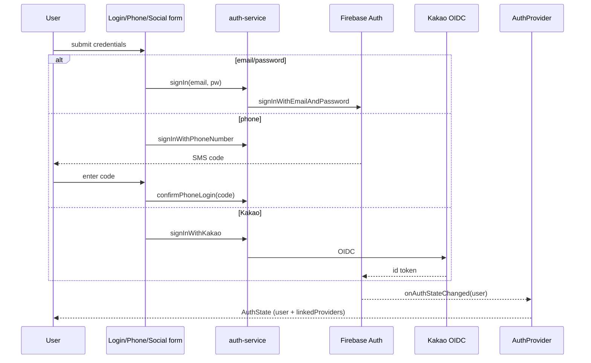
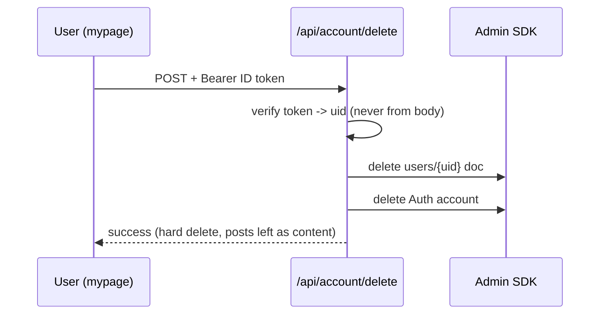
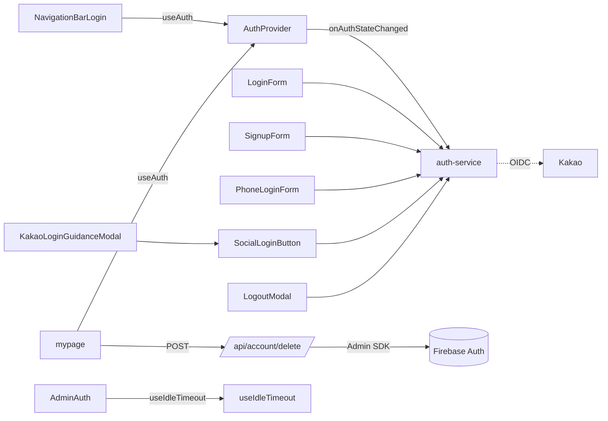

# Authentication

> Part of: [Codebase Overview](CODEBASE_OVERVIEW.md)

## Purpose

Handles user identity across three Firebase Auth methods — email/password, phone (SMS), and
Kakao OIDC — plus account linking/unlinking, reauthentication, email change, verification, and
member self-service (profile, account deletion). A single `AuthProvider` context exposes the
current user and linked providers to the whole tree.

## Key Components

| Component            | File(s)                                                                                                 | Responsibility                                                                                                                                                   |
| -------------------- | ------------------------------------------------------------------------------------------------------- | ---------------------------------------------------------------------------------------------------------------------------------------------------------------- |
| Auth context         | `src/components/auth/AuthProvider.tsx`                                                                  | `onAuthStateChanged` subscription; exposes `AuthState` (user, linked providers, Kakao op/error/success flags) via context + `useAuth`                            |
| Auth service         | `src/services/auth-service.ts`                                                                          | Firebase Auth wrapper: sign in/out, create user, phone flow, Kakao sign-in, link/unlink provider, reauth, email/phone update, password reset, email verification |
| Login page           | `src/app/login/page.tsx`, `src/app/pages/login/page.tsx`                                                | Login entry; hosts email/phone forms + social buttons                                                                                                            |
| Email/password       | `src/components/LoginForm.tsx`, `SignupForm.tsx`                                                        | Email login and signup (signup includes consent per compliance)                                                                                                  |
| Phone login          | `src/components/auth/PhoneLoginForm.tsx`                                                                | SMS code request + confirm (`signInWithPhoneNumber` → `confirmPhoneLogin`)                                                                                       |
| Social login         | `src/components/SocialLoginButton.tsx`, `auth/KakaoLoginGuidanceModal.tsx`                              | Kakao OIDC entry + in-app-browser guidance                                                                                                                       |
| Auth modals          | `auth/EmailVerificationModal.tsx`, `PasswordResetModal.tsx`, `UserNotFoundModal.tsx`, `LogoutModal.tsx` | Shared `ui/Modal`-based flows for verification, reset, not-found, and logout confirmation                                                                        |
| Nav auth chrome      | `auth/NavigationBarLogin.tsx`, `NavigationBarLogout.tsx`                                                | Logged-in/out navigation pills                                                                                                                                   |
| Idle timeout         | `src/hooks/useIdleTimeout.ts`                                                                           | Activity-tracked idle logout; wired into `AdminAuth` for admin sessions                                                                                          |
| Member self-service  | `src/app/mypage/page.tsx`, `mypage/layout.tsx`                                                          | Profile management + account withdrawal (탈퇴) trigger                                                                                                           |
| Account deletion API | `src/app/api/account/delete/route.ts`                                                                   | Admin-SDK hard-delete of the caller's own `users/{uid}` doc + Auth account (PIPA data-subject right)                                                             |

<!-- ============================================================
     DIAGRAM STEP — Data Flow
     Current tool: Mermaid
     ============================================================ -->

## Data Flow

## Component Relationships

## Key Patterns & Conventions

- **One context, many flags**: `AuthState` carries not just `user` but per-operation Kakao
  states (signing-in / linking / unlinking) and their error/success flags, so UI can react to
  OAuth operations without local state duplication.
- **Service-layer boundary**: components call `getAuthService()` methods, never the `firebase`
  SDK directly.
- **Shared modal system**: every auth flow (verification, reset, not-found, logout) uses the
  shared `ui/Modal` primitives — no hand-rolled modal shells.
- **Reauth-aware mutations**: sensitive changes (email/phone update) go through
  `reauthenticateWithType('password' | 'phone', …)` then `verifyBeforeUpdateEmail` /
  `updatePhoneNumber`.

## External Integrations

- **Firebase Auth** — email/password, phone (SMS via reCAPTCHA verifier), session state.
- **Kakao OIDC** — Korean social login (`NEXT_PUBLIC_KAKAO_*`). In-app browsers get a guidance
  modal steering users to an external browser.
- **`mountain-cats-users` project** — the centralized auth/user-management Firebase project
  (see `mountains.json` `_meta.centralUserService`).
- **Firebase Admin SDK** — server-side account deletion (`/api/account/delete`).

## Watch-outs

- **Account deletion trusts only the verified ID token**, never the request body — the uid to
  delete comes from the decoded Bearer token, so a caller can only ever delete themselves. It
  is an **immediate hard delete** of account PII (email/phone/닉네임) per the privacy policy
  retention clause; authored posts are content and are left in place.
- **Idle timeout lives in the hook but is only wired into `AdminAuth`** — admin sessions
  auto-logout after inactivity. If you want it for regular users, wire the hook there too.
- Phone login depends on a reCAPTCHA app verifier; the `appVerifier` is passed through
  `signInWithPhoneNumber`.
- `auth-service.ts` is large (~700 lines) and covers the full linking/reauth surface — search
  it before adding a new auth method to avoid duplicating an existing flow.
  </content>
