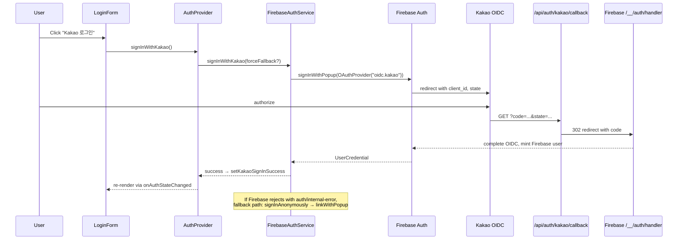
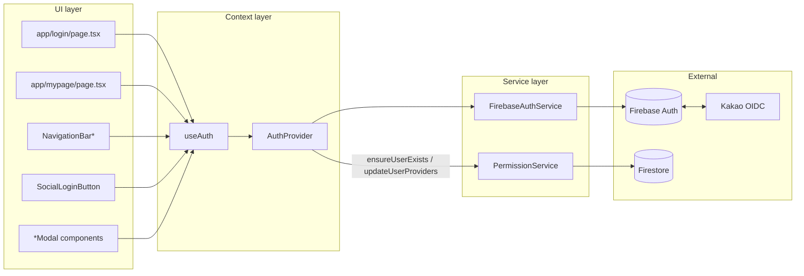

# authentication

> Part of: [Codebase Overview](CODEBASE_OVERVIEW.md)

## Purpose

User identity for the platform. Wraps Firebase Auth with a service layer and a React Context
provider so every component reads the same user/loading/provider state. Supports
email+password, phone (SMS) for Korean users, and Kakao OIDC social login. Also handles
account-management flows: provider linking/unlinking, profile updates, email change with
re-verification, phone-number change, and password reset.

## Key Components

| Component                                       | File(s)                                                                                                             | Responsibility                                                                                                                                                                                                                                                           |
| ----------------------------------------------- | ------------------------------------------------------------------------------------------------------------------- | ------------------------------------------------------------------------------------------------------------------------------------------------------------------------------------------------------------------------------------------------------------------------ |
| Firebase Auth init                              | `src/services/firebase.ts`                                                                                          | Initializes the Firebase app + `Auth` instance with explicit `browserLocalPersistence` (avoiding indexedDB which caused 48s delays). SSR uses `inMemoryPersistence`.                                                                                                     |
| `FirebaseAuthService`                           | `src/services/auth-service.ts` (~726 lines)                                                                         | `IAuthService` impl. Email/password sign-in, phone OTP, Kakao OIDC via `signInWithPopup` + anonymous-user fallback, provider linking/unlinking, profile/email/phone/password updates.                                                                                    |
| `AuthProvider` + `useAuthContext`               | `src/components/auth/AuthProvider.tsx`                                                                              | Single React Context. Subscribes to `onAuthStateChanged`, derives `linkedProviders` and `canLinkKakao`, exposes loading/error/success flags per OAuth operation. Calls `permissionService.ensureUserExists` on profile updates and `updateUserProviders` on link/unlink. |
| `useAuth` hook                                  | `src/hooks/useAuth.ts`                                                                                              | Thin re-export of `useAuthContext` for backward compatibility.                                                                                                                                                                                                           |
| Login page                                      | `src/app/login/page.tsx`                                                                                            | Tabbed login/signup screen. Wraps the form in `<Suspense>` because it reads `useSearchParams` (`tab`, `redirect`). `dynamic = 'force-dynamic'`.                                                                                                                          |
| `LoginForm` / `SignupForm` / `PhoneLoginForm`   | `src/components/LoginForm.tsx`, `SignupForm.tsx`, `auth/PhoneLoginForm.tsx`                                         | Email/password and phone OTP UIs.                                                                                                                                                                                                                                        |
| `SocialLoginButton` + `KakaoLoginGuidanceModal` | `src/components/SocialLoginButton.tsx`, `auth/KakaoLoginGuidanceModal.tsx`                                          | Kakao entry point and helper modal that explains the in-app browser limitation.                                                                                                                                                                                          |
| Account modals                                  | `src/components/auth/{EmailVerification,PasswordReset,Logout,UserNotFound}Modal.tsx`                                | Self-service account flows.                                                                                                                                                                                                                                              |
| Navigation auth state                           | `src/components/auth/NavigationBarLogin.tsx`, `NavigationBarLogout.tsx`                                             | Renders nav buttons based on `isAuthenticated`.                                                                                                                                                                                                                          |
| My-page                                         | `src/app/mypage/page.tsx`, `layout.tsx`                                                                             | Account dashboard. Uses `reauthenticateWithType`, `verifyBeforeUpdateEmail`, `updatePhoneNumber`, `linkKakaoProvider`, `unlinkProvider`.                                                                                                                                 |
| Kakao callback API                              | `src/app/api/auth/kakao/callback/route.ts`                                                                          | Receives Kakao's `code`, redirects to Firebase's OIDC handler at `<authDomain>/__/auth/handler`.                                                                                                                                                                         |
| Auth status API                                 | `src/app/api/auth/status/route.ts`                                                                                  | Health check endpoint for the auth service.                                                                                                                                                                                                                              |
| OAuth utilities                                 | `src/utils/oauth.ts`                                                                                                | OAuth state CSRF storage, success/error handling.                                                                                                                                                                                                                        |
| Auth tests                                      | `src/utils/auth-integration-test.ts`, `src/utils/kakao-auth-test.ts`, `test_admin_api.js`, `test-kakaotalk-auth.js` | Manual / scripted verification helpers (not unit tests).                                                                                                                                                                                                                 |

## Data Flow

<!-- ============================================================
     DIAGRAM STEP — Data Flow (Kakao OIDC)
     ============================================================ -->



<!-- END DIAGRAM STEP -->

<!-- ============================================================
     DIAGRAM STEP — Data Flow (Email + Permissions)
     ============================================================ -->

```mermaid
flowchart TD
    Login[LoginForm submit] --> SignIn[authService.signIn email,password]
    SignIn --> FbAuth[(Firebase Auth)]
    FbAuth -->|onAuthStateChanged| Ctx[AuthProvider effect]
    Ctx --> GetProviders[authService.getProviderData]
    GetProviders --> SetState[setUser, setProviderData, setLinkedProviders]
    SetState --> EnsureUser[permissionService.ensureUserExists]
    EnsureUser --> Firestore[(Firestore: users/{uid})]
    SetState --> UI[UI re-renders with isAuthenticated]
```

<!-- END DIAGRAM STEP -->

## Component Relationships

<!-- ============================================================
     DIAGRAM STEP — Component Relationships
     ============================================================ -->



<!-- END DIAGRAM STEP -->

## Key Patterns & Conventions

- **Single source of auth state.** The `AuthProvider` effect is the only place
  `onAuthStateChanged` is subscribed to. Components must read state via `useAuth()` /
  `useAuthContext()` rather than `auth.currentUser`. (Some legacy components still touch `auth`
  directly — minimize when found.)
- **Persistence is set at init time.** `initializeAuth(app, { persistence: browserLocalPersistence, popupRedirectResolver })`
  is in `src/services/firebase.ts`. SSR path uses `inMemoryPersistence`. The comment notes a
  prior 48-second hang caused by `indexedDBLocalPersistence` — keep `browserLocalPersistence`.
- **Per-operation OAuth state.** Each OAuth verb (sign-in, link, unlink) has its own
  `is*ing`, `*Error`, and `*Success` flags exposed by the context. UI doesn't manage its own
  pending state.
- **Kakao via OIDC.** Provider ID is `oidc.kakao` (configured in the Firebase Console). On
  certain `auth/internal-error` responses (`isKakaoUserCreationError`), the service falls back
  to `signInAnonymously` + `linkWithPopup` — anonymous user is `delete()`d if linking also fails.
- **Permissions sync on auth events.** After link / unlink / profile update, the provider
  calls `permissionService.ensureUserExists(user)` or `permissionService.updateUserProviders(uid, providers)`
  so the Firestore `users/{uid}` doc tracks linked providers in sync.
- **Login page is `force-dynamic`.** Required because `useSearchParams` is read; Next.js
  otherwise fails at build time.
- **`canLinkKakao` checks both provider IDs.** `oidc.kakao` (current) and `https://kakao.com`
  (legacy) — preserve both checks until all linked accounts have been migrated.

## External Integrations

- **Firebase Auth** — Email/password, phone (SMS), and OIDC sign-in. `signInWithPopup`
  primary path; `signInAnonymously` + `linkWithPopup` fallback.
- **Kakao OIDC** — Configured in the Firebase Console; client credentials and
  enable-flag come from `getKakaoOAuthConfig()` (env `NEXT_PUBLIC_KAKAO_*`).
- **`config/mountains/mountains.json` `_meta.centralUserService`** — Future state: a
  separate Firebase project (`mountain-cats-users`) holds the user/auth source of truth for
  cross-mountain access. Not active in code today; see `multi-tenant-config.md`.
- **Firestore `users/{uid}`** — Synced by `PermissionService.ensureUserExists` and
  `updateUserProviders`.

## Watch-outs

- **Verbose `console.log` in the Kakao flow.** `auth-service.ts` logs detailed OAuth state
  for debugging. It tries to redact secrets (`***HIDDEN***`) but be cautious before turning
  on production log forwarding. Replace with structured logging per CLAUDE.md guidance.
- **Anonymous-user cleanup on link failure depends on `auth.currentUser?.isAnonymous`** —
  if anything in the linking flow has already promoted the user, the cleanup is skipped.
- **Phone auth uses reCAPTCHA v3 invisibly** — `auth.currentUser` and `RecaptchaVerifier` are
  imported in `mypage/page.tsx`. There is no captcha enterprise / app-check fallback.
- **`oidc.kakao` vs `https://kakao.com`** — both provider IDs are checked; `c7a5d88` (recent
  commit) normalized one path. New code should always use `oidc.kakao`.
- **No automated auth tests.** `src/utils/*-test.ts` and root-level `test-kakaotalk-auth.js`,
  `test_admin_api.js` are manual scripts. Real test coverage is missing.
- **Email change re-auth path.** `mypage/page.tsx` walks the user through `password-reauth →
input-new → verification-sent`. Switching providers mid-flow can leave UI state inconsistent.
