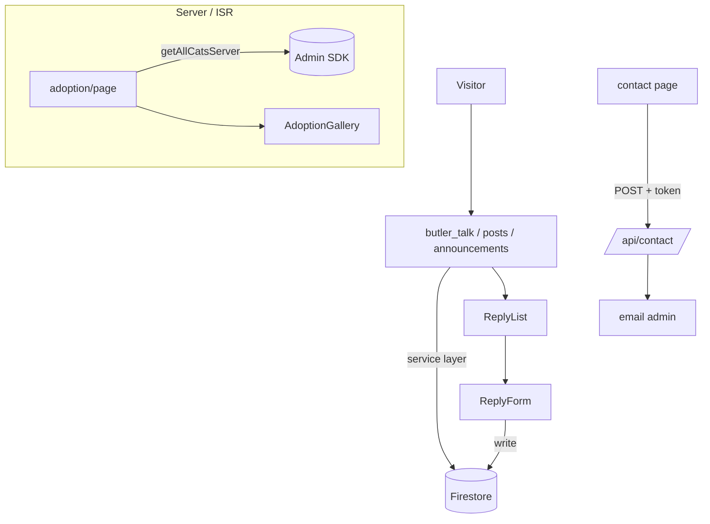

# Community Pages

> Part of: [Codebase Overview](CODEBASE_OVERVIEW.md)

## Purpose

The user-facing pages outside the map: content feeds (butler talk/stream, posts,
announcements), the adoption gallery, informational pages (about, faq, contact, privacy,
terms), and member self-service (mypage). Includes the shared post/reply system and site chrome
(Footer, nav dropdown).

## Key Components

| Component        | File(s)                                                                                                                     | Responsibility                                                                                      |
| ---------------- | --------------------------------------------------------------------------------------------------------------------------- | --------------------------------------------------------------------------------------------------- |
| Adoption gallery | `src/app/pages/adoption/page.tsx`, `AdoptionGallery.tsx`, `components/AdoptionPromotionClient.tsx`                          | 입양홍보 — server-read cats flagged `adoptable` on circular cards + accordion promotion posts (ISR) |
| Butler talk      | `src/app/pages/butler_talk/{page,new}.tsx`, `ButlerTalkClient.tsx`, `NewButlerTalkForm.tsx`                                 | 집사톡 feed + **the platform's media composer** (photo + YouTube video)                             |
| Butler stream    | `src/app/pages/butler_stream/{page,new}.tsx`, `ButlerStreamClient.tsx`, `NewPostForm.tsx`                                   | 집사게시판 — a 급식소 check-in log. ⚠️ **Composes text only; no media upload** (see below)          |
| Posts            | `src/app/pages/posts/[id]/page.tsx`, `PostList.tsx`, `NewPostForm.tsx`, `EditPostForm.tsx`                                  | Generic post list/detail + create/edit                                                              |
| Announcements    | `src/app/pages/announcements/{page,[id]}.tsx`, `AnnouncementClient.tsx`, `AnnouncementModal.tsx`, `NewAnnouncementForm.tsx` | 공지사항 list/detail + site-wide announcement modal                                                 |
| Replies          | `ReplyList.tsx`, `ReplyItem.tsx`, `ReplyForm.tsx`, `ReplyButton.tsx` (+ `AdminReplyList/Item`)                              | Threaded replies on posts                                                                           |
| About            | `src/app/pages/about/page.tsx`                                                                                              | 소개 — content edited via the admin About editor                                                    |
| Contact          | `src/app/pages/contact/page.tsx`                                                                                            | 동참/문의 form → `/api/contact`                                                                     |
| FAQ              | `src/app/pages/faq/page.tsx`, `components/FAQ.tsx`                                                                          | Frequently asked questions                                                                          |
| Privacy / Terms  | `src/app/pages/privacy/page.tsx`, `terms/page.tsx`                                                                          | 개인정보처리방침 / 이용약관 (compliance)                                                            |
| MyPage           | `src/app/mypage/{page,layout}.tsx`                                                                                          | Member profile + account withdrawal (탈퇴). See [authentication](authentication.md)                 |
| Chrome           | `components/Footer.tsx`, `NavDropdown.tsx`, `Navigation.tsx`                                                                | Footer (policy links), nav dropdown, top navigation                                                 |

> The `/cats` browser lives in [mountain-map-and-cats](mountain-map-and-cats.md); photo/video
> albums live in [media-and-youtube](media-and-youtube.md).

## Data Flow



## Component Relationships

```mermaid
graph LR
    Layout[app/layout] --> Nav[Navigation]
    Layout --> Footer
    Nav --> NavDropdown
    Footer -->|links| Privacy
    Footer -->|links| Terms
    AdoptPage[adoption page] --> AdoptionGallery
    AdoptionGallery --> CircleGrid[CatCircleGrid]
    AdoptionGallery --> Promo[AdoptionPromotionClient]
    PostDetail[posts/[id]] --> ReplyList
    ReplyList --> ReplyItem
    ReplyItem --> ReplyForm
    ButlerTalk[butler_talk] --> NewButlerTalkForm
    Contact --> ContactAPI[/api/contact/]
```

## Key Patterns & Conventions

- **Server-read where cacheable**: content that changes slowly (adoption gallery) is a Server
  Component with `revalidate = REVALIDATE_SECONDS`; interactive feeds hydrate client islands that
  read via the service layer.
- **Shared post/reply system**: butler talk, stream, announcements, and generic posts reuse the
  `PostList`/`ReplyList` component family and the `IPostService`-shaped services rather than
  bespoke feeds.
- **Korean-first copy**: user strings live in `src/constants/strings.ts`; friendly 해요체 tone.
- **Shared UI primitives**: cards, modals, buttons come from `src/components/ui/*`; the adoption
  gallery reuses `CatCircleGrid` from the map area for a consistent cat-card look.
- **Compliance pages are linked from the footer**: privacy/terms are reachable site-wide via
  `Footer`, and signup collects consent.

## External Integrations

- **Firestore** (via service layer) — posts, replies, announcements, adoption, cats.
- **`/api/contact`** — contact form submission + admin email.
- **Firebase Auth** — reply/post authorship and mypage.

## Watch-outs

- ⚠️ **집사게시판 does not compose media, on purpose** (2026-07-27, plan
  `butler-media-separation-plan-20260727.md`). It is a 급식소 check-in log; 집사톡 is the media
  composer. `NewPostForm` has no file input, no YouTube metadata block and no cat-tag selector,
  and its e2e spec **fails if a file input reappears there**. Media _display_ is untouched:
  legacy 집사게시판 posts still carry `videoUrls`/`imageUrls` and `PostList` renders them, and
  admins can still attach media by URL in `EditPostForm`. Don't "restore" the uploader.
- **집사톡 composes one file per section**, each with its own 제목 (video) and 설명, via
  `components/forms/MediaItemList`. An empty 설명 is saved empty — no invented default, and the
  post body is not copied onto every photo. 공지사항/입양홍보 still use the multi-file
  `MediaUploadField`; the two patterns coexist deliberately for now.
- **Adoption is dual-surface**: admins create 입양홍보 posts (`admin/adoption/new`) _and_ flag
  cats `adoptable`; the public gallery shows adoptable cats **with a photo** plus the promotion
  posts. Both feed the one page.
- Privacy/terms/withdrawal are **compliance-driven** (PIPA) — coordinate copy changes with
  `docs/compliance/` and the account-deletion flow before editing.
- The site-wide `AnnouncementModal` can pop on load — verify its trigger logic when changing the
  announcement feed.
  </content>
