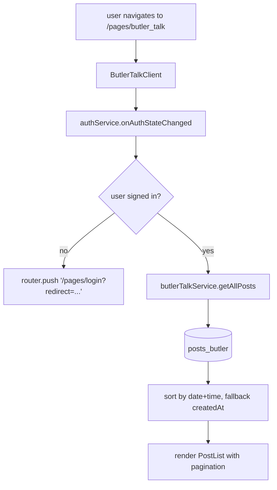
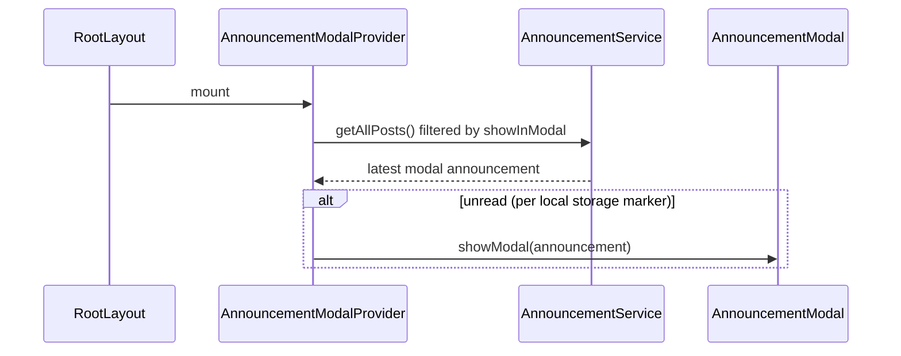
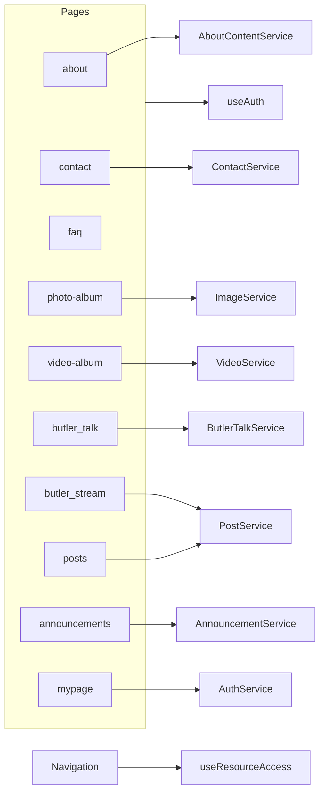

# community-pages

> Part of: [Codebase Overview](CODEBASE_OVERVIEW.md)

## Purpose

Every user-facing page outside the home map. Photo and video albums, posts, butler-talk
discussion, butler-stream feeding posts, announcements, about, contact, FAQ, and the user's
mypage. Almost all live under `/pages/<slug>` (App Router routes), are client components,
and gate access through `useResourceAccess` so visibility tracks the role-based permission
matrix.

## Key Components

| Page (route)               | File                                                                                                     | Notes                                                                                                                                                                                                                                           |
| -------------------------- | -------------------------------------------------------------------------------------------------------- | ----------------------------------------------------------------------------------------------------------------------------------------------------------------------------------------------------------------------------------------------- |
| `/` (home map)             | `src/app/page.tsx`                                                                                       | See `mountain-map-and-cats.md`.                                                                                                                                                                                                                 |
| `/pages/about`             | `src/app/pages/about/page.tsx`                                                                           | Mountain about-page content (`AboutContent` doc) + main photo. Editable from admin.                                                                                                                                                             |
| `/pages/contact`           | `src/app/pages/contact/page.tsx`                                                                         | Contact form → `getContactService().createContact()`.                                                                                                                                                                                           |
| `/pages/faq`               | `src/app/pages/faq/page.tsx`                                                                             | FAQ list (`FAQ.tsx`).                                                                                                                                                                                                                           |
| `/pages/photo-album`       | `src/app/pages/photo-album/page.tsx`                                                                     | Album view; backed by `PhotoAlbum.tsx` and `image-service`.                                                                                                                                                                                     |
| `/pages/video-album`       | `src/app/pages/video-album/page.tsx`                                                                     | Same shape for `cat_videos`; uses `VideoAlbum.tsx`.                                                                                                                                                                                             |
| `/pages/announcements`     | `src/app/pages/announcements/page.tsx`, `[id]/page.tsx`                                                  | List + detail of announcements; modal-flagged ones also pop up at site load via `AnnouncementModalContext`. Driven by `AnnouncementClient.tsx`.                                                                                                 |
| `/pages/butler_stream`     | `src/app/pages/butler_stream/page.tsx`, `new/page.tsx`, `ButlerStreamClient.tsx`, `ButlerStreamTabs.tsx` | Feeding posts (gated to logged-in users); post creation via `NewPostForm.tsx`.                                                                                                                                                                  |
| `/pages/butler_talk`       | `src/app/pages/butler_talk/page.tsx`, `new/page.tsx`, `ButlerTalkClient.tsx`                             | Discussion forum with replies; uses `getButlerTalkService()`. Redirects unauth users to `/pages/login?redirect=…`.                                                                                                                              |
| `/pages/posts`             | `src/app/pages/posts/page.tsx`, `[id]/page.tsx`                                                          | Generic post views (used as detail/list across post types).                                                                                                                                                                                     |
| `/pages/login`             | `src/app/pages/login/page.tsx`                                                                           | Alternate login route (the canonical one is `/login`).                                                                                                                                                                                          |
| `/login`                   | `src/app/login/page.tsx`                                                                                 | See `authentication.md`.                                                                                                                                                                                                                        |
| `/mypage`                  | `src/app/mypage/page.tsx`, `layout.tsx`                                                                  | Profile/account management.                                                                                                                                                                                                                     |
| `/auth-test`               | `src/app/auth-test/`                                                                                     | Debug page for testing auth flows.                                                                                                                                                                                                              |
| Navigation                 | `src/components/Navigation.tsx`                                                                          | Top-nav driven by `useResourceAccess(resourceId)`; gates each link by Firestore-stored resource permissions. ResourceIds: `about`, `contact`, `photo_album`, `video_album`, `adoption`, `announcements`, `faq`, `butler_stream`, `butler_talk`. |
| Announcement modal context | `src/contexts/AnnouncementModalContext.tsx`                                                              | Site-wide modal announcement plumbing. Loads modal-flagged announcements on first mount; renders `AnnouncementModal`.                                                                                                                           |

## Data Flow

<!-- ============================================================
     DIAGRAM STEP — Auth-gated page (butler_talk)
     ============================================================ -->

<!-- END DIAGRAM STEP -->

<!-- ============================================================
     DIAGRAM STEP — Announcement modal at site load
     ============================================================ -->

<!-- END DIAGRAM STEP -->

## Component Relationships

<!-- ============================================================
     DIAGRAM STEP — Page → service map
     ============================================================ -->

<!-- END DIAGRAM STEP -->

## Key Patterns & Conventions

- **`Client` suffix.** Each page route is server-rendered shell that mounts a
  `XxxClient` component (`ButlerTalkClient`, `ButlerStreamClient`, `AnnouncementClient`).
  The clients hold state and call services. Page files are intentionally thin.
- **Auth-gated content redirects, not 401.** `ButlerTalkClient` redirects to
  `/pages/login?redirect=…` on signed-out users. Resource-gated nav items are visually
  disabled but still clickable handlers prevent default. Don't rely on either for security
  — Firestore rules are the actual gate.
- **`useResourceAccess` is the visibility primitive.** Nav, page-level redirects, and
  feature toggles all read from `useResourceAccess(resourceId)`. New pages should pick a
  resourceId, add it to Firestore `resource_permissions`, and let the hook handle gating.
- **Korean date+time strings.** Posts often store separate `date` and `time` fields plus
  Firestore `createdAt`. Sorting code falls back through `${date}T${time}Z`,
  `${date}T${time}`, then `createdAt`. Use `src/utils/dateParser.ts` rather than
  reinventing the parser.
- **Site-wide modal announcement.** `AnnouncementModalProvider` wraps the whole tree; only
  one modal is shown per session (local-storage marker). New "popup" features should hook
  into this rather than mounting their own modal at root.
- **Two login routes.** `/login` (canonical, in `authentication.md`) and `/pages/login`
  (legacy alias). Redirect targets in this area use `/pages/login`. Don't introduce a third.

## External Integrations

- **Firestore** — All pages read via service-layer factories.
- **Firebase Storage** — Photo album thumbnails and full-res images.
- **YouTube embed** — Video album renders YouTube embed iframes from `videoUrl` /
  `youtubeId`.
- **Google Cloud Storage (static-data JSON)** — About-content fallbacks are sometimes
  served from `/static-data/about-content-static-data.json` (verify path); helps with
  cold-start performance.

## Watch-outs

- **The `adoption` resource is referenced in `Navigation.tsx`** but no `/pages/adoption`
  route exists. It's a placeholder. Don't break the nav by removing it without checking
  whether the corresponding Firestore `resource_permissions.adoption` entry is also pruned.
- **`butler_stream` and `butler_talk` are sibling concepts**: stream is feeding posts
  (operational), talk is discussion (community). Easy to confuse; don't rename without
  coordinated docs/UI updates.
- **Date/time sorting hot path.** Inconsistent timestamp formats across legacy and new posts
  mean the sort function in `ButlerTalkClient` and similar files has fallbacks. Be careful
  when refactoring — see the recurring `${date}T${time}Z` parsing strategy.
- **`/pages/login` vs `/login`.** Avoid linking to `/pages/login` from new code; prefer
  `/login`.
- **Korean strings in source.** Several pages embed Korean directly. Don't introduce English
  fallbacks without coordination on i18n strategy.
- **Modal announcement is shown once per device** based on local storage. Clearing storage
  re-shows it; clearing the modal flag in admin won't suppress it for users who haven't
  acknowledged.
