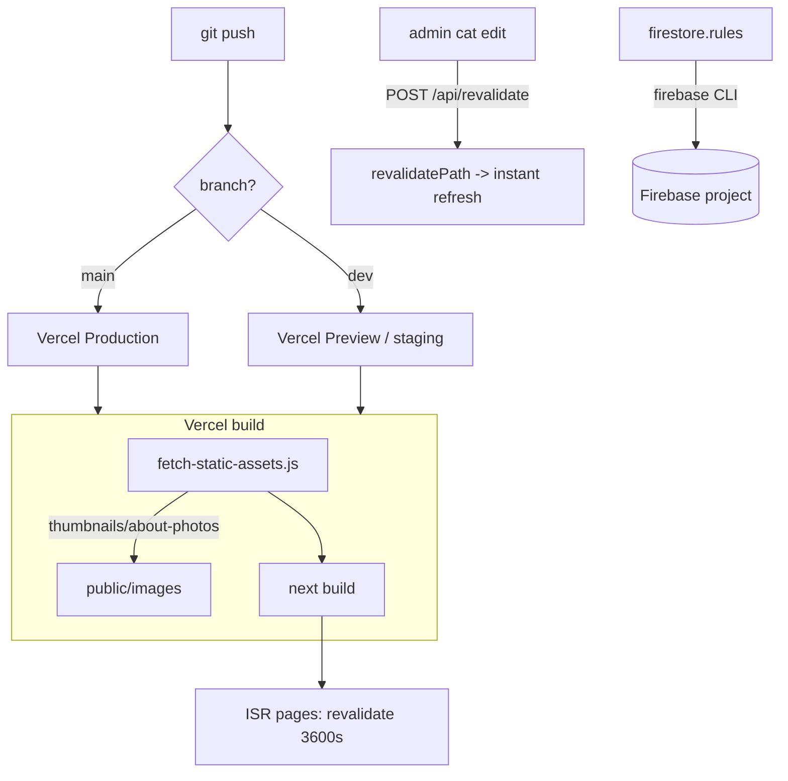
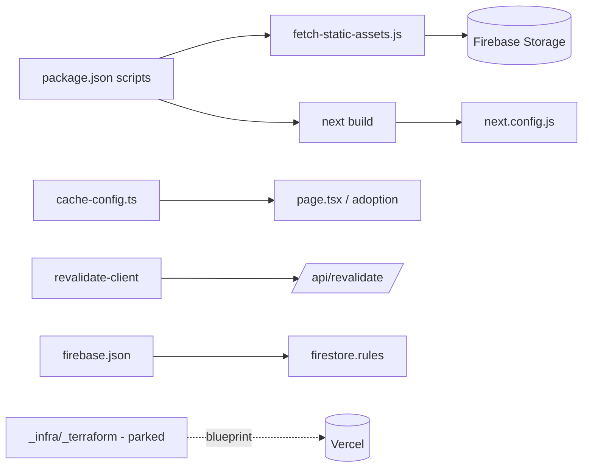

# Deployment & Build

> Part of: [Codebase Overview](CODEBASE_OVERVIEW.md)

## Purpose

How the app is built and shipped. The **only** deploy target is **Vercel**, driven by Git
integration — there is no deploy command, Dockerfile, or CI deploy workflow. The build has one
pre-step (pull image assets into `public/`) before `next build`. Firestore rules deploy
separately via the Firebase CLI. Terraform exists only as a parked future blueprint.

## Key Components

| Component               | File(s)                                                              | Responsibility                                                                                                             |
| ----------------------- | -------------------------------------------------------------------- | -------------------------------------------------------------------------------------------------------------------------- |
| Build scripts           | `package.json` (`build`, `vercel-build`, `fetch:assets`)             | `fetch-static-assets.js` → `next build` (both `build` and `vercel-build`)                                                  |
| Asset fetcher           | `scripts/maintenance/fetch-static-assets.js`                         | Downloads cat thumbnails + about-photos from Firebase Storage into `public/images/{thumbnails,about-photos}` at build time |
| ISR cache config        | `src/lib/cache-config.ts`                                            | `REVALIDATE_SECONDS = 3600` — the time-based ISR backstop (hardcoded so Next can statically analyze it)                    |
| Revalidate client/route | `src/lib/revalidate-client.ts`, `api/revalidate/route.ts`            | On-demand `revalidatePath` after admin cat edits                                                                           |
| Next config             | `next.config.js`                                                     | Image optimization (WebP/AVIF), Storage `remotePatterns`, package-import opts                                              |
| Firestore rules deploy  | `firebase.json`, `.firebaserc`, `config/firebase/firestore.rules`    | `firebase.json` trimmed to the `firestore` block; rules deploy via `firebase deploy --only firestore:rules`                |
| Deployment manuals      | `docs/manuals/deployment/`                                           | README, pre-deployment checklist, new-mountain setup, Vercel/Terraform walkthroughs                                        |
| Parked IaC              | `_infra/_terraform/` (`_main.tf`, `_outputs.tf`, `_variables.tf`, …) | Blueprint only (underscore = stale); **not** the live path                                                                 |

## Data Flow

## Component Relationships

## Key Patterns & Conventions

- **Deploy = `git push`**: Vercel Git integration builds and hosts. Production = `main`,
  Preview ("staging") = `dev`. No deploy command, no container.
- **Env vars by hand**: managed in the Vercel dashboard (Production + Preview), not by IaC.
- **Build pre-step pulls assets**: `fetch-static-assets.js` materializes thumbnails/about-photos
  into `public/` (they are **not** committed to git). Run `npm run fetch:assets` in dev.
- **Hybrid ISR freshness (§7a)**: `REVALIDATE_SECONDS` (1h) is the _backstop_; admin cat edits
  trigger instant `revalidatePath` via `/api/revalidate`. Point edits rely on the 1h backstop.
- **Rules deploy is separate**: only the Firestore `rules` remain in `firebase.json`; deploy them
  with the Firebase CLI.

## External Integrations

- **Vercel** — the sole compute/hosting target.
- **Firebase Storage** — source of build-time assets (`fetch-static-assets.js`).
- **Firebase CLI** — Firestore rules deployment.

## Watch-outs

- **Do not reintroduce Cloud Run, the home-server Docker path, or Firebase Hosting.** They were
  removed in the deployment cleanup (`Dockerfile`, `docker-compose.yml`, `deploy-cloud-run.yml`,
  `deploy-home-server.yml`, `firebase-hosting-*.yml` are all gone). This is an explicit
  anti-pattern in `CLAUDE.md`.
- **No static-data export step remains.** The old `export_all_to_cloud_storage.js` /
  Cloud-Storage JSON pipeline is gone — the app reads Firestore live. The build only fetches
  _image assets_.
- **`REVALIDATE_SECONDS` is hardcoded on purpose** — Next requires a statically analyzable
  segment `revalidate`. To change it, edit the literal in `cache-config.ts` and push; an env var
  won't work.
- **Terraform under `_infra/_terraform/` is parked** (underscore-prefixed = stale). Treat it as a
  possible-future blueprint, not the deployment path.
- `fetch-static-assets.js` references a service-account JSON path under `config/firebase/`; that
  credential file is gitignored and must exist in the build environment.
  </content>
