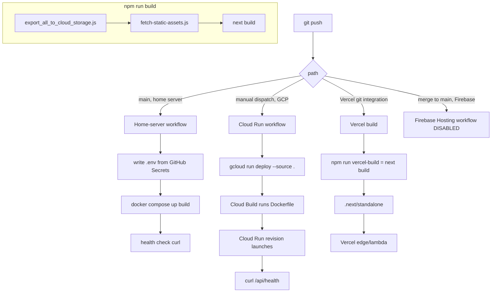
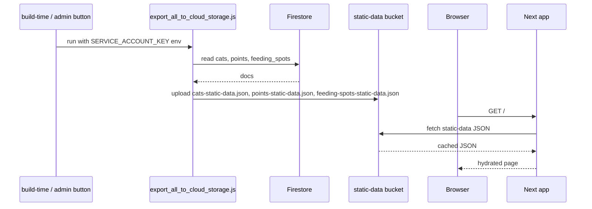
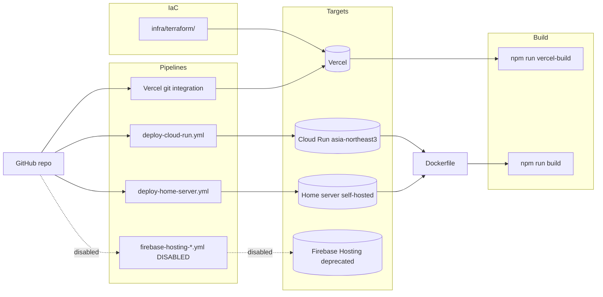

# deployment-and-build

> Part of: [Codebase Overview](CODEBASE_OVERVIEW.md)

## Purpose

Everything that gets the code from a git push to a running app. Three deployment paths
co-exist in the repo: **Vercel** (current), **Cloud Run** (legacy, on-demand), and a
**self-hosted home server via Docker Compose** (manual). Firebase Hosting workflows are
preserved but commented out. The build pipeline has a notable pre-step: it exports static
JSON from Firestore to Cloud Storage and pulls down image assets before `next build` runs.
Vercel deployments skip the export step (`vercel-build` is just `next build`) on the
assumption that static data is already in Cloud Storage.

## Key Components

| Component                  | File(s)                                                                                                                                                                           | Responsibility                                                                                                                                                                                                                                                                                            |
| -------------------------- | --------------------------------------------------------------------------------------------------------------------------------------------------------------------------------- | --------------------------------------------------------------------------------------------------------------------------------------------------------------------------------------------------------------------------------------------------------------------------------------------------------- |
| Build script               | `package.json` `build`                                                                                                                                                            | `node scripts/migration/export_all_to_cloud_storage.js && node scripts/maintenance/fetch-static-assets.js && next build`. Three steps in order: export Firestore → GCS, fetch local assets, build.                                                                                                        |
| Vercel build alias         | `package.json` `vercel-build`                                                                                                                                                     | `next build` only. Vercel uses this so its build doesn't redo the export step.                                                                                                                                                                                                                            |
| Static-data exporter       | `scripts/migration/export_all_to_cloud_storage.js` (+ `export_cats_to_static.js`, `export_points_to_static.js`, `export_feeding_spots_to_static.js`, `update_all_static_data.js`) | Reads Firestore, writes JSON to GCS. Resolves credentials via `SERVICE_ACCOUNT_KEY` env first, then a hard-coded local path.                                                                                                                                                                              |
| Asset fetcher              | `scripts/maintenance/fetch-static-assets.js`                                                                                                                                      | Downloads image binaries (cat thumbnails, about-photos) from Firebase Storage into `public/images/...` so they're inlined into the build output.                                                                                                                                                          |
| Migration scripts          | `scripts/migration/migrate-cats-to-firestore.js`, `migrate-created-time.js`, `import-media-to-firestore.js`, `add_*.js`, `remove_*.js`, etc.                                      | One-shot data migrations triggered manually or from `/admin/migration`. Each is documented in `README*.md` files alongside.                                                                                                                                                                               |
| Maintenance scripts        | `scripts/maintenance/cleanup_firestore_cat_videos.js`, `enforce_youtube_readonly_fields.js`, `data_updater.js`, `firebase_ops.js`, `_*.py`                                        | Operational data hygiene.                                                                                                                                                                                                                                                                                 |
| Dockerfile                 | `Dockerfile`                                                                                                                                                                      | Multi-stage `node:18-alpine` build. Two `FROM base AS deps` / `builder` / `runner` layers; runner copies the `.next/standalone` server, exposes 8080, runs as non-root `nextjs` user. Build-time ARGs hold all `NEXT_PUBLIC_*` and YouTube/Kakao envs (required by Next.js' build to inline public envs). |
| docker-compose             | `docker-compose.yml`                                                                                                                                                              | Single `web` service. Reads build args from shell env (or `.env`) and runtime env from `.env.local`. Maps `8080:8080`, `restart: always`.                                                                                                                                                                 |
| Cloud Run deploy workflow  | `.github/workflows/deploy-cloud-run.yml`                                                                                                                                          | Manual `workflow_dispatch`. Service `mtcat-next`, region `asia-northeast3`, `--allow-unauthenticated`, `--memory 512Mi`, `--cpu 1`, max 10 instances, all envs forwarded as `--set-env-vars`. Health-checks `/api/health`.                                                                                |
| Cloud Run service spec     | `config/deployment/cloud-run-service.yaml`                                                                                                                                        | Declarative variant for `gcloud run services replace`. Service `mcathcat`, 2 CPU / 2Gi memory, container concurrency 80, startup + liveness probes on `/api/health`.                                                                                                                                      |
| Home-server workflow       | `.github/workflows/deploy-home-server.yml`                                                                                                                                        | Pushes to `main` deploy to a `self-hosted` runner: writes `.env` from secrets, `docker compose down && up --build`, prunes images, curls localhost.                                                                                                                                                       |
| Firebase Hosting workflows | `.github/workflows/firebase-hosting-merge.yml`, `firebase-hosting-pull-request.yml`                                                                                               | Both fully commented out. Kept for historical reference; do not re-enable without re-evaluating image optimization.                                                                                                                                                                                       |
| Vercel IaC                 | `infra/terraform/main.tf`, `variables.tf`, `outputs.tf`, `terraform.tfvars.example`                                                                                               | Provider `vercel/vercel ~> 2.0`. Manages the GitHub-connected Vercel project, a `dev`-branch staging domain (`vercel_project_domain`), and `shared_envs` block that sets all `NEXT_PUBLIC_*` and YouTube/Kakao envs across Production + Preview.                                                          |
| Cloud Run deploy scripts   | `scripts/deployment/deploy-cloud-run.sh`, `deploy-cloud-run.bat`                                                                                                                  | Convenience wrappers. Same `gcloud run deploy` command.                                                                                                                                                                                                                                                   |
| Helper config              | `next.config.js`, `tsconfig.json`, `tailwind.config.js`, `postcss.config.js`, `eslint.config.mjs`, `.husky/`, `.lintstagedrc.js`, `firebase.json`, `.firebaserc`                  | Build/runtime config. `firebase.json` and `.firebaserc` are kept for backward compatibility with the now-deprecated Firebase Hosting path.                                                                                                                                                                |

## Data Flow

<!-- ============================================================
     DIAGRAM STEP — Local / CI build pipeline
     ============================================================ -->

<!-- END DIAGRAM STEP -->

<!-- ============================================================
     DIAGRAM STEP — Static-data refresh
     ============================================================ -->

<!-- END DIAGRAM STEP -->

## Component Relationships

<!-- ============================================================
     DIAGRAM STEP — Deployment matrix
     ============================================================ -->

<!-- END DIAGRAM STEP -->

## Key Patterns & Conventions

- **Vercel is the active deployment target.** `vercel-build` script exists, IaC under
  `infra/terraform/` provisions the project, README still references Cloud Run. Treat the
  README's Cloud Run claims as historical.
- **`build` runs migrations; `vercel-build` does not.** The pre-build steps (export +
  fetch-assets) can take minutes and need GCS write credentials. Vercel preview/production
  builds skip this — admins manually trigger refresh via `/api/admin/update-static-data`.
- **`NEXT_PUBLIC_*` envs are inlined at build time.** That's why the Dockerfile passes
  every `NEXT_PUBLIC_*` as a build ARG and ENV — Next.js needs them present during
  `next build`, not just at runtime.
- **Service account loading is permissive.** The exporter script and the Admin SDK init
  both replace single quotes / newlines / CR in `SERVICE_ACCOUNT_KEY` so a lightly mangled
  env value still parses. New scripts should follow the same convention.
- **Health checks point at `/api/health`.** Cloud Run service spec sets startup + liveness
  probes; the Cloud Run workflow curls it after deploy; the home-server workflow curls
  `localhost:8080`. Don't change the path without updating all three.
- **Region is `asia-northeast3`.** Hard-coded in the Cloud Run workflow — Korean user base.
- **Container runs as non-root `nextjs:nodejs` (uid 1001).** Don't add COPY steps that
  write outside `.next/` or the writable mounts (`/app/.next`).
- **`.env.local` for runtime, `.env` for build args.** Compose reads runtime config from
  `.env.local`. The home-server workflow writes a fresh `.env` for build args.

## External Integrations

- **Vercel** — Hosting + git integration + IaC via `vercel/vercel` Terraform provider. Two
  domains: production + dev-branch staging.
- **Google Cloud Run** — Legacy. `mtcat-next` (workflow) and `mcathcat` (service spec) are
  separate service names — verify which one is currently provisioned before touching.
- **Cloud Build** — Implicit; `gcloud run deploy --source .` triggers it.
- **Google Cloud Storage** — Static-data target (`cats-static-data.json`, etc.).
- **Firebase Hosting** — Deprecated. Workflows are disabled but config files
  (`firebase.json`, `.firebaserc`) remain.
- **GitHub Actions** — `deploy-cloud-run.yml` (manual), `deploy-home-server.yml` (push to
  main, self-hosted runner), Firebase workflows (disabled).
- **Self-hosted runner** — `runs-on: self-hosted` for the home-server workflow.

## Watch-outs

- **Three live deployment paths.** A push to `main` triggers the home-server workflow; the
  Cloud Run workflow is manual; Vercel is git-integration driven and may auto-deploy on the
  same push. Without coordination, two environments get the same build but different
  configuration. Be deliberate about which path you intend to ship through.
- **Service-account JSON is referenced by hard path.**
  `config/firebase/mountaincats-61543-7329e795c352.json` is gitignored but several scripts
  fall back to it when `SERVICE_ACCOUNT_KEY` is unset (`fetch-static-assets.js` always uses
  it). Multi-tenant builds need this path generalized or moved entirely to env.
- **`build` will fail on Vercel** because the export step needs `SERVICE_ACCOUNT_KEY` and
  GCS write access, which the public Vercel build doesn't have. That's why `vercel-build`
  exists. Don't accidentally point Vercel at `build` instead of `vercel-build`.
- **Cloud Run service name mismatch.** Workflow deploys `mtcat-next`; the YAML manifest
  describes `mcathcat`; the deprecated `cloud-run:deploy-backup` script targets `mcathcat`.
  Verify what's actually running.
- **Firebase Hosting workflows are kept but disabled.** Don't delete blindly — the setup
  is documented and could be revived. But make sure no one re-enables them by accident.
- **Build ARGs contain `*_CLIENT_SECRET` and `*_REFRESH_TOKEN`.** Anyone with access to the
  Docker image's build history can extract them. Don't push images to public registries
  without scrubbing.
- **`maxScale: 10` and `512Mi` memory** on Cloud Run. With YouTube refresh and image
  optimization, larger instance sizes can reduce cold-start tail latency — the Cloud Run
  service YAML uses 2Gi/2 CPU which is closer to right.
- **Self-hosted home-server has `restart: always`.** A bad image can loop without alerting;
  add a remote health check if you depend on this path.
