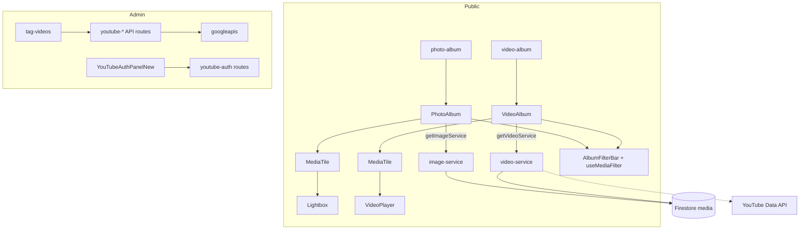
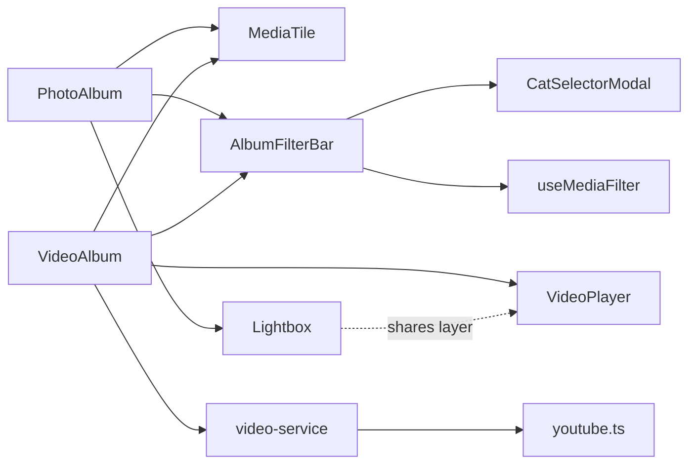

# Media & YouTube

> Part of: [Codebase Overview](CODEBASE_OVERVIEW.md)

## Purpose

Photo and video albums for the public site, plus the YouTube integration that backs videos
(playlist management, upload, metadata sync) and image optimization. The album pages share a
common set of primitives (tile, filter bar, lightbox/video viewer, filter hook) so photos and
videos look and behave consistently.

## Key Components

| Component            | File(s)                                                                                               | Responsibility                                                                                                     |
| -------------------- | ----------------------------------------------------------------------------------------------------- | ------------------------------------------------------------------------------------------------------------------ |
| Photo album          | `src/app/pages/photo-album/page.tsx`, `components/PhotoAlbum.tsx`                                     | 사진첩 — reads images via `getImageService`, grid of `MediaTile`, opens `Lightbox`                                 |
| Video album          | `src/app/pages/video-album/page.tsx`, `components/VideoAlbum.tsx`                                     | 영상첩 — reads videos via `getVideoService`, grid of `MediaTile`, opens `VideoPlayer`                              |
| Album tile           | `src/components/album/MediaTile.tsx`                                                                  | Shared grid card (rounded, hover lift/zoom, badge/placeholder slots; `square` for photos, `video` 16:9 for videos) |
| Album filter         | `src/components/album/AlbumFilterBar.tsx`                                                             | Shared search + cat-name filter; owns the `CatSelectorModal`; single consolidated chip row                         |
| Album states         | `src/components/album/AlbumStates.tsx`                                                                | Branded loading/empty/error states                                                                                 |
| Lightbox             | `src/components/ui/Lightbox.tsx`                                                                      | Full-bleed dark image viewer; Esc closes, ←/→ navigate (topmost layer)                                             |
| Video player         | `src/components/ui/VideoPlayer.tsx`                                                                   | Full-bleed dark video viewer; same key/nav language as Lightbox                                                    |
| Filter hook          | `src/hooks/useMediaFilter.ts`                                                                         | Shared free-text (description + tags) + cat-tag filtering for both albums                                          |
| Media links hook     | `src/hooks/useMediaLinks.tsx`                                                                         | Resolves media link tokens                                                                                         |
| YouTube service      | `src/services/youtube.ts`                                                                             | `fetchChannelVideos`, `searchYouTubeVideos`, YouTube data types                                                    |
| Image/video services | `src/services/image-service.ts`, `video-service.ts`, `media-albums.ts`                                | Firestore-backed media records + album grouping                                                                    |
| Storage/signed URLs  | `src/services/storage-service.ts`, API `generate-signed-url`                                          | Firebase Storage access + signed upload URLs                                                                       |
| YouTube admin        | `src/components/admin/YouTubeAuthPanelNew.tsx`, `admin/tag-videos`, `tag-images`                      | OAuth panel + tagging surfaces                                                                                     |
| YouTube API routes   | `api/{manage-playlists,youtube-playlists,upload-youtube,update-youtube-video,refresh-video-metadata}` | Playlist/video management. See [api-routes](api-routes.md)                                                         |

## Data Flow

## Component Relationships

## Key Patterns & Conventions

- **Shared album primitives**: photos and videos differ only in tile aspect and viewer
  (`Lightbox` vs `VideoPlayer`); everything else (`MediaTile`, `AlbumFilterBar`, `useMediaFilter`,
  `AlbumStates`) is shared. Change behavior once, both albums follow.
- **Immersive viewers vs card modals**: `Lightbox`/`VideoPlayer` are deliberately dark full-bleed
  surfaces (not the white `ui/Modal` card) so the media is the focus; they share the topmost-layer
  keyboard model (Esc/←/→). This is a documented gotcha — see `modal-design-system` in project
  memory.
- **Image optimization**: Next `<Image>` with WebP/AVIF and Firebase Storage `remotePatterns`
  (see `next.config.js`).
- **YouTube via service + routes**: client reads go through `getVideoService`/`youtube.ts`;
  mutating YouTube (upload, playlist edits, metadata) goes through the admin API routes using
  `googleapis` + refresh-token OAuth.

## YouTube OAuth credential (single shared channel)

> Corrected 2026-07-26 after the P5.4 manual pass found the routes and the admin
> re-authorize button using different token sources (`log/DEBUG_LOG.md`).

**One channel serves every mountain**, on one OAuth credential — per-mountain channels were
considered and rejected (monetization thresholds apply per channel; N channels means N expiring
refresh tokens). Per-mountain attribution comes from `cat_videos.mountainId`, not from channel
ownership.

`src/lib/youtube/credentials.ts` is the **only** place that credential is resolved. It exists
because the credential has two halves that live in different places:

| Half                                         | Source                                            | Rotates           |
| -------------------------------------------- | ------------------------------------------------- | ----------------- |
| Client identity (`getYouTubeOAuthClient`)    | env `YOUTUBE_CLIENT_ID`/`_SECRET`/`_REDIRECT_URI` | effectively never |
| Refresh token (`getYouTubeOAuthCredentials`) | Firestore `admin_config/youtube_auth` — **only**  | every 7–14 days   |

- ⚠️ **There is no `YOUTUBE_REFRESH_TOKEN` env var, by design.** Reading the token from env is
  what let a stale value silently shadow the one the admin 「토큰 갱신」 button had just written, so
  re-authorizing appeared to work and changed nothing. Env was removed rather than demoted to a
  fallback, because a fallback keeps that same failure shape for the case where the Firestore doc
  goes missing. **Don't reintroduce an env token path** — obtaining a token needs client identity
  only, so the recovery from "no token anywhere" is just 「토큰 갱신」.
- ⚠️ **Scopes are fixed at consent time and must cover writes.** `auth-url` requests
  `youtube.upload` + `youtube` + `youtube.readonly` + `youtube.force-ssl`. Trimming to
  upload+readonly (as it did until 2026-07-26) still yields a token that refreshes fine and
  reports healthy, but fails `videos.update` and `playlistItems.insert/delete` with Google's
  **"Insufficient Permission"** — distinct from our gate's "Insufficient permissions". Changing
  this list requires a re-authorize; an existing token cannot gain scopes.
- **Client identity resolves without a token** so `auth-url`/`callback` can _obtain_ one. The
  predecessor (`getYouTubeOAuthConfig()` in `utils/config.ts`, now deleted) required all three env
  vars together, which deadlocked the OAuth flow on a fresh deployment.
- **One token source means one status row.** `/api/admin/youtube-auth/status` used to report an
  `environment` token beside the `firestore` one — and displayed Firestore's timestamp against the
  env token, which is much of why the split went unnoticed. It now reports the stored token alone.
- **Consumers:** `upload-youtube`, `update-youtube-video`, `manage-playlists` (GET+POST),
  `youtube-playlists`, `admin/youtube-auth/{auth-url,callback,status}`. `refresh-video-metadata`
  is **not** one — it uses the public API key.
- **No automated test reaches YouTube** (the emulator has no credentials). Precedence is pinned by
  `tests/unit/youtubeCredentials.test.ts`; everything past the credential is covered only by the
  P5.4 manual pass on Preview.

## Image storage & serving strategy

> Verified against prod data 2026-07-25. Supersedes the archived, stale
> `docs/archive/implementation/[ OUTDATED ] IMAGE_STORAGE_EXPLAINED.md` (which describes the
> old `unoptimized: true` / "direct-from-CDN" setup, before Next optimization was enabled).

Two distinct mechanisms serve images — know which applies where:

| Image                       | Stored as                                       | Served via            | Baked into build?             |
| --------------------------- | ----------------------------------------------- | --------------------- | ----------------------------- |
| Cat thumbnails              | Storage URL (`cats.thumbnailUrl`)               | Next `<Image>`, live  | baked but **UNUSED** (legacy) |
| Album photos (`cat_images`) | Storage URL (`cat_images.imageUrl`)             | Next `<Image>`, live  | **never** baked               |
| About-page photos           | local path (`config…about.mainPhoto.localPath`) | static `public/` file | **baked + used**              |
| Map background              | config `url` → `public/`                        | static `public/` file | in-git design asset           |

- **Storage-URL + live optimizer (the dominant pattern).** Cat thumbnails and album photos
  store a **full Firebase Storage download URL**
  (`https://firebasestorage.googleapis.com/v0/b/<bucket>/o/<path>?alt=media&token=…`). The app
  reads them live from Firestore and renders through Next `<Image>`, which fetches the original
  from Storage at request time, optimizes to WebP/AVIF, and CDN-caches it (1-year TTL).
  `firebasestorage.googleapis.com` is whitelisted in `next.config.js` `remotePatterns`. No build
  step; ISR-fresh. Cost is negligible at this scale (per-transformation billing, long cache).
- **Baked build artifact.** Only **about-page photos** are served from `public/` (baked by
  `scripts/maintenance/fetch-static-assets.js` into `public/images/about-photos/{mountainId}/…`).
  The **map background** (`map.landscapeImage/portraitImage`) is also served from `public/`, but
  it's a static in-git design asset, not fetched from Firebase.

⚠️ **Cat-thumbnail baking is legacy/dead in prod.** `fetch-static-assets.js` still downloads the
Storage `thumbnails/` folder into `public/images/thumbnails/…`, but **no prod cat references those
files** — prod `cats.thumbnailUrl` are Storage URLs (cats switched from local paths to Storage URLs
historically — see `scripts/migration/rewrite-storage-bucket-urls.js`). The baked thumbnail files
are only referenced by the **e2e fixtures**, which still use `/images/thumbnails/…` local paths. So
changing how thumbnails are namespaced _on disk_ has **no effect on prod serving**.

⚠️ **Multi-tenant (M6).** Because thumbnails and album photos ride on Storage URLs, tenant
isolation comes from the **Storage object path**, not from baked files: uploads prepend the
tenant's `storagePrefix` (`generate-signed-url` route + the form image strategy in
`uploadStrategies.ts`), so a new mountain's uploads land under `mountains/<id>/…` and their URLs
are naturally scoped. Geyang's prefix is `''` (flat bucket). **No per-cat thumbnail migration is
needed** — the served values are already Storage URLs. See
[`multi-mountain-refactor-plan` §3 M6](../planning/multi-mountain-refactor-plan-20260719.md).

⚠️ **Token fragility.** The Storage URLs carry `?alt=media&token=…` (a download token). Rotating or
revoking that token breaks the URL. Baked files / a public bucket / signed URLs avoid this — a
low-probability, pre-existing consideration, not an active issue.

## External Integrations

- **Firebase Storage** — image/video files, signed URLs.
- **Firestore** — media records and tags.
- **YouTube Data API v3** — playlists, upload, metadata (refresh-token OAuth via `YOUTUBE_*`).

## Watch-outs

- **Old media-admin components were removed**: `ImageEdit`, `ImageList`, `VideoEdit`,
  `VideoList`. Tagging now happens in `admin/tag-images` and `admin/tag-videos` with the newer
  `YouTubeAuthPanelNew`. Don't reintroduce the old list/edit components.
- **The tagging pages compose a shared toolkit** (2026-07 complexity retirement):
  `src/components/admin/media/` holds `useMediaListController<T>` (load/selection/filter/
  sort/pagination on the shared `parseDate` normalizer), `useDateAutoParse<T>` (자동 날짜 인식
  loop), and the presentational set (`MediaStatsCards`/`MediaFilterBar`/`BatchActionsPanel`/
  `MediaGrid`/`PaginationBar`/`CatTagField`). **Write paths stay page-owned** — tag-videos'
  YouTube orchestration lives in the colocated `useYouTubeVideoMutations.ts` and is
  deliberately NOT genericized. Cat selection is the shared `CatSelectorModal`
  (commit-on-done); user prompts are the shared `ui/useDialog` Modal, not native
  `alert()/confirm()`.
- **Native `` inside `Lightbox`**: the immersive viewer historically used a native img (not
  Next `<Image>`) — verify before "optimizing" it (documented in project memory).
- The album filter chip row was consolidated to render selected cats **once**; if you refactor
  `AlbumFilterBar`, don't reintroduce the duplicate chip rows.
  </content>
