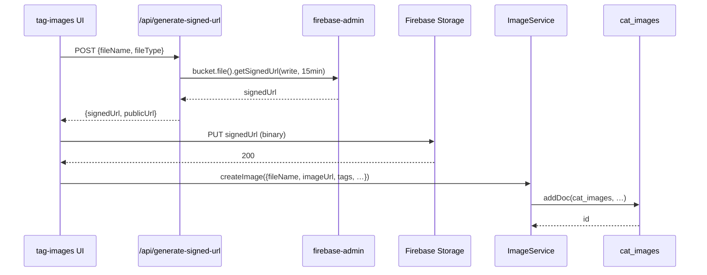
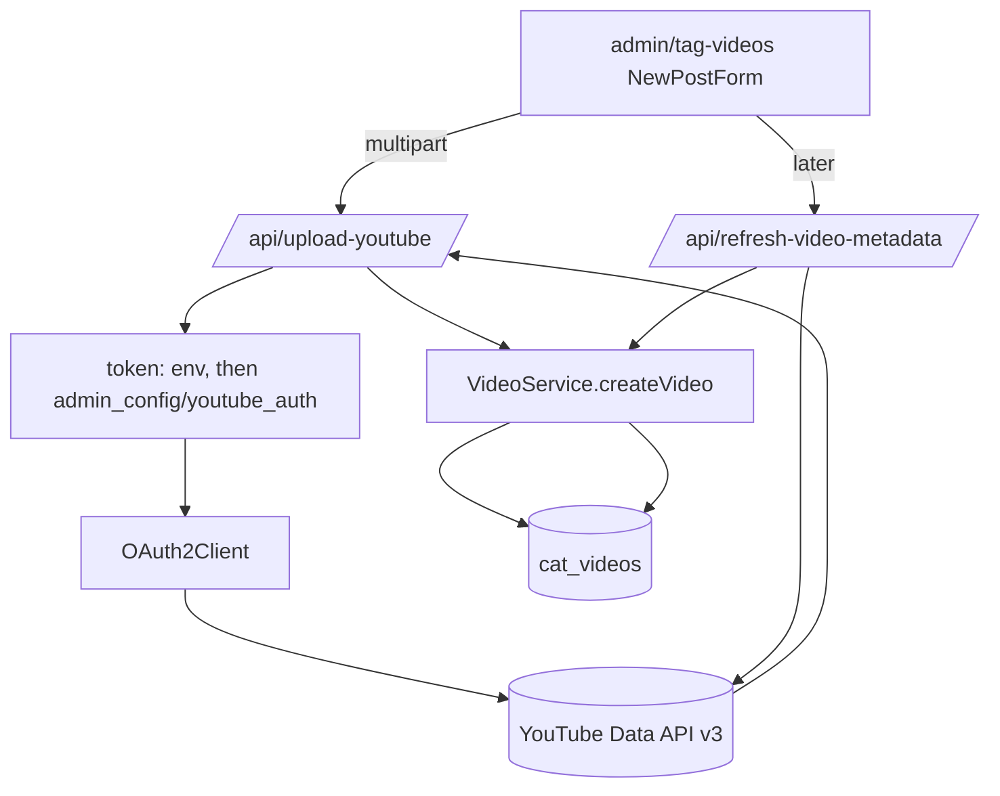
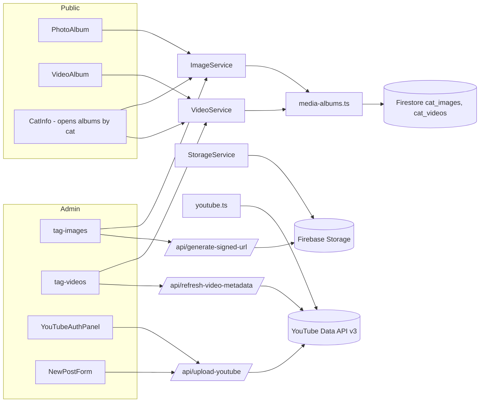

# media-and-youtube

> Part of: [Codebase Overview](CODEBASE_OVERVIEW.md)

## Purpose

Photos and videos for cats. Photos live in Firebase Storage with metadata (tags, descriptions,
dates, EXIF) tracked in Firestore `cat_images`. Videos are mostly hosted on YouTube; the app
syncs YouTube metadata into Firestore `cat_videos` for tagging-by-cat. Admins can upload to
YouTube directly from the admin UI, manage playlists, and refresh metadata both ways. The
public photo and video albums consume both sources via the service layer.

## Key Components

| Component                 | File(s)                                                                                                                                                                                         | Responsibility                                                                                                                                                       |
| ------------------------- | ----------------------------------------------------------------------------------------------------------------------------------------------------------------------------------------------- | -------------------------------------------------------------------------------------------------------------------------------------------------------------------- |
| `media-albums.ts`         | `src/services/media-albums.ts`                                                                                                                                                                  | The original (legacy) implementation of image + video Firestore operations. Now a worker library re-exported by `image-service.ts` and `video-service.ts`.           |
| `FirebaseImageService`    | `src/services/image-service.ts`                                                                                                                                                                 | `IImageService` impl. Thin wrapper over `media-albums.ts`. CRUD + batch + storage sync (`syncWithStorage`).                                                          |
| `FirebaseVideoService`    | `src/services/video-service.ts`                                                                                                                                                                 | `IVideoService` impl. Same shape as image; optionally syncs with YouTube via `syncWithYouTube`.                                                                      |
| `youtube.ts`              | `src/services/youtube.ts`                                                                                                                                                                       | Browser-side helpers for YouTube Data API v3 reads (channel videos, video details). Uses `NEXT_PUBLIC_YOUTUBE_API_KEY` and the mountain's `social.youtubeChannelId`. |
| `FirebaseStorageService`  | `src/services/storage-service.ts`                                                                                                                                                               | Generic upload / delete / download-URL operations on Firebase Storage.                                                                                               |
| `thumbnailPreloader`      | `src/services/thumbnailPreloader.ts`                                                                                                                                                            | See `mountain-map-and-cats.md`.                                                                                                                                      |
| Public album pages        | `src/components/PhotoAlbum.tsx`, `VideoAlbum.tsx`, `src/app/pages/photo-album/page.tsx`, `video-album/page.tsx`                                                                                 | Render albums; filter by cat tag when launched from `CatInfo`.                                                                                                       |
| Admin tagging             | `src/components/admin/{ImageList, ImageEdit, VideoList, VideoEdit, YouTubeAuthPanelNew}.tsx`, `src/app/admin/tag-images/page.tsx`, `tag-videos/page.tsx`, `src/components/CatSelectorModal.tsx` | Batch operations: bulk tag, bulk delete, recording-date inference.                                                                                                   |
| YouTube upload form       | `src/components/NewPostForm.tsx`                                                                                                                                                                | Some posts (butler stream) attach a YouTube video; uploads stream through `/api/upload-youtube`.                                                                     |
| YouTube auth panel        | `src/components/admin/YouTubeAuthPanelNew.tsx` + `/api/admin/youtube-auth/*`                                                                                                                    | UI to authorize the app's YouTube account, store the refresh token in `admin_config/youtube_auth`, and check status.                                                 |
| Signed URL endpoints      | `src/app/api/generate-signed-url/route.ts`, `generate-youtube-signed-url/route.ts`                                                                                                              | Server-issued upload URLs scoped to `uploads/<fileName>` with 15-minute expiry.                                                                                      |
| Image optimization config | `next.config.js`                                                                                                                                                                                | WebP/AVIF, 1-year cache TTL, allowed `firebasestorage.googleapis.com` remote pattern, custom device sizes.                                                           |
| Date parser               | `src/utils/dateParser.ts`, `dateParserTest.ts`                                                                                                                                                  | Infer recording date from YouTube descriptions / filenames. Used by tag-videos.                                                                                      |

## Data Flow

<!-- ============================================================
     DIAGRAM STEP — Photo upload (admin)
     ============================================================ -->

<!-- END DIAGRAM STEP -->

<!-- ============================================================
     DIAGRAM STEP — YouTube upload + metadata sync
     ============================================================ -->

<!-- END DIAGRAM STEP -->

## Component Relationships

<!-- ============================================================
     DIAGRAM STEP — Media stack
     ============================================================ -->

<!-- END DIAGRAM STEP -->

## Key Patterns & Conventions

- **`media-albums.ts` is the actual implementation; `image-service.ts` / `video-service.ts`
  are thin re-exports.** This is the second layer of the service factory pattern: the public
  interface is `IImageService` / `IVideoService`, but the legacy module retains the bulk of
  the code. When refactoring, prefer migrating logic _into_ the service classes rather than
  bypassing them.
- **YouTube reads via `googleapis` (server) and direct `fetch` (browser).**
  `src/services/youtube.ts` uses browser `fetch` with `NEXT_PUBLIC_YOUTUBE_API_KEY` for read
  operations. Server-side mutations go through `googleapis` + the OAuth refresh token.
- **Refresh token loaded from env first, Firestore second.** `/api/upload-youtube` and the
  YouTube playlist endpoints check `YOUTUBE_REFRESH_TOKEN` env, then fall back to
  `admin_config/youtube_auth`. The Firestore path is what `/api/admin/youtube-auth/callback`
  writes after consent.
- **Two date concepts.** `uploadDate` (when the file was added to the system) vs `createdTime`
  (when the photo/video was actually taken). Tag-videos infers `createdTime` from filename or
  description with `dateParser`.
- **Image optimization is server-driven.** `next.config.js` enables Next.js's `<Image>`
  pipeline with WebP/AVIF, 1-year TTL, and a `firebasestorage.googleapis.com` remote pattern.
  Components default to `<Image>` rather than ``.
- **Signed URLs are generic.** `/api/generate-signed-url` writes to `uploads/<fileName>` for
  any kind of file. Verify the path is partitioned (e.g., `uploads/images/...`,
  `uploads/videos/...`) before relying on it for ACL purposes.

## External Integrations

- **Firebase Storage** — Photo binary storage; signed-URL writes; download URLs.
- **Firestore** — `cat_images`, `cat_videos`, `admin_config/youtube_auth`.
- **YouTube Data API v3** — Channel listing, playlist management, video upload/update,
  metadata sync. Two auth modes: API-key (read) and OAuth refresh token (mutate).
- **Cloud Storage** — Static-data exports include `cats-static-data.json`,
  `points-static-data.json`, `feeding-spots-static-data.json` (no media binaries here, but
  the static-data refresh API touches GCS — see `deployment-and-build.md`).

## Watch-outs

- **`media-albums.ts` is large and pre-dates the service interface.** Direct callers may
  exist alongside the wrapped services; grep before changing function signatures.
- **`generate-signed-url` lacks auth.** It accepts arbitrary `fileName` / `fileType` and
  hands out a write URL. Anyone with the signed URL can write to the bucket. Consider
  requiring a bearer token + caller-specific path prefix.
- **YouTube quota.** Refresh-metadata and channel-list endpoints can blow through the daily
  YouTube quota if iterated naively. Tag-videos paginates, but mass-refresh is a footgun.
- **YouTube channel ID has env fallback.** `youtube.ts` reads `social.youtubeChannelId` from
  the mountain config, then falls back to `NEXT_PUBLIC_YOUTUBE_CHANNEL_ID`. Multi-tenant
  setup must populate the mountain config; don't rely on the env var.
- **`syncWithYouTube` and `syncWithStorage`.** Both can write many docs in one call. They
  exist on the service interface but a mass-sync run can saturate Firestore writes; throttle
  if the corpus grows.
- **WebP/AVIF transcoding requires Vercel/Cloud Run.** Firebase Hosting (legacy) static
  export disables this. Don't toggle `images.unoptimized: true` without understanding the
  impact on photo album latency.
