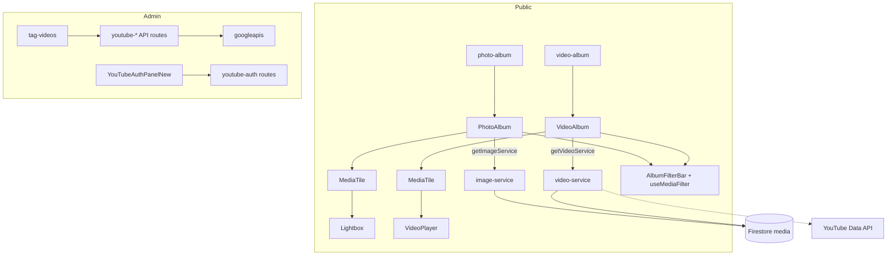
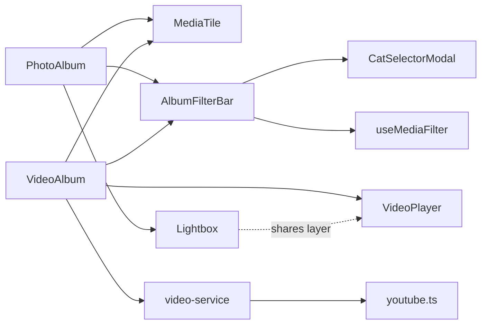

# Media & YouTube

> Part of: [Codebase Overview](CODEBASE_OVERVIEW.md)

## Purpose

Photo and video albums for the public site, plus the YouTube integration that backs videos
(playlist management, upload, metadata sync) and image optimization. The album pages share a
common set of primitives (tile, filter bar, lightbox/video viewer, filter hook) so photos and
videos look and behave consistently.

## Key Components

| Component            | File(s)                                                                                                                                          | Responsibility                                                                                                     |
| -------------------- | ------------------------------------------------------------------------------------------------------------------------------------------------ | ------------------------------------------------------------------------------------------------------------------ |
| Photo album          | `src/app/pages/photo-album/page.tsx`, `components/PhotoAlbum.tsx`                                                                                | 사진첩 — reads images via `getImageService`, grid of `MediaTile`, opens `Lightbox`                                 |
| Video album          | `src/app/pages/video-album/page.tsx`, `components/VideoAlbum.tsx`                                                                                | 영상첩 — reads videos via `getVideoService`, grid of `MediaTile`, opens `VideoPlayer`                              |
| Album tile           | `src/components/album/MediaTile.tsx`                                                                                                             | Shared grid card (rounded, hover lift/zoom, badge/placeholder slots; `square` for photos, `video` 16:9 for videos) |
| Album filter         | `src/components/album/AlbumFilterBar.tsx`                                                                                                        | Shared search + cat-name filter; owns the `CatSelectorModal`; single consolidated chip row                         |
| Album states         | `src/components/album/AlbumStates.tsx`                                                                                                           | Branded loading/empty/error states                                                                                 |
| Lightbox             | `src/components/ui/Lightbox.tsx`                                                                                                                 | Full-bleed dark image viewer; Esc closes, ←/→ navigate (topmost layer)                                             |
| Video player         | `src/components/ui/VideoPlayer.tsx`                                                                                                              | Full-bleed dark video viewer; same key/nav language as Lightbox                                                    |
| Filter hook          | `src/hooks/useMediaFilter.ts`                                                                                                                    | Shared free-text (description + tags) + cat-tag filtering for both albums                                          |
| Media links hook     | `src/hooks/useMediaLinks.tsx`                                                                                                                    | Resolves media link tokens                                                                                         |
| YouTube service      | `src/services/youtube.ts`                                                                                                                        | `fetchChannelVideos`, `searchYouTubeVideos`, YouTube data types                                                    |
| Image/video services | `src/services/image-service.ts`, `video-service.ts`, `media-albums.ts`                                                                           | Firestore-backed media records + album grouping                                                                    |
| Storage/signed URLs  | `src/services/storage-service.ts`, API `generate-signed-url`, `generate-youtube-signed-url`                                                      | Firebase Storage access + signed upload URLs                                                                       |
| YouTube admin        | `src/components/admin/YouTubeAuthPanelNew.tsx`, `admin/tag-videos`, `tag-images`                                                                 | OAuth panel + tagging surfaces                                                                                     |
| YouTube API routes   | `api/{fetch-playlists,manage-playlists,manage-playlist-membership,youtube-playlists,upload-youtube,update-youtube-video,refresh-video-metadata}` | Playlist/video management. See [api-routes](api-routes.md)                                                         |

## Data Flow

## Component Relationships

## Key Patterns & Conventions

- **Shared album primitives**: photos and videos differ only in tile aspect and viewer
  (`Lightbox` vs `VideoPlayer`); everything else (`MediaTile`, `AlbumFilterBar`, `useMediaFilter`,
  `AlbumStates`) is shared. Change behavior once, both albums follow.
- **Immersive viewers vs card modals**: `Lightbox`/`VideoPlayer` are deliberately dark full-bleed
  surfaces (not the white `ui/Modal` card) so the media is the focus; they share the topmost-layer
  keyboard model (Esc/←/→). This is a documented gotcha — see `modal-design-system` in project
  memory.
- **Image optimization**: Next `<Image>` with WebP/AVIF and Firebase Storage `remotePatterns`
  (see `next.config.js`).
- **YouTube via service + routes**: client reads go through `getVideoService`/`youtube.ts`;
  mutating YouTube (upload, playlist edits, metadata) goes through the admin API routes using
  `googleapis` + refresh-token OAuth.

## External Integrations

- **Firebase Storage** — image/video files, signed URLs.
- **Firestore** — media records and tags.
- **YouTube Data API v3** — playlists, upload, metadata (refresh-token OAuth via `YOUTUBE_*`).

## Watch-outs

- **Old media-admin components were removed**: `ImageEdit`, `ImageList`, `VideoEdit`,
  `VideoList`. Tagging now happens in `admin/tag-images` and `admin/tag-videos` with the newer
  `YouTubeAuthPanelNew`. Don't reintroduce the old list/edit components.
- **Native `` inside `Lightbox`**: the immersive viewer historically used a native img (not
  Next `<Image>`) — verify before "optimizing" it (documented in project memory).
- The album filter chip row was consolidated to render selected cats **once**; if you refactor
  `AlbumFilterBar`, don't reintroduce the duplicate chip rows.
  </content>
