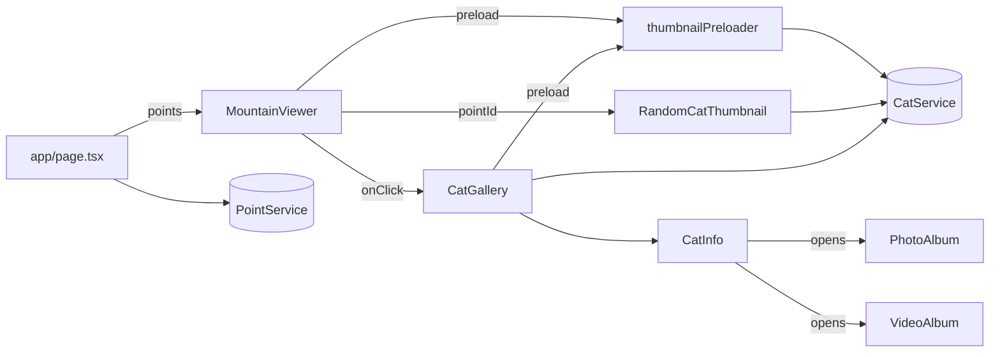

# mountain-map-and-cats

> Part of: [Codebase Overview](CODEBASE_OVERVIEW.md)

## Purpose

The public landing experience. A satellite-image map of the mountain (currently 계양산 / Geyang)
with clickable points; each point reveals a gallery of current and former feline residents.
This is what the awareness-raising mission is built around — every other feature exists to
support, manage, or extend the data shown here.

## Key Components

| Component                    | File(s)                                                        | Responsibility                                                                                                                                                                                                      |
| ---------------------------- | -------------------------------------------------------------- | ------------------------------------------------------------------------------------------------------------------------------------------------------------------------------------------------------------------- |
| Home page (server component) | `src/app/page.tsx`                                             | Server-fetches all points via `getPointService()` and passes them to `MountainViewer`.                                                                                                                              |
| `MountainViewer`             | `src/components/MountainViewer.tsx`                            | Renders the satellite image, overlays points, manages hover/click state, opens `CatGallery`. Handles mobile rotation + dynamic CSS-variable scaling so the 16:9 image fits portrait viewports.                      |
| `RandomCatThumbnail`         | `src/components/RandomCatThumbnail.tsx`                        | Per-point marker. Loads current cats for a point (with module-level cache), picks a random thumbnail, swaps in a fallback white circle if none exist or the image errors.                                           |
| `CatGallery`                 | `src/components/CatGallery.tsx`                                | Modal overlay for a selected point. Loads current + former residents via `getCatsByPointId()`, displays two grids (현재 거주 중 / 예전에 거주), opens `CatInfo` for a tapped cat.                                   |
| `CatInfo`                    | `src/components/CatInfo.tsx`                                   | Detail card. Shows name, status emoji (`산냥이`/`집냥이`/`별냥이`/`행방불명`), description, links to other cats via inline `cat-modal-link` anchors, and entry points to `PhotoAlbum`/`VideoAlbum` filtered by cat. |
| `thumbnailPreloader`         | `src/services/thumbnailPreloader.ts`                           | Module-level singleton. Eagerly fetches all current cats for all points on mount and primes the browser image cache. Idempotent via `loadedThumbnails` and `loadingPromises` sets.                                  |
| Cat / Point services         | `src/services/cat-service.ts`, `src/services/point-service.ts` | Firestore reads. `getCatsByPointId()` returns `{current, former}` based on `dwelling` and `prev_dwelling`.                                                                                                          |
| Types                        | `src/types/index.ts` (`Cat`, `Point`)                          | `Point.x` / `Point.y` are percentages used for absolute positioning over the satellite image. `Cat.dwelling` is the current point ID; `Cat.prev_dwelling` flags former residents.                                   |

## Data Flow

<!-- ============================================================
     DIAGRAM STEP — Data Flow
     ============================================================ -->

```mermaid
sequenceDiagram
    participant Browser
    participant Home as page.tsx (SSR)
    participant PointSvc as PointService
    participant Viewer as MountainViewer
    participant Pre as thumbnailPreloader
    participant CatSvc as CatService
    participant Firestore

    Browser->>Home: GET /
    Home->>PointSvc: getAllPoints()
    PointSvc->>Firestore: getDocs(points)
    Firestore-->>PointSvc: Point[]
    PointSvc-->>Home: Point[]
    Home-->>Browser: HTML + points prop

    Browser->>Viewer: hydrate
    Viewer->>Pre: preloadThumbnailsForPoints(pointIds)
    Pre->>CatSvc: getCatsByPointId(id) for each
    CatSvc->>Firestore: query where dwelling == id
    Firestore-->>CatSvc: Cat[]
    CatSvc-->>Pre: {current, former}
    Pre->>Browser: new Image() per thumbnailUrl

    Note over Browser: User clicks a point
    Browser->>Viewer: onClick(point)
    Viewer->>Browser: render <CatGallery pointId>
    Browser->>CatSvc: getCatsByPointId(pointId)
    CatSvc-->>Browser: {current, former}
    Browser->>Browser: render grids; on cat click, open CatInfo
```

<!-- END DIAGRAM STEP -->

## Component Relationships

<!-- ============================================================
     DIAGRAM STEP — Component Relationships
     ============================================================ -->



<!-- END DIAGRAM STEP -->

## Key Patterns & Conventions

- **Server-rendered points, client-rendered cats.** `app/page.tsx` is an `async` server
  component that pre-fetches points server-side. Cat data is fetched client-side via
  service-layer factories so per-point galleries are interactive without round-tripping.
- **Module-level cache + singleton preloader.** `RandomCatThumbnail` uses a `Map<pointId, Cat[]>`
  module cache; `thumbnailPreloader` is a single class instance exported at module scope.
  This avoids hooks-based cache plumbing but is also impossible to invalidate without a hard
  reload.
- **CSS variables for mobile rotation.** `MountainViewer` measures the satellite image's
  natural aspect ratio, computes `--mobile-scale-factor` and `--mobile-point-counter-scale-factor`,
  then applies a `rotate-90` parent + counter-rotated points so the same 16:9 image fits a
  portrait viewport without distorting marker positions.
- **`Point.x` / `Point.y` are percentages.** Markers position via inline `left: ${x}%; top: ${y}%`
  inside the scaled image container.
- **Hard-coded label collision rules.** Two specific point titles (`하느재 등산로 입구 부근`,
  `공원 관리소 부근`) get bespoke positioning to avoid label overlap. Adding new points may need
  similar special cases.

## External Integrations

- **Firestore** — `cats` collection (queried by `dwelling` and `prev_dwelling`); `points`
  collection (full scan via `getDocs`).
- **Firebase Storage** — `cat.thumbnailUrl` is a Firebase Storage URL; `next.config.js`
  whitelists `firebasestorage.googleapis.com` under `images.remotePatterns`.
- **`/public/images/`** — Static map background (`screenshot_mt_geyang_50.png`) and compass
  (`arrow_north.svg`).

## Watch-outs

- The satellite image path is hard-coded in `MountainViewer.tsx` line ~45
  (`/images/screenshot_mt_geyang_50.png`). Multi-mountain support here is incomplete — the
  image source needs to come from `getMountainConfig()` once a second mountain ships.
- Read-path errors return `[]` / `null` and only `console.error`. This silently degrades the UX
  to "no cats" if Firestore is misconfigured. Consider raising a visible error state for the
  initial server fetch.
- `RandomCatThumbnail` re-randomizes on every page load (memoized only within a render). If
  consistent thumbnails per session are desired, hash on `pointId` instead of using `Math.random()`.
- The catCache in `RandomCatThumbnail` is module-scoped and never invalidated. Edits made
  through the admin CMS require a full reload to appear on the public map.
