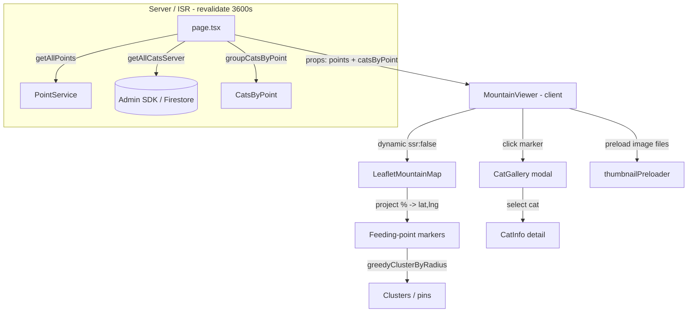
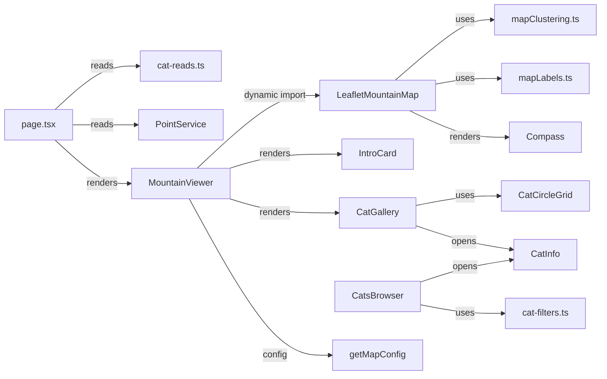

# Mountain Map & Cats

> Part of: [Codebase Overview](CODEBASE_OVERVIEW.md)

## Purpose

The public landing experience: an interactive **Leaflet** map of the mountain where each
feeding point reveals the cats that live (`dwelling`) or used to live (`prev_dwelling`) there,
plus the `/cats` "browse all cats" page. Cat data is read **server-side** (Admin SDK) and
baked into the ISR render, so the client map issues **zero Firestore queries** for avatars.

## Key Components

| Component           | File(s)                                              | Responsibility                                                                                                                   |
| ------------------- | ---------------------------------------------------- | -------------------------------------------------------------------------------------------------------------------------------- |
| Home page           | `src/app/page.tsx`                                   | `async` Server Component; `revalidate = REVALIDATE_SECONDS`; awaits points + cats, groups cats by point, passes as props         |
| Server cat reads    | `src/lib/server/cat-reads.ts`                        | `getAllCatsServer()` (Admin SDK, log+re-raise) and `groupCatsByPoint()` → `CatsByPoint` shape                                    |
| Map host            | `src/components/MountainViewer.tsx`                  | Client host: preloads thumbnails, owns `IntroCard`, gallery-modal state, mobile/landscape gating, config-driven clustering knobs |
| Leaflet map         | `src/components/LeafletMountainMap.tsx`              | `CRS.Simple` image-overlay map; portrait/landscape image swap; `%`→`[lat,lng]` projection; marker clustering + label placement   |
| Clustering          | `src/utils/mapClustering.ts`                         | Pure, zoom-independent greedy proximity clustering (replaces `leaflet.markercluster`) + spiderfy geometry                        |
| Label placement     | `src/utils/mapLabels.ts`                             | Resolves where a marker's name label sits (e.g. above the pin)                                                                   |
| Compass / IntroCard | `src/components/Compass.tsx`, `IntroCard.tsx`        | Static north indicator (rotates with portrait image); dismissible "click a cat" nudge (localStorage)                             |
| Per-point gallery   | `src/components/CatGallery.tsx`, `CatCircleGrid.tsx` | Modal listing a point's current/former cats as circular avatar cards                                                             |
| Cat detail          | `src/components/CatInfo.tsx`                         | Cat detail view (photos, fields) shown in a modal                                                                                |
| Cat-linked text     | `src/components/CatLinkedText.tsx`                   | Renders text with `[catmodal:name]` links that open a `CatInfo` modal                                                            |
| Cats browser page   | `src/app/pages/cats/page.tsx`, `CatsBrowser.tsx`     | 냥이들 — server-read cats + dwelling names → search/filter/sort island (card grid on mobile, table on desktop)                   |
| Shared filters      | `src/utils/cat-filters.ts`                           | Pure `filterCats`/`sortCats`/unique-value helpers shared by the browser **and** the admin cat grid                               |

<!-- ============================================================
     DIAGRAM STEP — Data Flow
     Current tool: Mermaid
     ============================================================ -->

## Data Flow

## Component Relationships

## Key Patterns & Conventions

- **Bake the data layer (§7a)**: cats are read once server-side via the Admin SDK
  (`getAllCatsServer`) and threaded through as props. The old per-point client waterfall
  (`getCatsByPointId` × N after hydration) is gone; `thumbnailPreloader` only warms the image
  _files_ into cache.
- **Client-only map**: Leaflet touches `window`, so `LeafletMountainMap` is loaded via
  `next/dynamic` with `ssr: false` and a Korean loading placeholder.
- **`CRS.Simple` image map**: the mountain photo is the coordinate plane addressed as `[y, x]`;
  stored point coords are **percentages** (x from left, y from top) projected at render time —
  Firestore/`Point` are never mutated.
- **Portrait/landscape by device, not orientation**: phones always get the pre-rotated (90° CW)
  portrait image; a phone held in landscape gets a "rotate to portrait" notice, not a sideways
  map. `useIsMobile` / `useIsPhoneLandscape` drive this.
- **Shared filter logic**: `cat-filters.ts` is the single source of truth so the public
  `CatsBrowser` and the admin cat grid apply identical predicates.

## External Integrations

- **Firestore** (via Admin SDK on the server for `getAllCatsServer`; via `PointService` for
  points) — the `cats` collection (`dwelling`, `prev_dwelling`) and points.
- **Firebase Storage** — cat thumbnail image URLs (preloaded, then served through Next
  `<Image>`).

## Watch-outs

- **Clustering was rewritten deliberately.** `leaflet.markercluster` rebuilt its grid off the
  map's live (fractional `CRS.Simple`) zoom and caused device-dependent breakage (pins
  vanishing / stuck pan on some phones). `mapClustering.ts` computes groups **once** in a fixed
  pixel space and never re-evaluates on zoom — see `log/DEBUG_LOG.md`. Keep it pure and
  zoom-independent.
- **The mobile projection rotates points with the image** (`x' = 1 − y`, `y' = x`). If you
  touch `pointToLatLng`, verify both layouts.
- **`getAllCatsServer` logs and re-raises** — a failed build read must surface, not silently
  ship an empty map. Don't add a swallow-and-return-`[]` fallback.
- A cat can appear in **both** a point's `current` and another point's `former` (moved
  dwellings) — `groupCatsByPoint` buckets each independently.
  </content>
