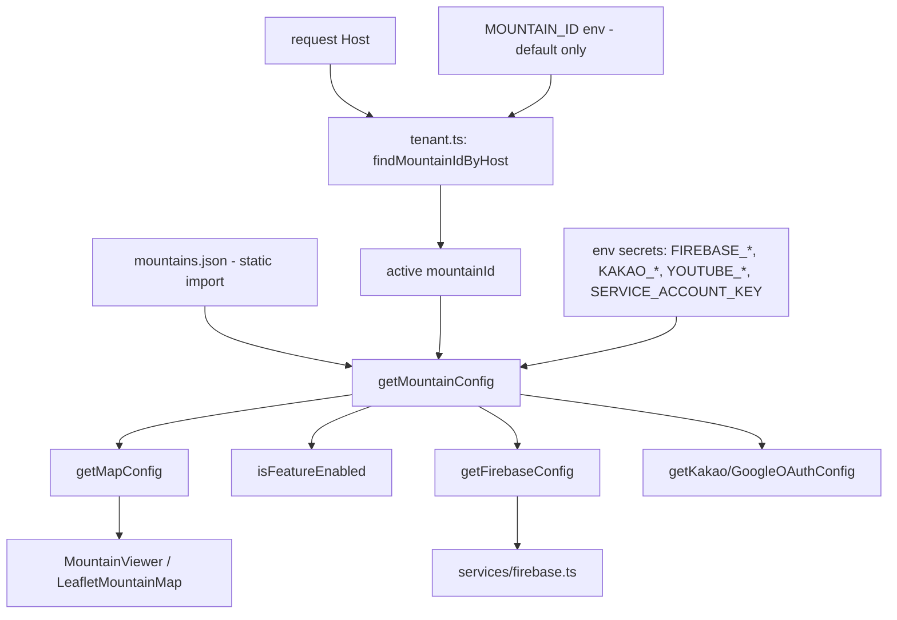
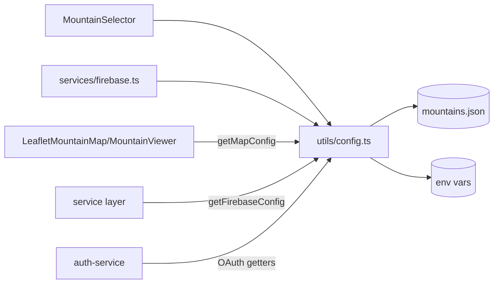

# Multi-Tenant Config

> Part of: [Codebase Overview](CODEBASE_OVERVIEW.md)

## Purpose

The multi-tenant system that lets one codebase serve multiple mountains (M1–M8 complete). The
active mountain is resolved **per request by Host** — each mountain's `domains` map its
production subdomain (e.g. `geyangsan.mohocats.org`) to a tenant, with a `/{mountainId}` path
fallback for dev/preview and `MOUNTAIN_ID` as a last-resort **default** (not a selector). A
tenant's public settings (branding, theme, features, map tuning, social, auth policy) come from
`config/mountains/mountains.json`; secrets are merged in from env. **All mountains share one
Firebase project and one Vercel project** — tenancy is enforced by a `mountainId` stamped on
every content doc, not by separate infrastructure. All mountain context is accessed through
`src/utils/config.ts` / `src/lib/tenant.ts` — never `process.env` directly.

## Key Components

| Component            | File(s)                               | Responsibility                                                                                                                                                  |
| -------------------- | ------------------------------------- | --------------------------------------------------------------------------------------------------------------------------------------------------------------- |
| Mountain config JSON | `config/mountains/mountains.json`     | Per-mountain public config (`geyang`, `manisan` stub); theme/features/map/social/authentication + `domains`/`storagePrefix`/`hidden`                            |
| Permissions JSON     | `config/permissions.json`             | Global `roles`→permission matrix + a `mountains` listing (kept coherent with `mountains.json`)                                                                  |
| Config utils         | `src/utils/config.ts`                 | `getDefaultMountainId`, `getMountainConfig`, `getMapConfig`, `isFeatureEnabled`, `getFirebaseConfig`, OAuth getters, `getAllMountains`, `getPublicMountains`, … |
| Tenant resolution    | `src/lib/tenant.ts` + middleware      | `findMountainIdByHost`, `getRequestMountainId`, `resolveMountainIdOrNull` — Host→tenant, consumed by the `[mountain]` layout + API routes                       |
| Mountain selector    | `src/components/MountainSelector.tsx` | UI to view/switch mountains (`getPublicMountains` — excludes `hidden`)                                                                                          |
| Firebase init        | `src/services/firebase.ts`            | Consumes `getFirebaseConfig()` to init the single shared SDK                                                                                                    |
| Firestore rules      | `config/firebase/firestore.rules`     | Mountain-aware access rules (deployed via Firebase CLI)                                                                                                         |

## Data Flow

## Component Relationships

## Key Patterns & Conventions

- **Single accessor module**: import everything mountain-related from `@/utils/config`. Reading
  `process.env.MOUNTAIN_ID` directly, or hard-coding a mountain's config, is an anti-pattern.
- **Public vs secret split**: `mountains.json` holds only non-sensitive config; secrets
  (Firebase keys, OAuth secrets, service account) live in env and are merged by `config.ts`.
- **Host-resolved, with a default fallback**: the tenant comes from the request Host (via each
  mountain's `domains`); an unmapped host or a missing `MOUNTAIN_ID` falls back to `geyang`.
  `MOUNTAIN_ID` is the default, **not** a selector.
- **Feature flags gate UI**: `features` (e.g. `videoAlbum`, `photoAlbum`, `advancedFiltering`,
  `adminPanel`) are checked via `isFeatureEnabled` before rendering optional surfaces.
- **Theme is global, not per-tenant** _(2026-08-05 — supersedes M8)_: `mountains.json` has no
  `theme` block and the `[mountain]` layout injects nothing. Color values live only in
  `tailwind.config.js`; `globals.css` declares
  `--color-primary: theme('colors.brand.DEFAULT')`, resolved at build time so non-Tailwind CSS
  can reach the same value without a second definition.
- **Centralized auth**: `authentication.type = "centralized"` means email/password, phone
  (SMS), and Kakao OIDC are shared across all mountains on the single Firebase project (no
  per-mountain provider setup). `roles`, `defaultRole`, `smsRegions`, and `requireApproval` are
  declared per mountain. A user's roles are a **map keyed by `mountainId`**
  (`users/{uid}.roles`), so one account can administer several mountains.

## External Integrations

- **Firebase** (one shared project for all mountains) — credentials assembled by
  `getFirebaseConfig` / `getFirebaseAdminServiceAccount`.
- **Kakao / Google OAuth, YouTube** — enablement + keys resolved through config getters
  (shared credentials; `social.youtubeChannelId` selects the channel but the OAuth token is
  shared).

## Watch-outs

- **Which tenant is request-time; the config values are still BAKED.** Tenant _selection_ is
  now resolved per request (Host → `mountainId`), so it is not baked. But the config **values**
  still are: `mountains.json` is a **static import**, so theme, features, `domains`,
  `storagePrefix`, and `map.*` change **only on redeploy** — unlike Firestore data (points/cats)
  which is ISR-fresh. Don't expect a config-value edit to appear without a deploy.
- Firestore **rules** still deploy separately via the Firebase CLI (`firebase deploy --only
firestore:rules`); `firebase.json` is trimmed to the `firestore` block. They are **mountain-aware**
  (gate writes on the doc's own `mountainId`, block cross-mountain moves, scope sensitive reads).
- Adding a second mountain is **config + DNS + console allowlists + data** — a JSON block in
  **both** `mountains.json` and `permissions.json`, a subdomain attached to the same Vercel
  project, and the subdomain allowlisted in Firebase Auth + Kakao. **No new Firebase project and
  no new env vars.** Full runbook:
  [`docs/manuals/deployment/new-mountain-setup.md`](../manuals/deployment/new-mountain-setup.md).
  </content>
