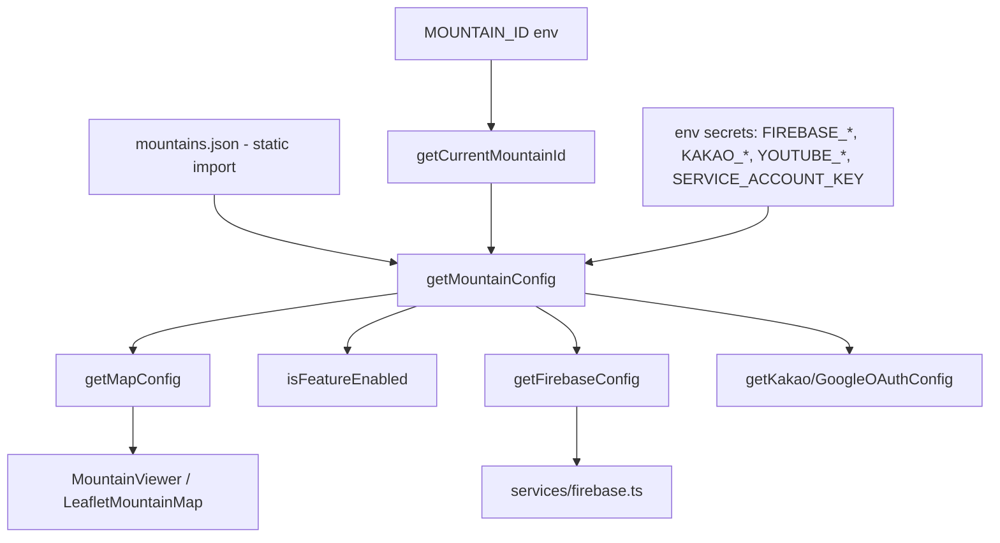
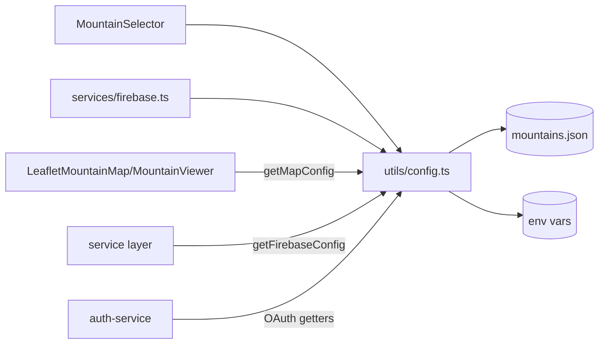

# Multi-Tenant Config

> Part of: [Codebase Overview](CODEBASE_OVERVIEW.md)

## Purpose

The multi-tenant system that lets one codebase serve multiple mountains. A `MOUNTAIN_ID` env
var selects the active mountain; its public settings (branding, theme, features, map tuning,
social, auth policy) come from `config/mountains/mountains.json`, and secrets are merged in from
env. All mountain context is accessed through `src/utils/config.ts` — never `process.env`
directly.

## Key Components

| Component            | File(s)                               | Responsibility                                                                                                                            |
| -------------------- | ------------------------------------- | ----------------------------------------------------------------------------------------------------------------------------------------- |
| Mountain config JSON | `config/mountains/mountains.json`     | Per-mountain public config (`geyang`) + `_meta.centralUserService`; theme/features/map/social/authentication                              |
| Config utils         | `src/utils/config.ts`                 | `getCurrentMountainId`, `getMountainConfig`, `getMapConfig`, `isFeatureEnabled`, `getFirebaseConfig`, OAuth getters, `getAllMountains`, … |
| Mountain selector    | `src/components/MountainSelector.tsx` | UI to view/switch mountains (`getAllMountains`, `getMountainName`)                                                                        |
| Firebase init        | `src/services/firebase.ts`            | Consumes `getFirebaseConfig()` to init the SDK                                                                                            |
| Firestore rules      | `config/firebase/firestore.rules`     | Access rules (deployed via Firebase CLI)                                                                                                  |

## Data Flow

## Component Relationships

## Key Patterns & Conventions

- **Single accessor module**: import everything mountain-related from `@/utils/config`. Reading
  `process.env.MOUNTAIN_ID` directly, or hard-coding a mountain's config, is an anti-pattern.
- **Public vs secret split**: `mountains.json` holds only non-sensitive config; secrets
  (Firebase keys, OAuth secrets, service account) live in env and are merged by `config.ts`.
- **Default fallback**: absent `MOUNTAIN_ID`, the system falls back to `geyang`.
- **Feature flags gate UI**: `features` (e.g. `videoAlbum`, `photoAlbum`, `advancedFiltering`,
  `adminPanel`) are checked via `isFeatureEnabled` before rendering optional surfaces.
- **Centralized auth**: `authentication.type = "centralized"` points at the
  `mountain-cats-users` project; roles, `defaultRole`, `smsRegions`, and `requireApproval` are
  declared per mountain.

## External Integrations

- **Firebase** (per mountain) — credentials assembled by `getFirebaseConfig` /
  `getFirebaseAdminServiceAccount`.
- **`mountain-cats-users`** — shared central auth project (`_meta.centralUserService`).
- **Kakao / Google OAuth, YouTube** — enablement + keys resolved through config getters.

## Watch-outs

- **Config knobs are BAKED, not live.** `mountains.json` is a **static import**, so theme,
  features, and `map.*` (e.g. `clustering`, `maxClusterRadius`) change **only on redeploy** —
  unlike Firestore data (points/cats) which is ISR-fresh. This is a different mental model from
  the data layer; don't expect a config edit to appear without a deploy.
- Firestore **rules** still deploy separately via the Firebase CLI (`firebase deploy --only
firestore:rules`); `firebase.json` is trimmed to the `firestore` block.
- Adding a second mountain means adding a JSON block + provisioning its Firebase project +
  setting env — see `docs/manuals/deployment/` for provisioning.
  </content>
