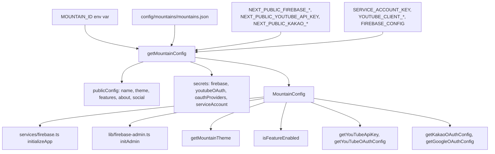
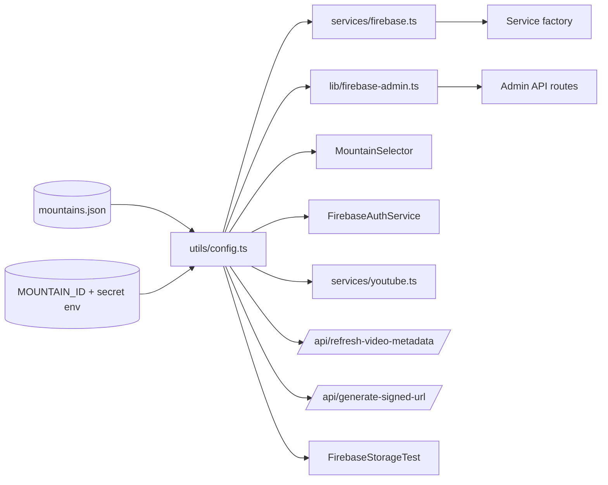

# multi-tenant-config

> Part of: [Codebase Overview](CODEBASE_OVERVIEW.md)

## Purpose

The architectural seam that lets the platform serve more than one mountain. Today there's
exactly one (계양산 / Geyang) but the system is designed so a second mountain can be onboarded
by editing a JSON file and provisioning its Firebase project — no application code changes.
Mountain identity is set at runtime via `MOUNTAIN_ID` (or `NEXT_PUBLIC_MOUNTAIN_ID`); a
single helper module (`src/utils/config.ts`) is the only place the rest of the codebase has
to know about mountain selection.

## Key Components

| Component                  | File(s)                                                                        | Responsibility                                                                                                                                                                                                                                                                                                                                                                                                                                                                                                                                                                                    |
| -------------------------- | ------------------------------------------------------------------------------ | ------------------------------------------------------------------------------------------------------------------------------------------------------------------------------------------------------------------------------------------------------------------------------------------------------------------------------------------------------------------------------------------------------------------------------------------------------------------------------------------------------------------------------------------------------------------------------------------------- |
| Per-mountain config        | `config/mountains/mountains.json`                                              | One top-level key per mountain (`geyang`, future `manisan`, …) plus a `_meta` block. Each contains: `id`, `name`, `description`, `adminEmail`, `about` (title, sections, main photo, mainContent), `theme` (primary/secondary/accent), `features` (videoAlbum, photoAlbum, advancedFiltering, adminPanel), `social` (youtubeChannelId, instagramHandle, facebookPage), `authentication` (type, userServiceProject, roles, smsRegions, defaultRole, requireApproval).                                                                                                                              |
| `_meta.centralUserService` | same                                                                           | Declares the cross-mountain auth project (`mountain-cats-users`). Future state — auth/user data lives in this central project, not per-mountain.                                                                                                                                                                                                                                                                                                                                                                                                                                                  |
| Config loader              | `src/utils/config.ts`                                                          | The runtime API: `getCurrentMountainId()`, `getMountainConfig()`, `getFirebaseConfig()`, `getYouTubeApiKey()`, `getYouTubeOAuthConfig()`, `getYouTubeChannelId()`, `getMountainTheme()`, `isFeatureEnabled()`, `getMountainName()`, `getMountainDescription()`, `getMountainAbout()`, `getOAuthProvidersConfig()`, `getGoogleOAuthConfig()`, `getKakaoOAuthConfig()`, `isGoogleOAuthEnabled()`, `isKakaoOAuthEnabled()`, `getFirebaseAdminServiceAccount()`, `getAllMountains()`. Merges JSON public config with env-derived secrets (Firebase, YouTube OAuth, OAuth providers, service account). |
| `MountainSelector`         | `src/components/MountainSelector.tsx`                                          | Header dropdown rendered in the root layout. Lists `getAllMountains()`; selecting a different mountain reloads the page with `?mountain=...` (placeholder behavior — see Watch-outs).                                                                                                                                                                                                                                                                                                                                                                                                             |
| Firebase clients           | `src/services/firebase.ts`, `src/lib/firebase.ts`, `src/lib/firebase-admin.ts` | All call `getFirebaseConfig()` / `getFirebaseAdminServiceAccount()` so per-mountain credentials flow through.                                                                                                                                                                                                                                                                                                                                                                                                                                                                                     |
| Permissions seed           | `config/permissions.json`                                                      | Per-mountain section (`mountains.geyang`, `mountains.manisan`) for admin emails and default role.                                                                                                                                                                                                                                                                                                                                                                                                                                                                                                 |
| Permission types           | `src/types/permissions.ts`                                                     | `MountainConfig`, `UserRole.mountainId`, `permission_logs.mountainId`.                                                                                                                                                                                                                                                                                                                                                                                                                                                                                                                            |
| Build-time consumers       | `scripts/migration/export_*.js`, `scripts/maintenance/fetch-static-assets.js`  | Use `MOUNTAIN_ID` at build time to scope Firestore-to-GCS exports.                                                                                                                                                                                                                                                                                                                                                                                                                                                                                                                                |

## Mountain config schema

From `config/mountains/mountains.json` (snippet):

```jsonc
{
  "_meta": {
    "centralUserService": {
      "projectId": "mountain-cats-users",
      "handles": ["authentication", "user-management", "cross-mountain-access"]
    },
    "version": "2.0",
    "lastUpdated": "2025-06-29"
  },
  "geyang": {
    "id": "geyang",
    "name": "계양산 냥이들",
    "adminEmail": "admin@geyang-cats.com",
    "about": { "title": "...", "subtitle": "...", "mainPhoto": {...}, "sections": [...] },
    "theme": { "primaryColor": "#ffbc00", ... },
    "features": { "videoAlbum": true, "photoAlbum": true, "adminPanel": true, ... },
    "social": { "youtubeChannelId": "UC1g-XZS4wwyUu7JHDEpB0jw", ... },
    "authentication": {
      "type": "centralized",
      "userServiceProject": "mountain-cats-users",
      "roles": ["admin", "butler-ground", "butler-internet", "viewer"],
      "smsRegions": ["KR"],
      "defaultRole": "viewer",
      "requireApproval": true
    }
  }
}
```

Secrets (Firebase API key, service account, YouTube OAuth, etc.) are _not_ in this file —
they come from environment variables and are merged by `getMountainConfig()`.

## Data Flow

<!-- ============================================================
     DIAGRAM STEP — Config resolution
     ============================================================ -->



<!-- END DIAGRAM STEP -->

<!-- ============================================================
     DIAGRAM STEP — Mountain switch (current placeholder)
     ============================================================ -->

```mermaid
sequenceDiagram
    participant User
    participant UI as MountainSelector
    participant Window
    participant ServerOrEdge as Next runtime

    User->>UI: pick mountain "manisan"
    UI->>Window: location.href = ?mountain=manisan
    Window->>ServerOrEdge: full reload
    Note over ServerOrEdge: process.env.MOUNTAIN_ID is unchanged;<br/>?mountain= query is currently ignored by getCurrentMountainId.
    ServerOrEdge-->>User: same mountain unless deployment ENV is changed
```

<!-- END DIAGRAM STEP -->

## Component Relationships

<!-- ============================================================
     DIAGRAM STEP — Mountain config consumers
     ============================================================ -->



<!-- END DIAGRAM STEP -->

## Key Patterns & Conventions

- **One module gateway.** Every component, service, or route that needs per-mountain
  context must import from `@/utils/config`. Don't read `process.env.MOUNTAIN_ID` directly —
  go through `getCurrentMountainId()`.
- **Public-vs-secret split.** `mountains.json` holds branding, theme, features, social IDs.
  Secrets (`apiKey`, `appId`, `clientSecret`, `refreshToken`, `serviceAccount`) live in env
  vars. `getMountainConfig()` merges them into one returned object.
- **`SERVICE_ACCOUNT_KEY` parsing is permissive.** The loader replaces single quotes,
  newlines, and carriage returns to recover from common copy-paste mangling. New env-driven
  configs should follow the same defensive parsing.
- **Default mountain is `geyang`.** Hard-coded fallback in `getCurrentMountainId()` and
  `getMountainConfig()`. Don't remove until a real router-driven selection is implemented
  for unauthenticated visitors.
- **`isFeatureEnabled('videoAlbum' | 'photoAlbum' | 'adminPanel' | 'advancedFiltering')`**
  is the gate for mountain-specific feature toggles. UI gates should prefer this over hard
  conditionals.
- **`getAllMountains()` excludes `_meta`.** Filters keys that start with `_` so adding new
  meta fields under `_meta.*` won't pollute the dropdown.
- **Theme not yet wired through.** `getMountainTheme()` returns colors but the home page
  and admin layout don't read them yet — Tailwind config is static. Future work.

## External Integrations

- **Firebase (per mountain)** — Project credentials come from `NEXT_PUBLIC_FIREBASE_*`
  env vars; `SERVICE_ACCOUNT_KEY` for the Admin SDK.
- **`mountain-cats-users` Firebase project (planned)** — Centralized auth/user store
  declared in `_meta.centralUserService`. Not yet active in code paths.
- **Vercel/Cloud Run env injection** — `MOUNTAIN_ID` is set as a build-time arg
  (Dockerfile) or a project env var (Vercel) and as a Cloud Run `--set-env-vars` flag.

## Watch-outs

- **`?mountain=...` query param is not honored.** `MountainSelector` sets
  `?mountain=...` on the URL, but `getCurrentMountainId()` only reads `process.env.MOUNTAIN_ID`.
  Switching mountains today requires changing the deployment env. Either implement a
  cookie/query-driven override in `getCurrentMountainId()` or update the selector to point
  at a per-mountain hostname.
- **`mountains.json` is shipped to the browser.** It's `import`ed in `src/utils/config.ts`,
  so all per-mountain public config is bundled. Don't put anything sensitive in it.
- **`NEXT_PUBLIC_MOUNTAIN_ID` and `MOUNTAIN_ID` are both checked.** This is intentional but
  fragile — server reads either while client only sees `NEXT_PUBLIC_*`. Keep them in sync
  in the deployment env or you'll see SSR/CSR drift.
- **`FIREBASE_CONFIG` env var is parsed if present.** The loader merges it on top of the
  per-key envs. If a deployment sets both, the merged result is whichever wins last.
- **Service-account fallback path is hard-coded** in `feeding-spots-admin-service.ts`
  (`config/firebase/mountaincats-61543-7329e795c352.json`). Multi-tenant deployment must
  remove this and rely solely on `getFirebaseAdminServiceAccount()` env-driven path.
- **Manisan exists in `permissions.json` but not in `mountains.json`.** Adding a mountain
  requires updates to both files. The seed is currently inconsistent — `permissions.json`
  has a `manisan` entry while `mountains.json` does not.
- **`adminEmail` in `mountains.json` and `adminUsers` in `permissions.json` are different
  fields.** Both control "who is admin" but neither is used end-to-end. The active gate is
  the user's `currentRole.role` in Firestore. Don't rely on these fields for authorization.
