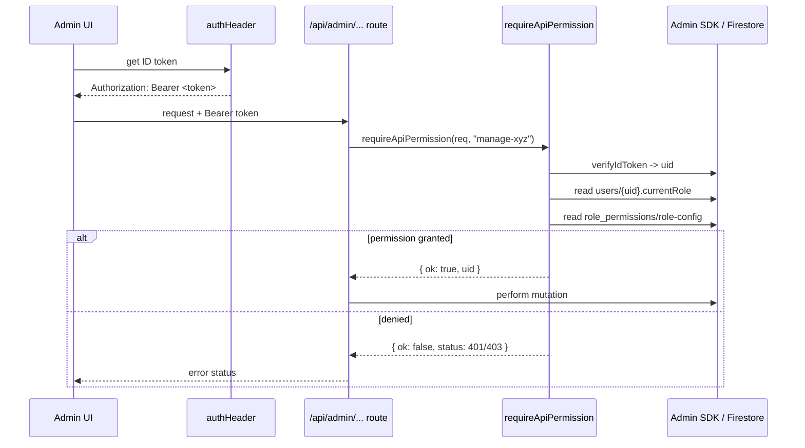
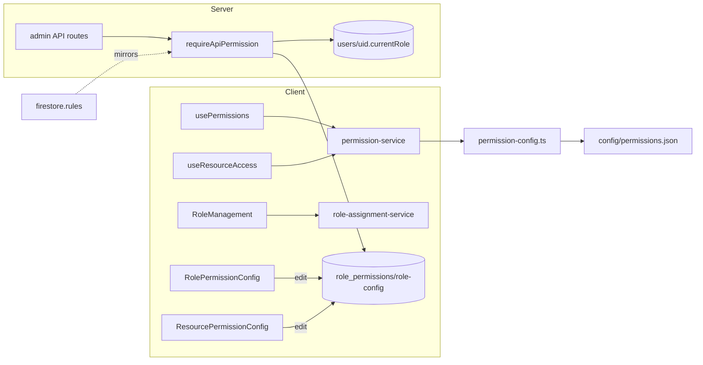

# Permissions & Roles

> Part of: [Codebase Overview](CODEBASE_OVERVIEW.md)

## Purpose

Role-based access control (RBAC) for the platform. Four roles — `admin`, `butler-ground`,
`butler-internet`, `viewer` — map to permission sets that gate both UI (hooks) and server
mutations (API-route guard + Firestore rules). Roles are assigned per user and stored in
Firestore; the permission matrix is editable from the admin UI.

## Key Components

| Component               | File(s)                                               | Responsibility                                                                                                                            |
| ----------------------- | ----------------------------------------------------- | ----------------------------------------------------------------------------------------------------------------------------------------- |
| Permission service      | `src/services/permission-service.ts`                  | Resolve a user's role → permissions; `checkPermission` / `hasAny` / `hasAll`; assign/suspend/reactivate role; role history; users-by-role |
| Role assignment service | `src/services/role-assignment-service.ts`             | First-login role assignment, `needsRoleAssignment`, available roles, role-change logging, descriptions                                    |
| Permission config       | `src/config/permission-config.ts`                     | Typed `Role` / `Permission` unions; loads `config/permissions.json` (roles → permissions, per-mountain admin users, default role)         |
| Seed config             | `config/permissions.json`                             | Seed role→permission matrix (admin 12, butler-ground 4, butler-internet 3, viewer 2)                                                      |
| Live matrix doc         | Firestore `role_permissions/role-config`              | The live, admin-editable role→permission matrix that the API guard and rules read                                                         |
| API guard               | `src/lib/auth/requireApiPermission.ts`                | Server-side gate for admin API routes: verify ID token → role → permission (Admin SDK bypasses rules, so routes must self-enforce)        |
| Auth header helper      | `src/lib/auth/authHeader.ts`                          | Attaches the Firebase ID token as `Authorization: Bearer` for admin API calls                                                             |
| UI hooks                | `src/hooks/usePermissions.ts`, `useResourceAccess.ts` | Resolve effective permissions / resource access for gating client UI                                                                      |
| Role management UI      | `src/components/admin/RoleManagement.tsx`             | Assign/adjust user roles (사용자 tab)                                                                                                     |
| Role→permission matrix  | `src/components/admin/RolePermissionConfig.tsx`       | Edit which permissions each role has (역할 tab)                                                                                           |
| Resource matrix         | `src/components/admin/ResourcePermissionConfig.tsx`   | Protect content pages/resources (권한 tab)                                                                                                |
| Firestore rules         | `config/firebase/firestore.rules`                     | `hasPermission`-based rules the API guard mirrors                                                                                         |

## Data Flow

## Component Relationships

## Key Patterns & Conventions

- **Two enforcement layers, one matrix**: Firestore security rules (`hasPermission`) protect
  client SDK writes; `requireApiPermission` protects Admin-SDK API routes (which bypass rules).
  Both resolve against the **same** `role_permissions/role-config` doc so they can't drift.
- **Result objects over exceptions**: `requireApiPermission` returns a discriminated
  `{ ok: true, uid } | { ok: false, status, error }` so routes map failures straight to HTTP
  status codes.
- **Live config preferred over stored permissions**: `getUserPermissions` prefers the live
  role config so matrix edits apply without re-assigning every user.
- **Never log the token**: the guard logs failures without ever emitting the token value.

## External Integrations

- **Firebase Auth** — ID-token verification (server) and current-user resolution (client).
- **Firestore** — `users/{uid}.currentRole`, `role_permissions/role-config` (live matrix), and
  role-history records.

## Watch-outs

- **The old debug/duplicate surface was removed.** `PermissionDebug`, `PermissionManager`,
  `RoleManagementDirect`, and a family of near-duplicate API routes
  (`get-all-user-permissions-{final,fixed,live,real,simple,working}`, `get-all-users`) are gone.
  Don't reintroduce parallel "get all permissions" endpoints — use the service + guard.
- **`permission-service.ts` carries stale in-code commentary** around `assignRole` /
  `getUserPermissions` (notes-to-self about which source of truth wins). The effective behavior
  is "prefer live config"; treat the comments as history, verify against the code.
- **Admin API routes must call `requireApiPermission` themselves** — the Admin SDK bypasses
  Firestore rules, so forgetting the guard silently removes all protection.
- Seed `config/permissions.json` is the _starting_ matrix; the _live_ authority is the
  Firestore `role_permissions/role-config` doc edited via the admin UI.
  ⚠️ **This means a permission can go live without any deploy, and without the migration
  script.** The admin UI's `POST /api/admin/role-permissions` writes the live doc directly,
  and **Preview (branch `dev`) runs against the production database** — so saving the
  Permission Matrix there changes production. (The `GET` auto-seed is _not_ a path: it fires
  only when the doc is absent.) 🔑 **Discovered 2026-08-03**, when §10n's grants turned out to
  be live while every doc said "not deployed". **Check the deployed artifact, not the branch.**
- **Member ("own") grants are deliberately narrower than they look, and must stay that way.**
  `write-own-post-*` (§10n) and `upload-own-photo` / `upload-own-video` (§10p) authorize
  creating a thing attributed to yourself — never updating or deleting anyone's, your own
  included. Authorization keys on a **uid** (`authorUid`, `uploadedByUid`), never on the
  display fields beside them (`username`, `uploadedBy`), which hold emails and literals like
  `'admin'` / `'system_sync'`.
- **When a role gains a capability, walk its whole journey.** §10n granted the two post
  permissions and shipped a member journey that still 403'd at the first upload — and because
  the composer abandons the save on an upload failure, the member lost the entire post. 🔑
  **The gap is never in the permission you just wrote**; it is in the step after it.
  </content>
