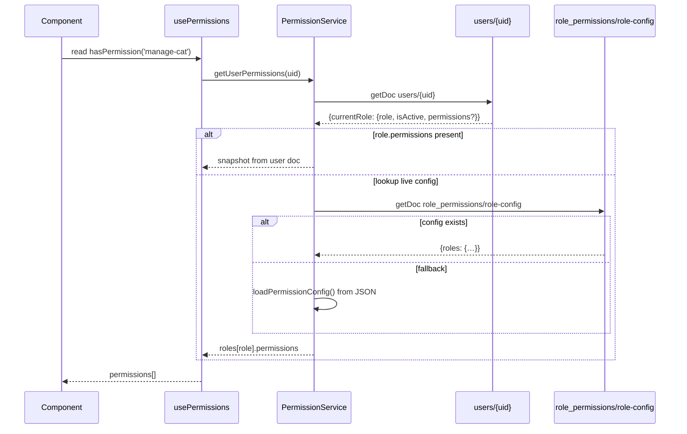
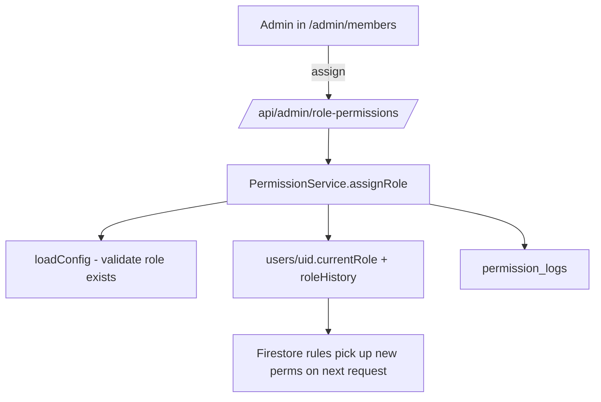
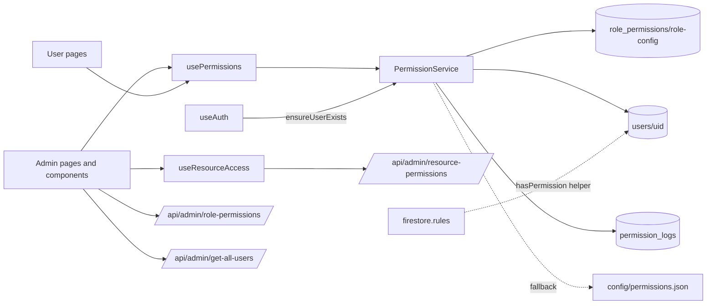

# permissions-and-roles

> Part of: [Codebase Overview](CODEBASE_OVERVIEW.md)

## Purpose

Role-based access control. Defines four roles (`admin`, `butler-ground`, `butler-internet`,
`viewer`) and a permission vocabulary (`manage-*`, `view-*`). Roles are stored as documents
in Firestore (`users/{uid}.currentRole` + a `roleHistory` audit trail). Permissions are
resolved live from a Firestore-cached `role-config` document, falling back to bundled
`config/permissions.json`. Resource-level access (which admin pages a role can see) is
configured separately in Firestore via `resource_permissions` and exposed through an admin
API. Firestore security rules enforce server-side guarantees independent of UI gating.

## Key Components

| Component                | File(s)                                                                                                                                                                                                             | Responsibility                                                                                                                                                                                                                                                                                                                                                          |
| ------------------------ | ------------------------------------------------------------------------------------------------------------------------------------------------------------------------------------------------------------------- | ----------------------------------------------------------------------------------------------------------------------------------------------------------------------------------------------------------------------------------------------------------------------------------------------------------------------------------------------------------------------- |
| Role / permission vocab  | `config/permissions.json`, `src/types/permissions.ts`, `src/config/permission-config.ts`                                                                                                                            | The four roles + their permission lists, mountains' admin emails and default role. Also defines `Role`, `Permission` types and `isValidRole`/`isValidPermission` guards.                                                                                                                                                                                                |
| `PermissionService`      | `src/services/permission-service.ts` (~491 lines)                                                                                                                                                                   | All RBAC operations. Loads config (Firestore-first, JSON fallback), resolves user → permissions, assigns/suspends/reactivates roles, ensures `users/{uid}` exists, syncs linked providers, writes `permission_logs` audit trail.                                                                                                                                        |
| `usePermissions` hook    | `src/hooks/usePermissions.ts`                                                                                                                                                                                       | Loads the current user's permissions (resolved server-side via `PermissionService`), exposes `hasPermission`, `hasAnyPermission`, `hasAllPermissions`, plus convenience getters (`canManageCats`, `canManagePosts`, `canManageUsers`, …).                                                                                                                               |
| `useResourceAccess` hook | `src/hooks/useResourceAccess.ts`                                                                                                                                                                                    | SWR-backed (`/api/admin/resource-permissions`, 60s dedupe) check of "can this user access _resource X_?" Resources are admin-page identifiers; required perms come from Firestore.                                                                                                                                                                                      |
| `useAuth` integration    | `src/components/auth/AuthProvider.tsx`                                                                                                                                                                              | On profile updates and provider link/unlink, calls `permissionService.ensureUserExists(user)` and `updateUserProviders(uid, providers)`.                                                                                                                                                                                                                                |
| Permission API routes    | `src/app/api/admin/resource-permissions/route.ts`, `role-permissions/route.ts`, `get-all-user-permissions*` (multiple variants), `get-all-users/route.ts`                                                           | Server-side reads/writes that elevate via `firebase-admin`. The many `get-all-user-permissions-*` route variants are leftovers from iterative debugging — the canonical path is `get-all-users` + `get-all-user-permissions-final` (verify before changing).                                                                                                            |
| Admin role UI            | `src/components/admin/RoleManagement.tsx`, `RoleManagementDirect.tsx`, `RolePermissionConfig.tsx`, `ResourcePermissionConfig.tsx`, `PermissionManager.tsx`, `PermissionDebug.tsx`, `src/app/admin/members/page.tsx` | Edit role definitions, assign roles to users, configure resource→permission mappings.                                                                                                                                                                                                                                                                                   |
| Firestore security rules | `config/firebase/firestore.rules`                                                                                                                                                                                   | Public-read collections (`cats`, `points`, `about_content`, `cat_images`, `cat_videos`, `posts_announcements`); `posts_feeding` / `posts_butler` gated by `hasPermission(uid, 'manage-posts')`; `admin_data` gated by `manage-users`. Rules call a `hasPermission(uid, perm)` helper that reads `user_permissions` (note: code now writes to `users/`, see watch-outs). |

## Roles & Permissions Matrix

From `config/permissions.json`:

| Permission        | admin | butler-ground | butler-internet | viewer |
| ----------------- | :---: | :-----------: | :-------------: | :----: |
| manage-app        |  ✅   |               |                 |        |
| manage-cat        |  ✅   |               |                 |        |
| manage-canteen    |  ✅   |               |                 |        |
| manage-shelter    |  ✅   |               |                 |        |
| manage-photo      |  ✅   |               |                 |        |
| manage-video      |  ✅   |               |                 |        |
| manage-posts      |  ✅   |               |                 |        |
| manage-users      |  ✅   |               |                 |        |
| view-post-feeding |  ✅   |      ✅       |                 |        |
| view-post-butler  |  ✅   |      ✅       |       ✅        |        |
| view-photo        |  ✅   |      ✅       |       ✅        |   ✅   |
| view-video        |  ✅   |      ✅       |       ✅        |   ✅   |

Mountains in seed config: `geyang` (admin: `jaesangpark@gmail.com`), `manisan` (no admins,
defaultRole `viewer`).

## Data Flow

<!-- ============================================================
     DIAGRAM STEP — Permission Resolution
     ============================================================ -->

<!-- END DIAGRAM STEP -->

<!-- ============================================================
     DIAGRAM STEP — Role Assignment
     ============================================================ -->

<!-- END DIAGRAM STEP -->

## Component Relationships

<!-- ============================================================
     DIAGRAM STEP — Component Relationships
     ============================================================ -->

<!-- END DIAGRAM STEP -->

## Key Patterns & Conventions

- **Role is canonical, permissions are derivable.** `assignRole` snapshots
  `roles[role].permissions` onto `users/{uid}.currentRole.permissions` for audit, but
  `getUserPermissions` prefers a live config lookup when the snapshot is empty so updates
  propagate without rewriting every user.
- **Firestore-first config with JSON fallback.** `PermissionService.loadConfig` reads
  `role_permissions/role-config`; on miss or error it falls back to `loadPermissionConfig()`,
  which `require`s `config/permissions.json` directly (bypassing HTTP).
- **Two collections, transitional naming.** Code writes to `users/{uid}` (`usersCollection`
  in `permission-service.ts`) but `firestore.rules` and the legacy `getUserPermissions`
  paths still reference `user_permissions/{userId}`. The active comment in code says
  "Migrated from 'user_permissions'". Rules need a follow-up update.
- **Audit trail via `roleHistory` + `permission_logs`.** Every assign/suspend/reactivate
  pushes the previous role into `roleHistory` and writes a `permission_logs` entry with the
  changing user, action, and metadata.
- **Resource access is data-driven.** `useResourceAccess` does not encode resource→permission
  rules in code. It fetches `/api/admin/resource-permissions` and treats empty/missing as
  "public". Add new admin pages by editing the Firestore config, not the hook.
- **`PermissionService` is constructed per-call.** `usePermissions` does `new PermissionService()`
  inside the hook (no factory). Cheap because the class only holds a lazy config cache, but
  it means each hook instance reloads config on first use.

## External Integrations

- **Firestore** — `role_permissions/role-config` (live config), `users/{uid}` (current role +
  history), `permission_logs/{id}` (audit), `resource_permissions` (page→permission map).
- **Firebase Admin SDK** — Server-side admin API routes elevate via `firebase-admin` to
  list users, set custom claims, and bypass rules.
- **`firestore.rules`** — Server-side enforcement. The `hasPermission(uid, perm)` helper
  (called by every gated rule) is the source of truth even if the UI is bypassed.

## Watch-outs

- **Collection name drift between rules and code.** `firestore.rules` references
  `user_permissions/{userId}`; `PermissionService` reads/writes `users/{uid}`. Either
  the rules' `hasPermission` helper transparently looks up the right collection, or one
  side is stale. Verify before relying on rule-level enforcement for any new feature.
- **Multiple `get-all-user-permissions-*` API variants.** Files: `simple`, `working`, `live`,
  `real`, `fixed`, `final`, `client`. Stale debugging artifacts. Treat them as a smell — when
  touching this area, consolidate.
- **No client-side UI gate guarantees server-side enforcement.** `usePermissions`/
  `useResourceAccess` only hide UI; mutations must rely on Firestore rules and
  authenticated admin API routes.
- **Default-role assignment is implicit.** New users created via `ensureUserExists` get the
  empty / mountain default; verify `config.mountains[mountainId].defaultRole` is set before
  onboarding a new mountain.
- **`config/permissions.json` is `require`d at runtime.** This works under Next.js' Webpack
  config but is fragile — if the JSON is moved or the build is restructured, the fallback
  silently disappears.
- **No permission-check tests.** `PermissionDebug.tsx` is a dev-only component that helps
  inspect a user's resolved permissions; it is not a substitute for unit tests.
