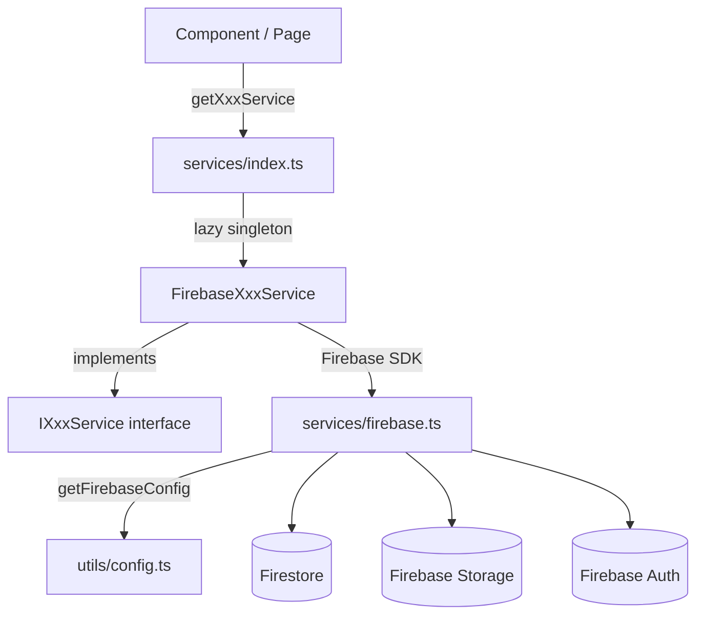
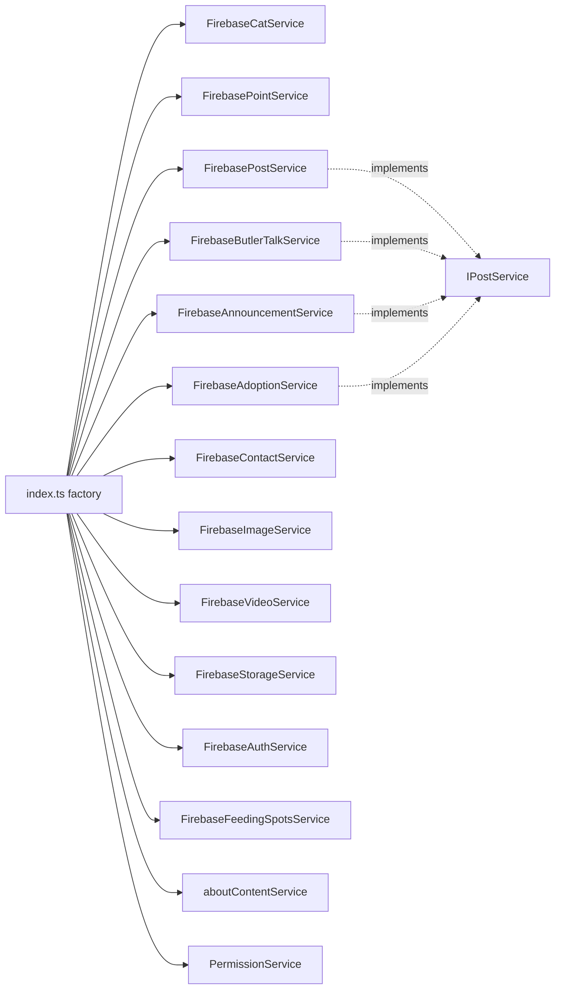

# Services Layer

> Part of: [Codebase Overview](CODEBASE_OVERVIEW.md)

## Purpose

A factory-pattern abstraction over Firebase. Components and pages never touch the Firebase SDK
directly — they call `getXxxService()` from `@/services`, which returns an interface-typed lazy
singleton. This is the seam for future multi-tenant DB separation, alternate backends, and
testing.

## Key Components

| Component           | File(s)                                                                                       | Responsibility                                                                                                                                                 |
| ------------------- | --------------------------------------------------------------------------------------------- | -------------------------------------------------------------------------------------------------------------------------------------------------------------- |
| Service factory     | `src/services/index.ts`                                                                       | Lazy-singleton getters (`getCatService`, `getPointService`, …) and public type re-exports                                                                      |
| Interfaces          | `src/services/interfaces.ts`                                                                  | `ICatService`, `IPointService`, `IPostService`, `IContactService`, `IImageService`, `IVideoService`, `IStorageService`, `IAuthService`, `IFeedingSpotsService` |
| Firebase init       | `src/services/firebase.ts`                                                                    | Initializes the Firebase app (config from `getFirebaseConfig()`), Storage, Auth (explicit persistence), Firestore, Analytics                                   |
| Cat / Point         | `cat-service.ts`, `point-service.ts`                                                          | Cat and feeding-point CRUD (`dwelling`/`prev_dwelling`, point coords)                                                                                          |
| Post family         | `post-service.ts`, `butler-talk-service.ts`, `announcement-service.ts`, `adoption-service.ts` | All implement `IPostService`; each targets its own Firestore collection (posts, butler talk, announcements `posts_adoption`)                                   |
| Contact             | `contact-service.ts`                                                                          | 문의/동참 submissions (`IContactService`)                                                                                                                      |
| Media               | `image-service.ts`, `video-service.ts`, `media-albums.ts`, `storage-service.ts`, `youtube.ts` | Image/video records, album grouping, Firebase Storage, YouTube integration                                                                                     |
| Feeding spots       | `feeding-spots-service.ts`, `feeding-spots-admin-service.ts`                                  | Feeding-station data (public + admin variants)                                                                                                                 |
| Auth                | `auth-service.ts`                                                                             | `IAuthService` — see [authentication](authentication.md)                                                                                                       |
| Permissions         | `permission-service.ts`, `role-assignment-service.ts`                                         | RBAC — see [permissions-and-roles](permissions-and-roles.md)                                                                                                   |
| About content       | `about-content-service.ts`                                                                    | About-page editable content                                                                                                                                    |
| Thumbnail preloader | `thumbnailPreloader.ts`                                                                       | Warms cat thumbnail image files into browser cache                                                                                                             |

## Data Flow

## Component Relationships

## Key Patterns & Conventions

- **Lazy singletons**: each getter caches its instance in a module-level `let … | null`,
  instantiating on first use. Import getters from `@/services` — never `new` a service or
  import `firebase/*` in a component.
- **Shared post interface**: butler talk, announcements, and adoption all reuse `IPostService`
  — a new "post-like" content type should implement `IPostService` and add a getter, not invent
  a new shape.
- **Config-driven Firebase init**: `firebase.ts` pulls credentials from `getFirebaseConfig()`
  (multi-tenant config) and throws loudly if config is missing — no silent misconfiguration.
- **Separate server read path**: Server Components that need cats at build/server time use
  `src/lib/server/cat-reads.ts` (Admin SDK), _not_ the client `getCatService()`. See
  [mountain-map-and-cats](mountain-map-and-cats.md).

## External Integrations

- **Firestore** — every content service's backing store.
- **Firebase Storage** — image/video files and signed URLs (`storage-service.ts`).
- **Firebase Auth** — `auth-service.ts`.
- **YouTube Data API v3** — `youtube.ts` and the media/YouTube routes.

## Watch-outs

- **`getPermissionService()` returns a fresh instance** (`return new PermissionService()`),
  unlike the other getters which cache. If you rely on per-instance caching inside
  `PermissionService`, be aware each call constructs anew.
- **Removed helpers**: `MIGRATION_EXAMPLE.ts` and the static-data JSON path
  (`cats-static-data.json`, `feeding-spots-static-data.json`, `cat-migration-helper.ts`) are
  gone — the app reads Firestore live. Don't reintroduce a static-data read path.
- There are several feeding-spots service variants (`service` / `admin-service` /
  `basic-…-service`); confirm which one a caller needs before adding a method.
- Read paths in some legacy services still swallow errors and return `[]`/`null`. New code
  should follow the repo convention: **log and re-raise**.
  </content>
