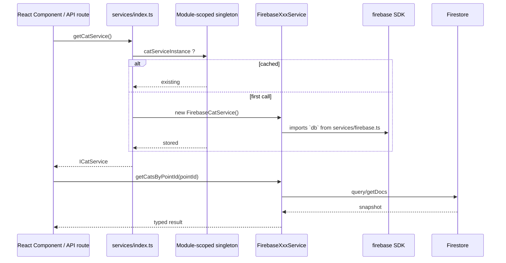
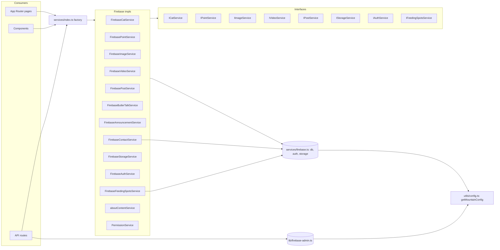

# services-layer

> Part of: [Codebase Overview](CODEBASE_OVERVIEW.md)

## Purpose

A factory-pattern abstraction layer between UI and Firebase. Components never call
`firebase/firestore` or `firebase/auth` directly — they go through `getXxxService()` factory
functions that return interface-typed singletons. This is the seam that makes the app
multi-tenant ready, and the seam where alternate backends (mocks, REST, GraphQL) could be
swapped in without touching components. The pattern is implemented today for ~13 domain
services, all of which currently use Firebase implementations.

## Key Components

| Component                                  | File(s)                                                                                                                                                                                                                                                                                                                                                                                                                                                          | Responsibility                                                                                                                                                                                                                                                                                                                               |
| ------------------------------------------ | ---------------------------------------------------------------------------------------------------------------------------------------------------------------------------------------------------------------------------------------------------------------------------------------------------------------------------------------------------------------------------------------------------------------------------------------------------------------- | -------------------------------------------------------------------------------------------------------------------------------------------------------------------------------------------------------------------------------------------------------------------------------------------------------------------------------------------- |
| Service factory                            | `src/services/index.ts`                                                                                                                                                                                                                                                                                                                                                                                                                                          | Exports `getCatService`, `getPointService`, `getImageService`, `getVideoService`, `getPostService`, `getButlerTalkService`, `getAnnouncementService`, `getContactService`, `getStorageService`, `getAuthService`, `getFeedingSpotsService`, `getAboutContentService`, `getPermissionService`. Each lazy-instantiates and caches a singleton. |
| Service interfaces                         | `src/services/interfaces.ts`                                                                                                                                                                                                                                                                                                                                                                                                                                     | `ICatService`, `IPointService`, `IPostService`, `IContactService`, `IImageService`, `IVideoService`, `IStorageService`, `IAuthService`, `ProviderData`, `IFeedingSpotsService`. Components type against these, not concrete classes.                                                                                                         |
| Firebase client init                       | `src/services/firebase.ts`                                                                                                                                                                                                                                                                                                                                                                                                                                       | The shared client-side Firebase app + `db`, `auth`, `storage`, `analytics`. Uses `initializeAuth` with explicit persistence (not `getAuth`) to avoid 48s indexedDB stall.                                                                                                                                                                    |
| Firebase Admin client                      | `src/lib/firebase-admin.ts`                                                                                                                                                                                                                                                                                                                                                                                                                                      | Admin-SDK init for server-side routes. Uses `getFirebaseAdminServiceAccount()` from config; falls back to `GOOGLE_APPLICATION_CREDENTIALS` / Cloud env.                                                                                                                                                                                      |
| Concrete implementations                   | `cat-service.ts`, `point-service.ts`, `image-service.ts`, `video-service.ts`, `post-service.ts`, `butler-talk-service.ts`, `announcement-service.ts`, `contact-service.ts`, `storage-service.ts`, `auth-service.ts`, `feeding-spots-service.ts`, `feeding-spots-admin-service.ts`, `basic-feeding-spots-service.ts`, `about-content-service.ts`, `permission-service.ts`, `media-albums.ts`, `youtube.ts`, `thumbnailPreloader.ts`, `role-assignment-service.ts` | One file per service. Most are `Firebase*Service implements IXxxService`. `feeding-spots-admin-service.ts` and `basic-feeding-spots-service.ts` use the Admin SDK directly (server-side); their inits read the service-account JSON from `config/firebase/`.                                                                                 |
| About-content service (singleton instance) | `src/services/about-content-service.ts`                                                                                                                                                                                                                                                                                                                                                                                                                          | Exports an `aboutContentService` instance (not a class factory) used directly by `getAboutContentService()`.                                                                                                                                                                                                                                 |
| `MIGRATION_EXAMPLE.ts`                     | `src/services/MIGRATION_EXAMPLE.ts`                                                                                                                                                                                                                                                                                                                                                                                                                              | Reference snippet showing how to migrate a component from direct-Firebase calls to the service layer.                                                                                                                                                                                                                                        |

### Per-service collection map

| Service        | Firestore collection(s)                                          |
| -------------- | ---------------------------------------------------------------- |
| Cat            | `cats`                                                           |
| Point          | `points`                                                         |
| Image          | `cat_images`                                                     |
| Video          | `cat_videos`                                                     |
| Post (feeding) | `posts_feeding`                                                  |
| ButlerTalk     | `posts_butler`                                                   |
| Announcement   | `posts_announcements`                                            |
| Contact        | `contacts` (verify)                                              |
| Feeding-spots  | `feeding_spots`                                                  |
| AboutContent   | `about_content/about` (single doc)                               |
| Permission     | `users/{uid}`, `role_permissions/role-config`, `permission_logs` |

## Data Flow

<!-- ============================================================
     DIAGRAM STEP — Service Resolution
     ============================================================ -->

<!-- END DIAGRAM STEP -->

## Component Relationships

<!-- ============================================================
     DIAGRAM STEP — Service Dependencies
     ============================================================ -->

<!-- END DIAGRAM STEP -->

## Key Patterns & Conventions

- **Lazy-init singleton via module scope.** Each `getXxxService()` checks a
  `xxxServiceInstance` variable, news the impl on first call, and returns the cached
  reference. Cheap, no DI container, no test reset hook — careful in tests.
- **Component-side: no direct Firebase imports.** Components import from `@/services`, never
  from `firebase/firestore` etc. The codebase has a couple of exceptions
  (`AuthProvider.tsx` imports `auth` from `services/firebase`, `firebase.ts` legacy file in
  `src/lib/`) — keep that minimal.
- **One file per service.** Filename pattern `<domain>-service.ts`; class name
  `Firebase<Domain>Service implements I<Domain>Service`. Stick to the convention when adding.
- **Read-on-error returns; write-on-error throws.** Most read methods catch + `console.error`
  - throw a wrapped error; the legacy `src/lib/firebase.ts` reads return `[]` on error. Avoid
    the latter pattern in new code (it hides Firestore misconfiguration).
- **Two SDK families.** Client services use the modular `firebase` SDK (browser-friendly;
  reads honor security rules). Admin services use `firebase-admin` (Node-only; bypasses
  rules; used in API routes).
- **`feeding-spots-admin-service.ts` reads service-account JSON from disk.** The path is
  hard-coded to `config/firebase/mountaincats-61543-7329e795c352.json`. This file is
  gitignored — see `multi-tenant-config.md` for the env-driven alternative
  (`getFirebaseAdminServiceAccount()`).
- **Interfaces sometimes use `any`.** `IPostService` returns `Promise<any[]>`. Tightening
  these is open work; new fields should be added to `Post` in `src/types/index.ts` and the
  interface return types narrowed.

## External Integrations

- **Firebase Firestore** — Primary database for all services.
- **Firebase Auth** — Used by `FirebaseAuthService` and `FirebaseStorageService` (auth
  context for upload).
- **Firebase Storage** — `FirebaseStorageService`, `FirebaseImageService`,
  `FirebaseVideoService` (thumbnail uploads).
- **Firebase Admin SDK** — Used by admin API routes (cats CMS, user management, static-data
  refresh) and the admin-only feeding-spots services.

## Watch-outs

- **Singletons leak state across requests on the server.** Next.js may share module scope
  across requests; if a service ever stored per-request state (auth token, mountain ID), it
  would bleed. Today the services are stateless beyond Firebase clients, but treat with care
  when adding caches.
- **No service is mocked.** Despite the interface seam, there are no mock implementations
  for tests. Adding `MockCatService` in a `tests/` folder would unblock unit tests for
  components.
- **`feeding-spots-admin-service.ts` requires the gitignored service-account JSON.** This
  works locally but breaks in any environment where the file isn't materialized. Production
  paths use `SERVICE_ACCOUNT_KEY` env via `getFirebaseAdminServiceAccount()` — verify before
  adding new admin-SDK services.
- **Multi-tenant isolation is not yet enforced at the service layer.** All services read
  `db` (a single Firebase client). Future per-mountain DB separation requires either
  per-mountain `db` instances or a service factory that takes a mountain ID. The interface
  contracts already accommodate this by being mountain-agnostic.
- **`MIGRATION_EXAMPLE.ts` is not consumed.** It's a reference doc disguised as code.
  Either keep it explicitly archived or convert it to a real markdown doc.
- **`role-assignment-service.ts` exists but is not exposed via the factory.** It's
  imported directly by callers; either add it to `index.ts` or remove the file if dead.
