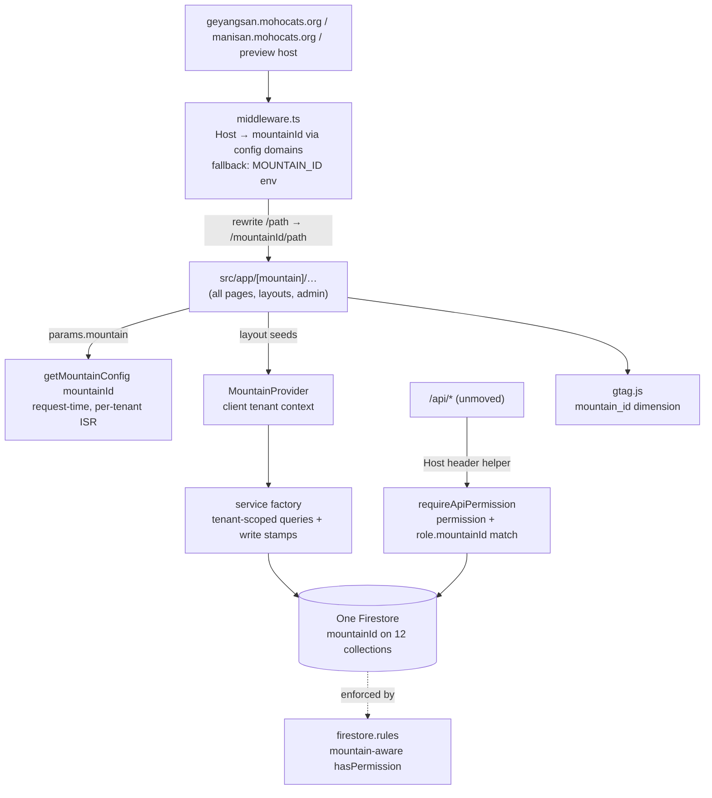

# Multi-Mountain Refactor — Execution Plan — 20260719

> Execution plan for refactoring the codebase into a true multi-mountain platform and
> reconfiguring **geyang as one of many mountains**. This plan operationalizes the
> decisions locked on 2026-07-19 against the decision framework
> [`multi-tenant-architecture-decision-20260718.md`](./multi-tenant-architecture-decision-20260718.md)
> (its §9 Q1–Q8). Every current-state claim below was re-verified against `dev` on
> 2026-07-19 (post complexity-retirement, tree clean through `2584dcb`).
>
> **Status:** 🚧 **EXECUTING — M1–M4 + M5.1 + M5.2 + M5.3 ✅ COMPLETE.** M1–M3 (`8920c66`/
> `092d226`/`491b832`, 2026-07-19) → **M4** `b83a112` (2026-07-20, incl. the verified
> 99-doc prod backfill) → **M5.1** `d4a0bb2` scoped reads + composite indexes →
> **M5.2** `47d0f3d` per-mountain role model (map keyed by `mountainId`) +
> mountain-aware rules (both 2026-07-22). M5.2a/M5.2b were **inseparable at the
> emulator gate**. Gates: tsc, smoke 30/30, unit 39/39, **rules 11/11**, full e2e
> 116/13/0. **M0 rules deploy DONE (owner, 2026-07-22).** ⚠️ **A NEW rules deploy is
> owed for M5.2b — ORDER-CRITICAL: run `migrate-m5-role-and-about.js` FIRST, then
> deploy** (a not-yet-migrated user is fail-closed → locked out). **M5.3 route audit DONE
> (2026-07-23 — no leak-by-omission; only residual cross-tenant surface is the shared
> YouTube channel, non-Firestore/deferred). Next: M5.4 two-tenant isolation e2e** (needs
> a `manisan` stub in config + seed — see M5.4). ⚠️ CI not yet updated for `test:rules` / the isolation e2e (owner-flagged,
> fresh session). Process note: commits are **owner-gated**.
>
> **Companion docs:** the decision framework (verified current state + why each axis was
> chosen) · [`firebase-sdk-usage-inventory.md`](./firebase-sdk-usage-inventory.md) +
> [`firebase-read-access-inventory.md`](./firebase-read-access-inventory.md) (the
> per-collection work-item list for M4/M5) · PROJECT_PLAN §9 (tracker entry).

**Legend:** `[ ]` todo · `[x]` done · ⚠️ watch-out · 🔑 owner-owed (only the owner can do it)

---

## 0. Decisions locked (2026-07-19, owner-answered)

| #   | Question                  | **Answer**                                                                                                                                                                                                                                                                                                                    |
| --- | ------------------------- | ----------------------------------------------------------------------------------------------------------------------------------------------------------------------------------------------------------------------------------------------------------------------------------------------------------------------------- |
| Q1  | Custody vs management     | **Management only.** Shared Firebase project; mountain #2's owner manages content through the admin CMS, scoped by RBAC + `mountainId`. You remain PIPA controller and bill payer.                                                                                                                                            |
| Q2  | Subdomains acceptable?    | **Yes.** `geyangsan.mohocats.org` / `manisan.mohocats.org` — subdomains are distinct hosts and that is accepted (resolves the framework's §2 tension).                                                                                                                                                                        |
| Q3  | Deployment topology       | **A1 — one Vercel project**, host-based mountain selection via middleware. One build serves all mountains.                                                                                                                                                                                                                    |
| Q4  | Data topology             | **B1 — one Firestore**, `mountainId` field on the 12 content collections, scoped queries, mountain-aware rules, one-shot backfill.                                                                                                                                                                                            |
| Q5  | Central auth project      | **Moot under Q1+Q4.** One Firebase project (the existing `mountaincats-61543`) serves auth, data, and storage for _all_ mountains — auth is central by construction. No two-backend split, no named-app discipline needed. The unconsumed `mountain-cats-users` / `_meta.centralUserService` scaffolding is **removed** (M2). |
| Q6  | Analytics access model    | **Single shared GA4 property + `mountain_id` custom dimension** for v1 (you are the only analytics consumer today). Dual-tag per-mountain properties deferred — `gtag.js` (M7) makes adding a second measurement ID a config change later.                                                                                    |
| Q7  | Selector audience         | **Visitors too.** The public mountain drop-down becomes real — cross-subdomain links in production, path links in dev/preview.                                                                                                                                                                                                |
| Q8  | Second mountain imminent? | **Preparatory.** No real mountain #2 is being provisioned. Multi-tenancy is proven by a **stub tenant** in config + emulator-seeded two-tenant e2e isolation tests, and by geyang running as "one of many."                                                                                                                   |

**Sub-decisions taken by this plan** (defaults chosen; overridable before go-ahead):

1. **Cross-subdomain session: accepted limitation for v1.** `browserLocalPersistence`
   is per-origin, so a logged-in user moving `geyangsan.` → `manisan.` must log in
   again (same account — auth is central; only the _session_ is per-origin). A
   cookie-session on `.mohocats.org` is deferred (recorded in §6 Deferred).
2. **Authed community reads stay auth-gated, not mountain-read-restricted.**
   `posts_feeding` / `posts_butler` / `feeding_spots` reads remain `auth != null`;
   isolation for these comes from query scoping. Rules-level _read_ scoping is reserved
   for the sensitive set (`contacts`, `permission_logs`, `admin_data`, `users`-others)
   where a leak is a PII/audit problem, not a curiosity. Public collections stay
   `read: if true` — public data is public on every mountain.
3. **Storage: per-mountain path prefix, no object migration.** `storagePrefix` joins
   mountain config: `''` for geyang (its objects stay where they are — no risky
   migration), `mountains/{id}/` for every new mountain. The framework §8
   "paths-not-URLs" item stays deferred (§6).
4. **`MOUNTAIN_ID` env is demoted, not removed.** It becomes the **default tenant**
   for hosts the middleware can't map (localhost, `*.vercel.app` previews, e2e) and
   for build scripts. Its meaning changes from "the mountain" to "the fallback."
5. **Dead `analytics` Firestore scaffolding is deleted** (rules block + nothing else —
   the `view-analytics` _permission_ survives; `permission_logs` reads use it). 🔑
   Owner may veto at M7.
6. **Roles are a map keyed by `mountainId`** (owner, 2026-07-22), NOT a singular
   `currentRole` and NOT an array — one account can hold an active role on **several**
   mountains at once, and the host/URL picks which one applies:
   `users/{uid}.roles = { geyang: {role,permissions,isActive,…}, manisan: {…} }`.
   A **map** (not array) is mandatory so rules do an O(1) key lookup
   (`get(user).data.roles[mountainId].permissions.hasAny([...])`) instead of iterating.
   **No owner bypass** — the controller is simply a user with an admin role on every
   mountain (fully audited). This reshapes M5.2/M5.3 (see M5) and adds a small additive
   `users` migration (`currentRole` → `roles[mountainId]`). Supersedes the earlier
   single-role + owner-bypass sketch.

---

## 1. Target architecture (end state)

- **One repo, one Vercel project, one Firebase project.** A mountain = a block in
  `mountains.json` (+ its `permissions.json` twin), a `domains` entry, storage prefix,
  and Firestore documents carrying its `mountainId`.
- **URL model:** visitors see clean paths (`geyangsan.mohocats.org/pages/cats`); the
  app tree internally lives under `/[mountain]/…` via middleware rewrite. In dev and
  on Vercel previews (single host), tenants are reachable directly by path
  (`localhost:3000/manisan/pages/cats`); the default tenant also answers at the root
  via the fallback rewrite.
- **ISR preserved per tenant:** `generateStaticParams()` over mountain ids gives each
  tenant its own cached pages; `revalidate = REVALIDATE_SECONDS` unchanged; on-demand
  revalidation becomes per-tenant (`revalidatePath('/' + mountainId)`).
- **Isolation is a correctness property** (framework §5 B1 warning) — enforced three
  times: query scoping in services, `firestore.rules` for client paths, route-code
  checks for the ~7 Admin-SDK paths. The two-tenant e2e suite (M5.7) is the net that
  proves it and keeps proving it.

---

## 2. Key design specs

### 2.1 Tenant resolution

- **`src/middleware.ts` (new):**
  1. If the pathname already starts with a known mountain id (dev/preview path access)
     → pass through.
  2. Else map `Host` → mountainId via each mountain's new `domains: string[]` config;
     unmapped hosts → `MOUNTAIN_ID` env → `'geyang'`.
  3. Rewrite to `/{mountainId}{pathname}`. Skip `/api`, `/_next`, static files.
- **Server pages/layouts:** read `params.mountain`; a thin
  `src/lib/tenant.ts` exposes `resolveTenant(params)` (validates the id against
  config, 404s unknown ids so `/[mountain]` doesn't wildcard-match garbage).
- **API routes:** `getRequestMountainId(req)` (same Host mapping + explicit
  `x-mountain-id`/body override where a route legitimately acts cross-context) — API
  routes are dynamic, so reading headers is free.
- **Client:** `MountainProvider` context, seeded by the `[mountain]/layout.tsx` from
  its param. `useMountain()` replaces every client-side `getCurrentMountainId()` /
  baked `NEXT_PUBLIC_MOUNTAIN_ID` assumption. Client _services_ receive the id
  explicitly (see 2.3).

### 2.2 Config layer (`src/utils/config.ts`)

- Every getter gains an **explicit `mountainId` parameter**:
  `getMountainConfig(mountainId)`, `getMapConfig(mountainId)`,
  `isFeatureEnabled(feature, mountainId)`, etc. No ambient tenant on the server.
  (`mountains.json` stays a static import — the _set_ of mountains changes on
  redeploy, which is fine; what becomes request-time is _which_ mountain is active.)
- `getCurrentMountainId()` → renamed `getDefaultMountainId()` (env fallback only:
  middleware default, scripts, e2e). Grep-verified consumers today: `MountainSelector`
  (rewritten in M3), `useAboutPhoto` (moves to `useMountain()`),
  `api/admin/assign-role` (moves to `getRequestMountainId(req)`).
- **`mountains.json` schema additions** per mountain: `domains: string[]`,
  `storagePrefix: string`, and (M7) `gaMeasurementId` stays env-level, not per-mountain
  (single property, Q6). `_meta.centralUserService` + `authentication.userServiceProject`
  removed (Q5). Secrets stay env-merged exactly as today — one Firebase project means
  the existing env vars serve all tenants unchanged.

### 2.3 Service layer tenancy

- `mountainId: string` added to the model types of the **12 content collections**
  (framework §1.8): `about_content`, `admin_data`, `cat_images`, `cat_videos`, `cats`,
  `contacts`, `feeding_spots`, `points`, `posts_adoption`, `posts_announcements`,
  `posts_butler`, `posts_feeding`.
- **Factory seam:** `getCatService(mountainId)` etc. — the getters take the tenant id
  and cache **per-tenant instances** (`Map<mountainId, instance>`); each service
  stamps `mountainId` on every create and adds `where('mountainId','==',id)` to every
  list/query read. Get-by-id reads verify the loaded doc's `mountainId` and treat a
  mismatch as not-found. Call sites get the id from `useMountain()` (client) or
  `resolveTenant`/`getRequestMountainId` (server).
- **Server read paths** (`src/lib/server/cat-reads.ts`, `point-reads.ts`,
  `feeding-spots-admin-service.ts`, `basic-feeding-spots-service.ts`) take the same
  explicit parameter.
- ⚠️ **Composite indexes:** adding `where('mountainId'…)` to queries that also
  `orderBy`/`where` on other fields will demand new Firestore composite indexes.
  Collect them from emulator/dev errors during M5 and add to `firestore.indexes.json`
  (create the file; wire into `firebase.json`) so they deploy declaratively.

### 2.4 Rules + API-guard enforcement (the two mechanisms, both mountain-aware)

- `hasPermission(userId, permission)` → **`hasPermissionFor(userId, permission,
mountainId)`**: existing role→permission resolution **plus**
  `get(user).data.currentRole.mountainId == mountainId`.
- **Content writes (client SDK):** permission check + `request.resource.data.mountainId`
  must equal the actor's `currentRole.mountainId`; updates must not change
  `mountainId` (`request.resource.data.mountainId == resource.data.mountainId`).
- **Sensitive reads:** `contacts`, `permission_logs`, `admin_data` reads add
  `resource.data.mountainId == currentRole.mountainId` — this closes the concrete
  PII leak the framework flags (§5 B1: a `manage-users` holder on mountain #2
  reading geyang's 동참 submissions). `users`-others admin reads: keep permission-gated
  (user docs are identity-domain, not per-mountain content) — noted as accepted.
- **`permission_logs` + `contacts` docs need `mountainId` too** — `/api/contact` and
  `/api/admin/assign-role` stamp it; both join the M4 backfill. (Role-change history
  already records `mountainId` per framework §1.3.)
- **`requireApiPermission(req, permission)`** additionally resolves the request tenant
  and enforces `role.mountainId === requestMountainId` (returning the tenant to the
  route so it can scope its own reads/writes). All ~7 Admin-SDK write routes + the
  admin read routes go through it; each route's Firestore access is audited against
  the SDK/read inventories during M5.
- **Identity-domain collections** (`users`, `role_permissions`, `permission_logs`) stay
  structurally central — they are _about_ the shared user base; only the audit rows
  carry a `mountainId` tag.
- ⚠️ The `hasPermission` incident (rules silently denying everyone) is the cautionary
  precedent — M5 adds **emulator rules tests** for the mountain dimension before the
  rules deploy, and the deploy is staged (see M0 note on the _pending_ deploy).

### 2.5 Routing move (`src/app/[mountain]/`)

- **Everything except `/api` moves** under the segment: the home page, `pages/*`,
  `login`, `mypage`, `admin/*`, plus `layout.tsx` composition (root layout keeps the
  `<html>` shell + analytics; the `[mountain]` layout owns nav/footer/tenant context).
- `generateStaticParams()` on the `[mountain]` layout returns all mountain ids →
  per-tenant ISR for the static/ISR pages; `revalidate` exports unchanged.
- `revalidatePath` call sites (`src/lib/revalidate-client.ts` →
  `/api/revalidate/route.ts`, `src/lib/cache-config.ts`) become tenant-aware.
- ⚠️ **Link audit:** internal `href="/pages/…"` links keep working in production
  (middleware re-rewrites per host) but would escape the tenant under dev path
  access. Add a `useTenantHref()`/`tenantHref(mountainId, path)` helper and sweep
  `Link`/`router.push`/`redirect` call sites; the e2e suite running against the
  default tenant plus the two-tenant spec running against `/manisan/...` paths is
  the regression net for misses.
- ⚠️ **Auth redirects & OAuth callbacks:** `login` flows, Kakao callback
  (`/api/auth/kakao/callback`), and `router.push` targets must round-trip the tenant.
  Audit during M3.

### 2.6 Assets & storage

- `scripts/maintenance/fetch-static-assets.js`: loop **all** mountains; thumbnails
  land in `public/images/thumbnails/{mountainId}/…` (about-photos are already
  per-mountain foldered). Audit + update every consumer of the baked paths
  (`thumbnailPreloader`, avatar rendering, about page) as part of M6 — geyang's
  existing flat paths change here, so this is a consumer-sweep, not just a script
  edit.
- Upload paths (signed-URL routes `generate-signed-url` /
  `generate-youtube-signed-url`, `storage-service.ts`, form upload strategies in
  `src/components/forms/uploadStrategies.ts`) prepend the tenant's `storagePrefix`.
  Geyang's prefix is `''` → zero behavior change for existing data.

### 2.7 Analytics (GA4 via gtag.js)

- Replace `firebase/analytics` (`services/firebase.ts` export + `AnalyticsTracker`)
  with a `gtag.js` snippet in the root layout driven by
  `NEXT_PUBLIC_GA_MEASUREMENT_ID`; `AnalyticsTracker` sends `page_view` with
  `mountain_id` (from `useMountain()`) on route change.
- 🔑 GA4 console: create/confirm the property, register `mountain_id` as a
  **custom dimension** — ⚠️ **before any second-tenant traffic exists** (GA4 does not
  backfill dimensions; framework §7).

---

## 3. Phase plan

Every phase gates on: `npx tsc --noEmit` · `npm run test:smoke` · **full e2e**
(baseline **116 passed / 13 skipped / 0 failed**, growing as specs are added) ·
browser verification of touched surfaces · owner go-ahead before each commit
(one commit per phase, complexity-retirement style).

**Execution tracking (stop/resume protocol — same as the complexity-retirement
track):** this section is the live tracker. As work proceeds, tasks flip `[ ]`→`[x]`
in place and each phase header gains a status marker (📋 → 🚧 → ✅ with date +
commit hash + execution notes). On any stop — including mid-phase — the state is
recorded here plus a HANDOFF.md status/changelog touch, so resuming = read HANDOFF →
this section → continue at the first unchecked box. Mid-phase stops leave the tree
dirty but described; phase boundaries leave it clean (committed).

### M0 — Prerequisite sync (🔑 owner, before any code)

- [ ] 🔑 **Deploy the already-pending `firestore.rules`** (`firebase deploy --only
firestore:rules`) and run its post-deploy check (assign role → `permission_logs`
      doc appears). Rationale: prod rules must match the repo **before** this track
      starts changing them, so the M5 rules diff deploys clean and any regression is
      attributable.
- [x] Record the §0 decisions in the decision framework (§9 table + status) and
      PROJECT*PLAN §9. *(Done alongside this plan's creation, 2026-07-19.)\_

### M1 — ✅ Decoupling prerequisites — DONE 2026-07-19, committed `8920c66` (plan docs: `5672330`)

The framework's §8 standalone items that reduce blast radius before the big moves:

- [x] **Retire `src/lib/firebase.ts`** — deleted. No new code needed:
      `storage-service.getDownloadUrl` already had `getStorageUrl`'s exact
      semantics, so `useAboutPhoto` now calls `getStorageService().getDownloadUrl`
      (static import, matching app convention). The dead `getPoints` /
      `getCatsByPointId` went with the file. One client init module remains
      (`services/firebase.ts`).
- [x] `feeding-spots-admin-service.ts` — its entire top-level hard-coded-SA-path
      init deleted; it now imports `db` from `@/lib/firebase-admin` (env-based SA
      resolution + the emulator branch, which the old init lacked).
      _(`basic-feeding-spots-service.ts` from the inventories no longer exists —
      stale snapshot row.)_
- [x] Hard-coded map image paths → mountain config: `map.landscapeImage` /
      `map.portraitImage` (`MapImageConfig`) in `mountains.json` + config types;
      `LeafletMountainMap` resolves them via `getMapConfig()` and **fails loud**
      (`requireMapImage`) if a mountain renders the map without declaring both.
- [x] Sweep: zero direct `MOUNTAIN_ID` / `NEXT_PUBLIC_MOUNTAIN_ID` reads outside
      `utils/config.ts`; zero `@/lib/firebase` imports remain (src/tests/scripts).
- Gates (2026-07-19): tsc ✅ · smoke 29/29 ✅ · unit 54/54 ✅ · **full e2e ✅**
  (first run 115/1/13 — the 1 fail was `member/contact-submit.spec.ts`, proven a
  pre-existing hydration-race flake: green ×3 in isolation, then a full re-run
  passed clean with zero failures) · browser pass ✅ (landing map renders from
  config imagery with avatars; butler_stream 200 via the refactored admin init;
  about page's blank main photo A/B-tested against stashed pre-M1 code —
  **identical**, i.e. the documented dev-mode `next/image` optimizer stall, not a
  regression). ⚠️ Ops note for local runs: `npm run test:e2e` re-fetches build
  assets **from the storage emulator**, clobbering real images under `public/` —
  run `npm run fetch:assets` afterwards before eyeballing media surfaces in dev.

### M2 — 🚧 Config layer request-time (medium)

- [x] `utils/config.ts` split into **tenant config** (explicit required
      `mountainId` on `getMountainConfig` / `getMapConfig` / `isFeatureEnabled` /
      `getMountainName` / `getMountainDescription` / `getYouTubeChannelId` /
      `getMountainAbout`) and **deployment secrets** (env-only, no `mountainId` —
      Firebase, service account, YouTube key/OAuth, OAuth providers — per Q5 one
      project serves all tenants; `MountainSecrets` and the `config.secrets`
      merge are gone; no consumer outside `config.ts` read `.secrets`).
      `getCurrentMountainId()` → `getDefaultMountainId()`. All 11 call sites
      threaded: API routes resolve via **`getRequestMountainId(request)`**
      (host-based, default-tenant fallback → behavior-identical today:
      `contact` — `sendNotification` takes `mountainId`; `assign-role`;
      `manage-playlists`; `refresh-video-metadata` — now uses
      `getYouTubeChannelId`); client components/services pass
      `getDefaultMountainId()` until M3 seeds real context.
- [x] `mountains.json`: geyang gains `domains: ["geyangsan.mohocats.org"]` +
      `storagePrefix: ""`; `_meta.centralUserService` and
      `authentication.userServiceProject` deleted (Q5); `MountainConfig` typed
      with the new fields (meta version → 3.0).
- [x] `src/lib/tenant.ts` landed: `resolveMountainIdOrNull` (segment validation,
      null → caller 404s), `getMountainIdForHost` (port/case-insensitive domain
      match, default-tenant fallback), `getRequestMountainId`. Pure functions, no
      Next imports — middleware/route/unit-test usable.
- [x] `MountainProvider`/`useMountain()` client context landed
      (`src/components/MountainProvider.tsx`), seeded by prop; outside a provider
      it falls back to the default tenant until M3 wires the `[mountain]` layout.
- [x] Unit tests `tests/unit/tenant.test.ts` (12): segment validation, host
      mapping incl. port/case/fallback/env-override, Request resolution, config
      explicit-id contract.
- Gates (2026-07-19): tsc ✅ · unit+smoke 66/66 ✅ (12 new tenant tests) ·
  **full e2e ✅ clean** (`.last-run.json` status passed, zero failures) · browser
  pass ✅ (landing map + avatars identical through the parameterized config;
  selector dropdown lists mountains via `getAllMountains` /
  `getMountainName(id)`).

### M3 — ✅ Routing: `[mountain]` segment + middleware — DONE 2026-07-19

- [x] All non-API routes moved (git mv) under `src/app/[mountain]/` (home,
      `pages/*`, `login`, `mypage`, `admin/*`). Root layout is now the bare HTML
      shell (font, globals.css, metadata); the new `[mountain]/layout.tsx` owns
      the tenant chrome (header/nav/footer, Announcement + Auth providers,
      AnalyticsTracker) wrapped in `MountainProvider`, with
      `generateStaticParams` over configured mountains and `notFound()` for
      unknown segments.
- [x] `src/middleware.ts`: pass through already-tenant-prefixed paths; otherwise
      Host→mountain (default-tenant fallback) and **rewrite** onto the segment.
      Matcher excludes `api`, `_next`, and dotted files (public assets).
- [x] `/api/revalidate` revalidates the baked subpaths (`''`,
      `/pages/adoption`) **per configured mountain**.
- [x] Link/redirect/OAuth audit: only server `redirect()` is the Kakao callback →
      Firebase auth handler (env `NEXT_PUBLIC_BASE_URL`, tenant-independent under
      Q5 — multi-subdomain implications land in the M8 provisioning guide, incl.
      per-subdomain Firebase authorized domains + Kakao redirect URIs). All
      `Link`/`router.push` targets are relative → middleware re-rewrites per
      host; no `tenantHref` helper needed. Dev-only caveat (accepted): browsing
      a **non-default** tenant by path prefix, in-app links jump back to the
      default tenant — host mode is unaffected.
- [x] `MountainSelector` is real: current mountain via `useMountain()`; selection
      navigates to the target's `domains[0]` when on a mapped production host,
      else to `/{mountainId}` (dev/preview). The no-op `?mountain=` query write
      is gone (closes the PROJECT_PLAN §9 selector item). New
      `findMountainIdByHost` (strict, null on unmapped) backs the mode pick;
      +3 unit tests.
- [x] `LeafletMountainMap` de-module-scoped: imagery resolved per-tenant inside
      the component (`useMountain` + `getMapConfig`), layout/coord helpers take
      the images as params, `PointMarkersLayer` receives them as a prop.
      `MountainViewer`, about page, `AboutContentEditor`, `useAboutPhoto` now
      read the tenant via `useMountain()`.
- [x] Smoke suite structural paths updated to the `[mountain]` segment (+
      layout/middleware existence check) — the only test-side change; **e2e specs
      untouched by design**.
- [x] Dev routing matrix verified: `/`→200 (rewrite), `/geyang`→200,
      `/pages/about`→200, `/geyang/pages/about`→200, `/everest`→**404**,
      `/api/points`→200. Browser pass: landing + `/geyang/pages/faq` render the
      full tenant chrome, console clean.
- Gates (2026-07-19): tsc ✅ · unit+smoke 69/69 ✅ · **full e2e 116 passed /
  0 failed with zero e2e-spec rewrites** — the phase's proof of behavior
  preservation · browser pass ✅.

### M4 — ✅ DONE 2026-07-20 — Data tenancy 1: stamp + backfill (code `b83a112`; prod backfill run & verified)

- [x] `mountainId` added to the 12 collections' types; every **write** path stamps it
      (client services from the factory's tenant id; Admin-SDK routes from
      `requireApiPermission`'s resolved tenant; `/api/contact` + `assign-role` stamp
      `contacts` / `permission_logs`).
- [x] **Backfill migration** `scripts/migration/backfill-mountain-id.js`: stamp
      `mountainId='geyang'` across the 12 collections + `contacts` +
      `permission_logs`; dry-run mode printing per-collection counts; ⚠️ `set` with
      `merge:true` only (the Sheets-pipeline wipe incident is the precedent —
      `cat-data-sheets-pipeline` memory).
- [x] 🔑 **Prod backfill RUN 2026-07-20** (owner-authorized; dry-run → owner
      eyeball → run → verification). **99 documents stamped
      `mountainId='geyang'`** across 13 collections: `about_content` 1,
      `cat_images` 10, `cat_videos` 12, `cats` 32, `contacts` 3,
      `feeding_spots` 10, `points` 8, `posts_adoption` 1,
      `posts_announcements` 1, `posts_butler` 5, `posts_feeding` 16.
      `admin_data` was **empty (total=0)** — confirms the "no writer in `src`"
      finding; `permission_logs`' single doc was **already stamped** (written
      after the Tier-1 migration restored the audit trail, so `assign-role`
      had already stamped it) → 0 needed.
      **Verified three ways:** (a) re-run dry-run inverted completely —
      every row `would stamp=0`, `Would stamp 0 document(s)`; (b) per-collection
      `total` identical before/after — nothing replaced or deleted; (c) field
      spot-check via Admin SDK — `개똥이` 19 fields incl. `adoptable:false`,
      `깡패` 21 incl. `adoptable:true`/`adoption_info`/`name_origin`, image and
      point docs intact, i.e. `merge:true` held and the Sheets-wipe failure mode
      did **not** occur. Browser pass against prod data afterwards: landing map
      (8 points + avatars) and photo album (10) render unchanged.
- [x] Emulator seed data gains `mountainId` — stamped in
      `scripts/test/seed-emulators.mjs` (a `TENANT_SCOPED` set + `withTenant`
      helper applied in `seedCollection`/`seedDoc`) rather than hand-edited into
      each fixture JSON, so the id cannot drift between fixture files.
- Gates: full suite green; reads still unscoped so behavior is unchanged even
  mid-backfill.

**Execution notes (2026-07-20):**

- **Service-factory parameterization landed here** (as scouted): `src/services/index.ts`
  getters are now `getCatService(mountainId)` etc., backed by a shared `perTenant()`
  helper that caches one instance per tenant id (`Map<mountainId, instance>`).
  Tenant-free services (`getStorageService`, `getAuthService`, `getPermissionService`)
  keep their old zero-arg shape. Each content service takes `mountainId` via
  constructor and stamps it on its create paths.
- **Call sites threaded: 49 tsc errors → 0**, across ~30 files. Client components
  read `useMountain()`; API routes resolve `getRequestMountainId(request)`
  (`/api/points` and `/api/admin/cats` GET gained a `request` parameter for this).
  `useRichContentForm` seeds the tenant into `SignedUrlImageContext`, which gained a
  required `mountainId` field — the one public-signature change outside the factory.
- **`media-albums` module functions** (`addImageRecord`, `addVideoRecord`,
  `syncImages`, `syncVideos`) gained an explicit `mountainId` parameter, since they
  are plain functions rather than class methods. `syncVideos` now resolves the
  channel via `getYouTubeChannelId(mountainId)` instead of the default tenant.
- **`aboutContentService` singleton retired** — it was a module-level `new
AboutContentService()`; it is now created per-tenant through the factory. ⚠️ The
  `about_content/about` **document id is still shared across tenants** — per-tenant
  doc ids are an M5 scoped-reads decision, noted in the service.
- **Nothing to stamp in `assign-role`** (M2 already stamps `permission_logs`) or in
  `refresh-video-metadata` / `update-youtube-video` (both only `.update()` existing
  `cat_videos` docs — no creates). `admin_data` has **no writer anywhere in `src`**,
  so it is backfill-only. `feeding_spots` likewise has no create path in the app
  (migration-seeded), so its service holds the tenant id for M5 only.
- Model types took `mountainId?: string` (optional) — M5 tightens once the prod
  backfill has run.
- **Gates (2026-07-20):** tsc ✅ · smoke 30/30 ✅ · unit 39/39 ✅ · **full e2e 116
  passed / 13 skipped / 0 failed** ✅ (the M3 baseline, unchanged) · browser pass ✅
  (landing map + avatars, photo album 10, video album 12, about content, 공지사항
  list — all through the tenant-parameterized services; console clean; routing
  matrix re-verified `/`→200, `/geyang`→200, `/everest`→404, `/api/points`→200).
- ⚠️ **Flake seen once, not a regression:** the first full-suite run failed
  `admin/posts.spec.ts` "creating an announcement with an image" — the create
  succeeded and the success dialog was confirmed, but the post-submit
  `router.push` never committed (URL stuck on `/admin/announcements/new`). That is
  the **known P6 dialog/redirect race** (`DEBUG_LOG` 2026-07-19), whose fix is a
  `setTimeout(…, 0)` and so stays timing-sensitive under parallel load. Re-ran the
  spec 3×3 in isolation (17/17 green) and the full suite again (116/0 clean).
  Worth hardening if it recurs — the durable fix would be awaiting the unmount
  commit rather than deferring a macrotask.

### M5 — 🚧 IN PROGRESS (M5.1/M5.2/M5.3 ✅; M5.4 next) — Data tenancy 2: scoped reads + enforcement (large)

> **Read first — two things learned after this phase was written:**
>
> 1. 🔑 **M0's `firestore:rules` deploy must land before touching rules here**, so
>    the M5 diff deploys clean and any regression is attributable.
> 2. ⚠️ **This Firestore is shared with a second application.** `image_uploader`
>    (13 docs) belongs to the owner's separate uploader tool — invisible to this
>    codebase (found via `listCollections()`, not code), **no `firestore.rules`
>    entry** (so it must use the Admin SDK, which bypasses rules — confirm with the
>    owner before deploying), and **no `mountainId`**. If it ever writes into
>    `cat_images`, those writes need a stamp or the images vanish once reads are
>    scoped. Corollary: the SDK/read inventories built from this repo are **not** a
>    complete picture of the database.
>
> **Snapshot first:** `npm run backup:firestore` before anything in this phase
> writes to prod ([`admin-manual` §10](../manuals/admin-manual/README.md#10-backups--recovery-owner)).
> PITR (7-day) + weekly backups are now in place as of 2026-07-20.

- [x] **M5.1 DONE (uncommitted) — scoped reads + server paths + indexes.** Every
      content read now carries `where('mountainId','==', …)`; doc-by-id reads
      (`getCatById`, `getPointById`, the post/announcement/adoption `getById`,
      `getImageById`, `getVideoById`) gained a **post-read tenant guard** (a known
      cross-tenant id reads as "not found" — `where` can't scope a doc-id read).
      `media-albums` module reads took a `mountainId` param, threaded from the
      tenant-constructed `image-service`/`video-service` wrappers. The two Admin-SDK
      server reads (`getAllCatsServer`/`getAllPointsServer`) now take `mountainId`,
      threaded through all 5 call sites via the layout's `resolveMountainIdOrNull` + `notFound()` pattern (`/api/points` already resolved the tenant → no change).
      `firestore.indexes.json` created (6 composite indexes) + wired into
      `firebase.json`. ⚠️ **Indexes were derived by hand, not by the emulator** — the
      Firestore emulator auto-creates indexes and will not surface a missing one, so a
      prod-only gap would throw → be swallowed by these services' catch-and-return-`[]`
      → silently empty an album. The 6 cover the only index-requiring combos:
      `cat_images`/`cat_videos` (mountainId + `tags` array-contains),
      `posts_butler`/`posts_feeding`/`contacts` (mountainId + `createdAt` DESC),
      `feeding_spots` (mountainId + `id` ASC). Two-equality queries (e.g. mountainId +
      `showInModal`/`parentId`/`dwelling`) need **no** composite index — Firestore
      merge-joins single-field indexes. Gates: tsc, smoke 30/30, unit 39/39, **full
      e2e 116/13/0** (single-tenant emulator → scoping is a no-op since seeding stamps
      `mountainId='geyang'`; the read audit is the real proof, not the e2e).
      **Two deferred decisions surfaced, both left untouched (owner-owed):**
      (a) `about_content/about` is a **single shared doc** — field-scoping can't
      separate tenants; needs a per-tenant doc id + prod migration (already flagged in
      M4 as "an M5 decision"). (b) `admin_config/youtube_auth` is one OAuth-credential
      doc while each mountain has its own channel — a per-tenant YouTube-auth question,
      out of M5.1's read scope. `permission_logs`/`admin_data` sensitive-read scoping
      is intentionally **not** app-layer (dead read methods; `PermissionService` stays
      central) — it lands in the rules rework below.
- [x] **M5.2a — role model → map keyed by `mountainId`** (§0 sub-decision 6). DONE
      (uncommitted). `UserPermissions.currentRole` → `roles: Record<mountainId,
UserRole>`; permission resolution is `hasPermissionFor(userId, permission,
mountainId)` reading `roles[mountainId]` (permission-service + `admin.ts` +
      `usePermissions`/`usePermissionCheck` via `useMountain()` + butler pages +
      AdminAuth all threaded); `assign-role` writes `roles[mountainId]` via deep-merge
      (other mountains' roles preserved) and retires only that mountain's prior role
      into `roleHistory`; the members roster route (`get-all-user-permissions-client`)
      shows each user's role _on the request mountain_. **New signups get `roles: {}`**
      (no default role) — a fresh account has no permissions until an admin assigns one;
      this also makes the self-write rule a bulletproof "roles empty on create /
      unchanged on update". **`users` migration**
      (`scripts/migration/migrate-m5-role-and-about.js`, dry-run default, additive):
      `currentRole` → `roles[mountainId]`, ⚠️ **normalizing the legacy `'default'`
      placeholder → `geyang`** (the prod admin account carries `'default'` — keying it
      under `roles.default` would strand it on a non-existent mountain and lock the
      admin out). The old `currentRole` is left in place (reversible).
- [x] **M5.2b — `firestore.rules` rework** per §2.4. DONE (uncommitted). ⚠️ **Coupled
      to M5.2a — not separable at the emulator gate**: the rules' `hasPermission()` and
      the seed both key on the role shape, so moving the app to `roles` forces the rules
      to `roles` too (else seeded admins resolve no permissions and e2e fails). New:
      `hasPermissionFor(uid, perm, mountainId)` reads `roles[mountainId]`; `canWrite()`
      authorizes a content write only when the actor holds the permission **on the
      doc's own `mountainId`** and the write doesn't move the doc between mountains;
      sensitive reads (`contacts`, `permission_logs`, `admin_data`) scoped to the doc's
      mountain; `users` read is **self-only** (the admin roster is Admin-SDK-only, so no
      client cross-user read is needed); dead `analytics` block removed (§0
      sub-decision 5). **Emulator rules tests rewritten — 11/11 green**: self-write
      escalation blocked, self-only read, cross-tenant cat write denied, mountainId
      move denied, multi-role admin allowed on each mountain, cross-tenant contacts
      read denied. ⚠️ **Deploy order: run the migration BEFORE deploying these rules**
      (a not-yet-migrated user resolves to no permissions, fail-closed).
- [x] **M5.3 core — `requireApiPermission` mountain enforcement** DONE (uncommitted;
      folded in with the model change since it reads the same shape): resolves the
      request tenant by Host, reads `roles[requestMountainId]`, and returns the
      `mountainId` to the route. A role on another mountain grants nothing.
- [x] **M5.3 route audit — DONE (2026-07-23).** Walked all 21 `src/app/api/**` routes
      and checked every Firestore access path against the tenant model. **Verdict: no
      leak-by-omission — every Firestore path is either correctly tenant-scoped or
      correctly central-by-design.** - **Content routes tenant-scoped ✅:** `/api/admin/cats` (GET+POST) via
      `getCatService(mountainId)`, `/api/points` via `getPointService(mountainId)`,
      `/api/contact` stamps `contacts.mountainId`, `/api/admin/assign-role` writes
      `users.roles[mountainId]` + a `mountainId`-stamped `permission_logs` entry
      (cross-mountain roles preserved via deep-merge), `/api/upload-youtube` writes the
      video record via `getVideoService(mountainId)`. - **Identity / central-config routes global _by design_ ✅:** `/api/account/delete`
      deletes the whole `users/{uid}` (탈퇴 = leaving the platform, uid from token);
      `/api/admin/get-all-user-permissions-client` reads the central `users` roster but
      **projects each user's `roles[mountainId]`**; `/api/admin/role-permissions` +
      `/api/admin/resource-permissions` read/write the platform-wide `role_permissions/*`
      matrix (only role _assignment_ is per-tenant). - **No-Firestore / stub:** `/api/admin/posts-collections` (unimplemented),
      `/api/revalidate` (iterates **all** mountains' baked paths — correct),
      `/api/auth/kakao/callback`, `youtube-playlists`. - **Only residual cross-tenant surface = the shared YouTube channel (non-Firestore,
      already deferred = M5.1 note b):** `getYouTubeChannelId(mountainId)` is per-tenant
      (config), but `getYouTubeOAuthConfig()` + `admin_config/youtube_auth` are a single
      shared credential/doc, so `upload-youtube` / `update-youtube-video` target one
      shared channel regardless of tenant. Video _records_ are stamped, so no Firestore
      leak; the underlying channel isn't isolated. - **Out-of-scope find (pre-existing, NOT a multi-tenant regression) — logged as an
      owner-owed thread in HANDOFF:** 7 write/credential-capable routes have **no auth
      gate at all** (`manage-playlists`, `refresh-video-metadata`, `update-youtube-video`,
      `upload-youtube`, `youtube-playlists`, `generate-signed-url`,
      `generate-youtube-signed-url`). Orthogonal to tenancy; surfaced by the systematic
      walk.
- [ ] **M5.4 — two-tenant e2e isolation spec.** 🔑 **Config prerequisite (the config
      half of M8's stub tenant, pulled forward):** the platform is currently configured
      with **only `geyang`** and the seed uses a single `SEED_MOUNTAIN_ID`. First add a
      second stub mountain (`manisan`) to `config/mountains/mountains.json` (so
      `generateStaticParams` / `resolveMountainIdOrNull` / the selector treat it as
      real, not a 404) and seed it in `seed-emulators.mjs` alongside geyang (its own
      content + a manisan-role admin). Then the spec asserts (a) its content is
      invisible on geyang surfaces & vice versa (public feeds, map, albums, admin
      lists), (b) a **single-mountain** (manisan-only) admin gets denied on geyang API
      routes + cannot read geyang `contacts`, (c) a **multi-role** admin (roles on both)
      is allowed on each of their mountains, (d) creates land with the right
      `mountainId`. ⚠️ **CI must run this multi-mountain config** (owner-flagged CI
      thread — also wire `npm run test:rules` into GitHub Actions).
- [ ] 🔑 `firebase deploy --only firestore:rules` (+ indexes) after the emulator net
      is green; staged post-deploy click-through of geyang admin CMS.
- Gates: full e2e (old suite + isolation spec) green; this phase is **the** isolation
  proof.

### M6 — Assets & storage namespacing (medium)

> 🔑 **Precondition — snapshot first:** run `npm run backup:firestore` before any
> script in this phase writes to production. Added after M4's backfill ran with no
> snapshot and no PITR (safe only because it was additive and exactly reversible).
> PITR is now enabled (7-day window) + a weekly backup schedule; the local dump is
> the pre-migration insurance on top. Runbook:
> [`docs/manuals/admin-manual/README.md`](../manuals/admin-manual/README.md#10-backups--recovery-owner) §10.

- [ ] `fetch-static-assets.js` loops all mountains → per-mountain `public/` paths;
      consumer sweep (thumbnail preloader, avatars, about page) — geyang's baked
      thumbnail paths change here.
- [ ] `storagePrefix` wired through `storage-service.ts`, both signed-URL routes, and
      the form upload strategies (geyang `''` → no-op).
- [ ] Browser pass on media surfaces (map avatars, albums, upload flows) + e2e green.

### M7 — Analytics decoupling (small)

- [ ] `firebase/analytics` → `gtag.js` + `mountain_id` event param (§2.7); remove the
      `analytics` export from `services/firebase.ts`.
- [ ] Delete the dead `analytics` collection scaffolding (rules block; leave the
      `view-analytics` permission — `permission_logs` uses it). 🔑 Owner confirm.
- [ ] 🔑 GA4: property + `mountain_id` custom dimension registered (before any
      tenant-2 traffic, ever).

### M8 — Geyang as one-of-many + provisioning proof (medium)

- [ ] Add the **stub tenant** (`manisan`) to `mountains.json` **and**
      `permissions.json` coherently (resolves the drift item), with its own theme
      knobs, `domains`, `storagePrefix`, feature flags.
- [ ] Verify in browser: `localhost:3000/manisan/…` renders the stub tenant (own
      name/branding, empty content states, admin denied for geyang-role users);
      geyang unchanged at `/`.
- [ ] **Theme wiring** (PROJECT_PLAN §9 item): render `config.theme` into CSS
      variables in the `[mountain]` layout so per-tenant theming is real (geyang's
      values = today's tokens → zero visual change for geyang; stub tenant proves
      differentiation).
- [ ] Rewrite `docs/manuals/deployment/new-mountain-setup.md` for real: config block,
      permissions block, DNS/Vercel domain attach, Firebase Auth authorized domains,
      Kakao redirect URIs, GA nothing (shared property), backfill-not-needed note,
      verification checklist (the guide's §8).
- [ ] 🔑 Vercel/DNS (when a real mountain #2 arrives — not now): subdomain DNS +
      domain attach; Firebase **authorized domains** + Kakao console **redirect URIs**
      per new subdomain. Recorded in the guide, not executed for the stub.
- [ ] Docs close-out: `docs/codebase/multi-tenant-config.md` (config is now
      request-time — its "BAKED" watch-out changes), `services-layer.md`,
      `deployment-and-build.md`, CLAUDE.md architecture bullets ("multi-tenant ready"
      → actually true; ISR notes gain the tenant dimension), FEATURE_MOD_LOG entry,
      HANDOFF + PROJECT_PLAN §9 close, decision framework status → ✅ EXECUTED.

---

## 4. Sizing & sequencing summary

| Phase | Size   | Risk                                          | Depends on   |
| ----- | ------ | --------------------------------------------- | ------------ |
| M0    | 🔑 ops | low                                           | —            |
| M1    | S      | low                                           | —            |
| M2    | M      | low                                           | M1           |
| M3    | **L**  | **high** (routing/ISR/links)                  | M2           |
| M4    | M      | med (prod backfill)                           | M2 (not M3)  |
| M5    | **L**  | **high** (rules regression, leak-by-omission) | M3 + M4      |
| M6    | M      | med (baked-path consumers)                    | M3           |
| M7    | S      | low                                           | M3           |
| M8    | M      | low                                           | M5 + M6 + M7 |

M4 can start while M3 is in review (independent surfaces); everything else is
sequential. Rough total: ~6–8 working sessions at the complexity-retirement cadence.

## 5. Risks & mitigations

- **Rules regression** (precedent: the `hasPermission` silent-deny incident) →
  emulator rules tests land _before_ the deploy; M0 syncs prod first so the M5 diff
  is clean; staged post-deploy click-through.
- **Leak-by-omission under B1** (a missed `where`) → three-layer enforcement +
  the two-tenant isolation spec as a permanent net; the SDK/read inventories are the
  checklist so no path is audited from memory.
- **Routing/ISR subtleties in M3** (cache keyed per path; middleware/e2e interplay;
  link escapes) → default-tenant fallback keeps every existing URL — and therefore
  the whole e2e suite — unchanged; that suite passing without spec rewrites is the
  phase gate.
- **Prod backfill** → dry-run + counts + `merge:true` only (Sheets-wipe precedent).
- **Baked-asset consumers** (M6 changes geyang's thumbnail paths) → consumer sweep +
  browser pass on every media surface.
- **Per-origin sessions surprising users** → accepted + documented (§0.1); revisit
  with a cookie session if real cross-mountain traffic materializes.

## 6. Deferred / out of scope (recorded, not lost)

- Cross-subdomain SSO cookie session on `.mohocats.org`.
- Storage **paths-not-URLs** persistence + geyang object re-prefixing.
- `next/image` prod re-test on media surfaces (framework §8 — independent).
- Dual-tag per-mountain GA4 properties (config add once needed).
- Multi-role users (one user holding roles on several mountains) — `currentRole` stays
  single; a real mountain #2 with shared humans would reopen this.
- Admin read-route hardening for `contacts`/`users` (read inventory R3 note).
- Real mountain #2 provisioning (Q8: preparatory only).
